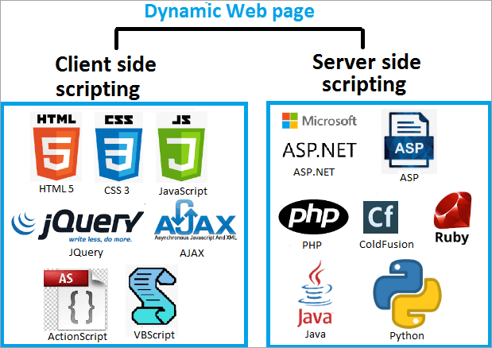
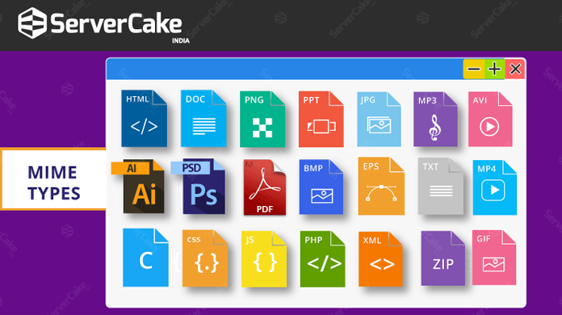
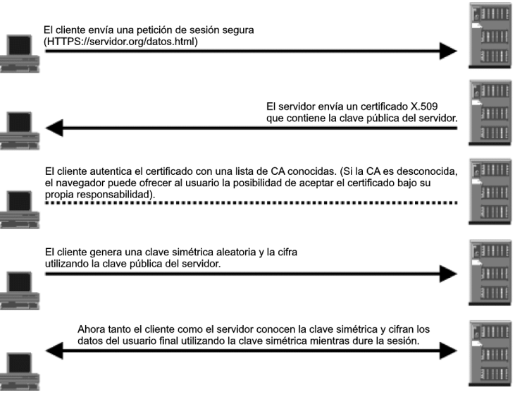
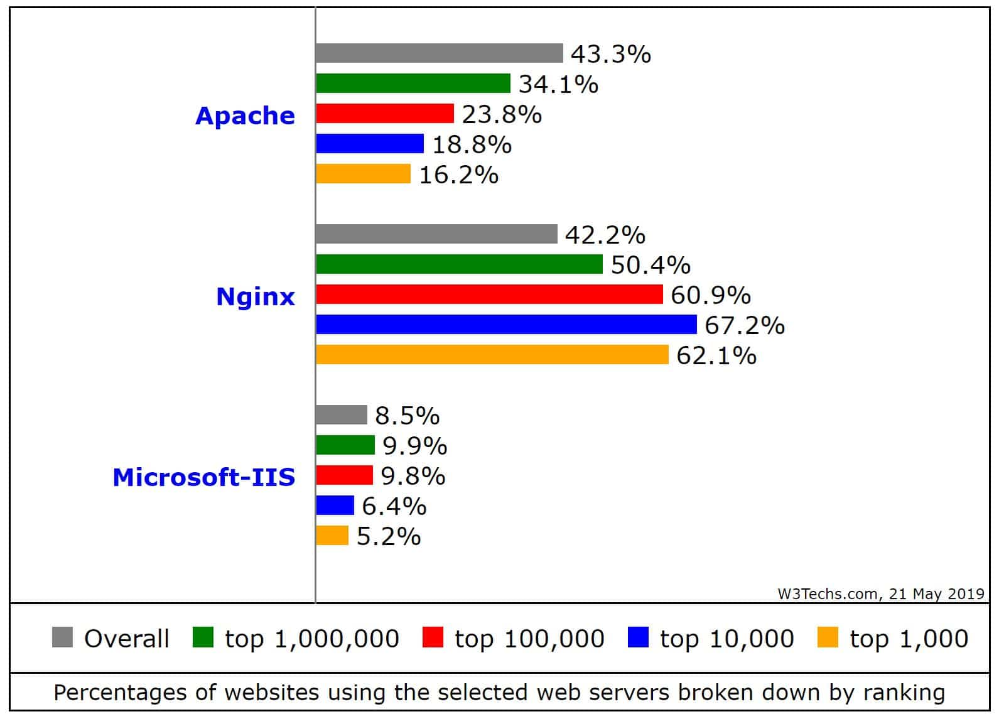
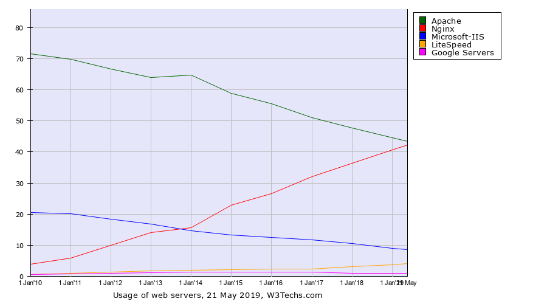

# **Arquitectura Web. Implantación y administración de servidores web**

## Introducción

Con la evolución y el acceso libre a Internet, uno de los principales alicientes que han surgido es la publicación de páginas web donde se pueden almacenar unos contenidos bastante atractivos para nosotros y que, al mismo tiempo, pueden ser consultados desde cualquier del mundo para todos. 

Cabe decir que, con la popularización de Internet, tanto empresas como usuarios han visto la necesidad de establecer un punto desde donde anunciar sus productos, o bien, a título particular, dar publicidad a las aficiones o capacidades personales mediante la publicación de páginas web. 

Las páginas web, en su mayoría en formato HTML, requieren ser alojadas en máquinas que dispongan de espacio en disco para almacenar archivos HTML, imágenes, bloques de código o archivos de vídeo en directorios específicos y, al mismo tiempo, deben ser capaces de entender todo tipo de extensión de los archivos que son enviados en ambos sentidos de la comunicación. 

{: style="height:450px;width:550px"}

Paralelamente, no podemos dejar de lado la importancia de las medidas de seguridad ante los peligros existentes en Internet. Para ello, las páginas deberán estar diseñadas considerando la incorporación de protocolos de comunicación seguros como, por ejemplo, los desarrollados con el protocolo seguro de transferencia de hipertexto (HTTPS, Hyper Text Transfer Protocol secure) que utilizan claves y estrategias de cifrado propias de las herramientas del protocolo de capa de conexión segura (SSL, secure sockets layer). 

Las máquinas que alojan las páginas web reciben la categoría de servidores web. Desde el punto de vista de los servidores, los requerimientos más relevantes son el espacio de disco necesario para poder almacenar la estructura de la página web y una buena conexión de red para que el consumo de la unidad de procesamiento central (CPU, central processing unit ) sea bastante bajo. 

El funcionamiento de los servidores web es especial ya que, como si se tratara de un diente de sierra, tienen consumos de recursos puntuales porque podemos estar un tiempo sin peticiones y, de repente, tener una avalancha de peticiones. Esto hace que los servidores web suelan tener un número bajo de procesos en espera. A medida que resultan necesarios, se van arrancando nuevos. 

Cabe decir que no todas las peticiones consumen el mismo, y, por ejemplo, aquellas páginas web que ejecuten programas de interacción con el usuario o requieran cifrado (HTTPS) consumen más recursos que otras páginas web con menos interacción. 

## ¿Qué es un servidor web?

Los servidores web sirven para almacenar contenidos de Internet y facilitar su disponibilidad de forma constante y segura. Cuando visitas una página web desde tu navegador, es en realidad un servidor web el que envía los componentes individuales de dicha página directamente a tu ordenador. Esto quiere decir que para que una página web sea accesible en cualquier momento, el servidor web debe estar permanentemente online. 

{: style="height:300px;width:550px"}

Toda página accesible en Internet necesita un servidor especial para sus contenidos web. A menudo, las grandes empresas y organizaciones cuentan con un servidor web propio para disponer sus contenidos en Intranet e Internet. Sin embargo, la mayoría de administradores recurren a los centros de datos de proveedores de alojamiento web para sus proyectos. Independientemente de si tienes un servidor web propio o de si alquilas uno externo, siempre necesitarás un software para gestionar los datos de tu página y mantenerla actualizada. En este sentido, tienes la posibilidad de elegir entre varias soluciones de software para servidores web diseñadas para diferentes aplicaciones y sistemas operativos. 

### Tecnología de servidores web

Principalmente, el software de un servidor HTTP es el encargado de proporcionar los datos para la visualización del contenido web. 

Para abrir una página web, el usuario solo tiene que escribir el URL correspondiente en la barra de direcciones de su navegador web. El navegador envía una solicitud al servidor web, quien responde, por ejemplo, entregando una página HTML. Esta puede estar alojada como un documento estático en el host o ser generada de forma dinámica, lo que significa que el servidor web tiene que ejecutar un código de programa (p. ej., Java o PHP) antes de tramitar su respuesta. 

El navegador interpreta la respuesta, lo que suele generar automáticamente más solicitudes al servidor a propósito de, por ejemplo, imágenes integradas o archivos CSS (hojas de estilos). 

El protocolo utilizado para la transmisión es HTTP (o su variante cifrada HTTPS), que se basa, a su vez, en los protocolos de red IP y TCP (y muy rara vez en UDP). Un servidor web puede entregar los contenidos simultáneamente a varios ordenadores o navegadores web. La cantidad de solicitudes (requests) y la velocidad con la que pueden ser procesadas depende, entre otras cosas, del hardware y la carga (número de solicitudes) del host. Sin embargo, la complejidad del contenido también juega un papel importante: los contenidos web dinámicos necesitan más recursos que los contenidos estáticos. 

La selección del equipo adecuado para el servidor y la decisión de si este debe ser dedicado, virtual o en la nube, se debe hacer pensando siempre en evitar sobrecargas en el servidor. Aunque se haya encontrado un servidor web que se adapta perfectamente a las necesidades del proyecto, siempre se corre el riesgo de que se presenten fallos en él como consecuencia de imprecisiones técnicas o cortes de energía en el centro de datos del host. Aunque no es muy frecuente, durante un período de inactividad de este tipo (downtime), la web no estará disponible. 

### Otras funciones de los servidores web

Aunque su principal función es la transferencia de contenido web, muchos programas de servidor web ofrecen características adicionales: 

 Seguridad                  | Cifrado de la comunicación entre el servidor web y el cliente vía HTTPS                                                                   
----------------------------|-------------------------------------------------------------------------------------------------------------------------------------------
 Autenticación del usuario  | Autenticación HTTP para áreas específicas de una aplicación web                                                                           
 Redirección                | Redirección de una solicitud de documento por medio de Rewrite Engine                                                                     
 Redirección                | Almacenamiento en caché de documentos dinámicos para la respuesta eficiente de solicitudes y para evitar una sobrecarga del servidor web  
 Asignación de cookies      | Envío y procesamiento de cookies HTTP    

Además del software del servidor, un host puede contener otro tipo de programas, como por ejemplo un servidor FTP para la carga de archivos o un servidor de base de datos para contenidos dinámicos. En general, existen diferentes tipos de servidores web que pueden ser utilizados para numerosos propósitos, por ejemplo, los servidores de correo, los servidores de juegos o los servidores proxy. 

## El protocolo HTTP

### Historia

El protocolo de transferencia de hipertexto (HTTP, Hypertext Transfer Protocol) es el motor que da vida a Internet, ya que es la base para la web (www, world wide web). 

Desde un punto de vista histórico, la web fue creada en 1989 en el Consejo Europeo para la Investigación Nuclear (CERN, Centro Europeene pour la Recherche Nucléaire), con sede en Ginebra, justo en la frontera entre Suiza y Francia. Cabe decir que este organismo disponía (y dispone) de una amplia plantilla de científicos de diferentes países de Europa que trabajan en sus aceleradores de partículas. En consecuencia, muchos equipos de trabajadores están integrados por miembros de nacionalidades diferentes. Además, muchos de los experimentos que se realizan destacan por su complejidad y requieren años y años de planificación y de construcción de equipamientos. 

Fue a raíz de la necesidad de disponer de múltiples grupos de científicos repartidos por el mundo y colaborando entre ellos (enviándose informes, dibujos, esquemas, fotos y todo tipo de documentos) que nació la web. 

Es en los inicios del protocolo HTTP, a mediados del año 1990, cuando encontramos la versión 0.9. Esta versión tenía como única finalidad transferir datos por Internet en forma de páginas web escritas en lenguaje de marcado de hipertexto (HTML, HyperText Markup Language). A partir de la versión 1.0 del protocolo surgió la posibilidad de transferir mensajes con encabezados que describían el contenido de los mensajes. 

### Versiones

#### La primera versión: HTTP/1

La historia de HTTP empezó en 1989, cuando Tim Berners-Lee y su equipo del CERN (Suiza) empezaron a desarrollar la World Wide Web. La versión inicial de HTTP fue bautizada con el número de versión 0.9, consistía en una sola línea y solo permitía solicitar un archivo HTML del servidor cada vez. 

El servidor entonces no hacía más que transferir el archivo solicitado, de manera que esta versión del protocolo solo podía manejar archivos HTML.

#### El primer estándar oficial: HTTP/1.1

HTTP/1.1 aclaró ambigüedades y añadió numerosas mejoras: 

 + Una conexión podía ser reutilizada, ahorrando así el tiempo de re-abrirla repetidas veces. 

 + Enrutamiento('Pipelining' en inglés) se añadió a la especificación, permitiendo realizar una segunda petición de datos, antes de que fuera respondida la primera, disminuyendo de este modo la latencia de la comunicación. 

 + Se permitió que las respuestas a peticiones, podían ser divididas en sub-partes. 

 + La negociación de contenido, incluyendo el lenguaje, el tipo de codificación, o tipos, se añadieron a la especificación, permitiendo que servidor y cliente, acordasen el contenido más adecuado a intercambiarse. 

 + Gracias a la cabecera, Host, pudo ser posible alojar varios dominios en la misma dirección IP. 

#### Un protocolo de mayor rendimiento HTTP/2

Según pasaban los años, las páginas web se volvían cada vez más amplias y complejas. Para cargar una web moderna en el navegador, este tiene que solicitar muchos megabytes de datos y enviar hasta cien solicitudes HTTP. HTTP/1.1 está pensado para procesar solicitudes una tras otra en una misma conexión, de manera que cuanto más compleja sea una página web, más tardará en cargarse y mostrarse. 

Por esta razón, Google desarrolló un nuevo y experimental protocolo, el SPDY o Speedy, que despertó un gran interés entre los desarrolladores y permitió que en 2015 se publicara la versión HTTP/2 del protocolo. Este estándar incluye múltiples mejoras que tienen como objetivo acelerar la carga de las páginas web. 

La versión HTTP/2 se extendió rápidamente y las páginas web con mucho tráfico fueron de las primeras en adoptarla. Actualmente (con fecha de enero de 2020), según W3Techs, un 42 % de las páginas web utilizan la versión HTTP/2. 

#### El futuro: HTTP/3

Un punto débil de todas las versiones de HTTP usadas hasta ahora es el protocolo de control de transmisión (TCP) en el que se basan. Este protocolo requiere que el receptor de cada paquete de datos confirme la recepción antes de que pueda enviarse el siguiente paquete. De este modo, basta con que se pierda un paquete para que todos los demás tengan que esperar a que dicho paquete sea transmitido de nuevo. 

Para evitarlos, la nueva versión HTTP/3 no funcionará con TCP, sino con UDP, que no aplica este tipo de medidas correctivas. A partir de UDP, se ha creado el protocolo QUIC (Quick UDP Internet Connections), que será la base de HTTP/3.

## Funcionamiento del protocolo HTTP

Ya hemos comentado que el protocolo HTTP tiene un funcionamiento bastante sencillo basado en el envío de mensajes entre cliente y servidor. 

Gráficamente podemos resumir el proceso de comunicación HTTP como sigue: 

  1. Un usuario accede a una URL, seleccionando un enlace de un documento HTML o introduciéndola directamente en el campo correspondiente del cliente Web. 

  2. El cliente Web descodifica la URL, separando sus diferentes partes: el protocolo de acceso, la dirección DNS o IP del servidor, el posible puerto opcional (el valor por defecto es 80) y el objeto requerido del servidor. `http://direccion[:puerto][path]`

    `Ejemplo: http://www.miweb.com/documento.html`

  1. Se abre una conexión TCP/IP con el servidor, llamando al puerto TCP correspondiente. En ese momento, se realiza la petición HTTP. Para ello, se envía el comando necesario (GET, POST, HEAD,...), la dirección del objeto requerido (el contenido de la URL que sigue a la dirección del servidor), la versión del protocolo HTTP empleada y un conjunto variable de información, que incluye datos sobre las capacidades del navegador (browser), datos opcionales para el servidor, etc. 

  2. El servidor devuelve la respuesta al cliente. Consiste en un código de estado y el tipo de dato MIME de la información de retorno, seguido de la propia información. 

  3. Se cierra la conexión TCP. Este proceso se repite en cada acceso al servidor HTTP. Por ejemplo, si se recoge un documento HTML en cuyo interior están insertadas 2 imágenes y 1 vídeo, el proceso anterior se repite cuatro veces, una para el documento HTML y tres más para los recursos (la dos imágenes y el vídeo). 

### Comandos o métodos HTTP

HTTP define un conjunto de métodos de petición para indicar la acción que se desea realizar para un recurso determinado. 

{: style="height:420px;width:600px"}

El estándar HTTP/1.0 recoge únicamente tres comandos, que representan las operaciones de recepción y envío de información y chequeo de estado: 

* **GET**: se utiliza para solicitar cualquier tipo de información o recurso al servidor. Cada vez que se pulsa sobre un enlace o se teclea directamente a una URL se usa este comando. Como resultado, el servidor HTTP enviará el recurso correspondiente. 

+ **HEAD**: se utiliza para solicitar información sobre el recurso: su tamaño, su tipo, su fecha de modificación… Es usado por los gestores de cachés de páginas o los servidores proxy, para conocer cuándo es necesario actualizar la copia que se mantiene del recurso. Con HEAD se podrá comprobar la última fecha de modificación de un recurso antes de traer una nueva copia del mismo. 

- **POST**: sirve para enviar información al servidor, por ejemplo, los datos contenidos en un formulario. El servidor pasará esta información a un proceso encargado de su tratamiento. 

La versión 1.1 del protocolo incorpora unos pocos comandos más como son: OPTIONS, PUT, DELETE, TRACE y CONNECT. Veamos algunos de ellos: 

+ **OPTIONS**: Devuelve los métodos HTTP que el servidor soporta para una URL específica. Esto puede ser utilizado para comprobar la funcionalidad de un servidor web mediante petición en lugar de un recurso específico. 

+ **DELETE**: sirve para eliminar un recurso especificado en la URL, aunque pocas veces sera permitido por un servidor web. 

+ **TRACE**: comando que permite hacer un sondeo para saber todos los dispositivos de la red por los que pasa nuestra petición. Así podremos descubrir si la petición pasa a través dispositivos intermedios o proxys antes de llegar al servidor Web. 

+ **PUT**: puede verse como el comando inverso a GET. Nos permite escribir datos en el servidor o, lo que es lo mismo, poner un recurso en la URL que se especifique. Si el recurso no existe lo crea sino lo reemplaza. La diferencia con POST puede ser algo confusa; mientras que POST está orientado a la creación de nuevos contenidos, PUT está más orientado a la actualización de los mismos (aunque también podría crearlos). 

HTTP/2 no incluye métodos nuevos. 

### Ejemplo de petición y respuesta

Una solicitud HTTP es un conjunto de líneas que el navegador envía al servidor. Incluye: 

+ El recurso solicitado, el método que se aplicará y la versión del protocolo utilizada. 

+ Los campos del encabezado de solicitud: es un conjunto de líneas opcionales que permiten aportar información adicional sobre la solicitud y/o el cliente (navegador, sistema operativo, etc.). Cada una de estas líneas está formada por un nombre que describe el tipo de encabezado, seguido de dos puntos (:) y el valor del encabezado. 

+ El cuerpo de la solicitud: es un conjunto de líneas opcionales que deben estar separadas de las líneas precedentes por una línea en blanco y que, por ejemplo, permiten la transmisión de datos al servidor de un formulario a través del método POST. 

 

La sintaxis de una respuesta HTTP es un conjunto de líneas que el servidor envía al navegador. Incluye: 

 

+ Una línea de estado donde figura el versión del protocolo usada, un código de estado/error y un texto con el significado de dicho código. 

+ Los posibles códigos de estado se identifican con números de tres cifras y se clasifican en cinco grupos según sean informativos (1xx), de éxito en la solicitud (2xx), para redireccionar la solicitud (3xx), por error generado en el cliente (4xx) o bien por errores generados en el servidor (5xx) → <u>**Códigos de estado/error** </u>

+ Los campos del encabezado de la respuesta. Conjunto de lineas opcionales que aportan información adicional sobre la respuesta y/o el servidor. 

+ El cuerpo de la respuesta que contiene el recurso (objeto) solicitado

### Cabeceras HTTP

Las **cabeceras HTTP** son los parámetros que se envían en una petición o respuesta HTTP al cliente o al servidor para proporcionar información esencial sobre la transacción en curso. Estas cabeceras proporcionan información mediante la sintaxis ***'Cabecera: Valor'*** y son enviadas automáticamente por el navegador o el servidor Web.  → <u>Cabeceras HTTP</u> 

### Tipos MIME

El protocolo HTTP fue diseñado para transportar por red ficheros en formato ASCII, formados por texto plano. Con el paso del tiempo, surgió la necesidad de incluir diferentes tipos de ficheros no ASCII en las aplicaciones por Internet (imágenes, vídeos, sonidos, etc.) y, como consecuencia de ello, fue necesario buscar una solución: había que transformar estos formatos a tipo ASCII (u otros juegos de caracteres compatibles) para su correcta recepción en el navegador web. 

Este problema ya había surgido en las aplicaciones de correo electrónico, cuando se necesitó enviar por MAIL ficheros no formados por texto plano, y por tanto, no compatibles con los juegos de caracteres permitidos. 

Para solucionar este problema se crearon los tipos MIME (Multipurpose Internet Mail Extensions), especificaciones para dar formato a mensajes no-ASCII, de forma que pudieran ser enviados por Internet e interpretados correctamente por los programas de correo locales. 

Tipos de medios de Internet, previamente conocido como "tipos " o "tipos de contenido", es un estándar diseñado para indicar el tipo de información que presenta un archivo o un conjunto de datos. En , este identificador puede ser útil para conocer el tipo de un archivo antes de descarcarglo y tener acceso a él. Es una buena pŕactica proveer información de tipos de medios siempre que sea posible, como en el caso de los elementos que cuentan con atributos como type, enctype, formenctype y accept. 

Todo identificador de tipo de medio de Internet debe ajustarse al siguiente formato: 

Así pues, el "tipo" y el "subtipo" deben estar presentes en cualquier tipo de medio de Internet. En la lista siguiente hay algunos ejemplos que contienen cada una da las partes delineadas anteriormente. 

## HTTPS

El Protocolo seguro de transferencia de hipertexto (en inglés, Hypertext Transfer Protocol Secure o HTTPS) es un protocolo de aplicación basado en el protocolo HTTP, destinado a la transferencia segura de datos de hipertexto, es decir, es la versión segura de HTTP. 

**La web es insegura por naturaleza.** Cuando se diseñaron los protocolos en los que está basada (TCP/IP) no se tuvieron en cuenta muchos de los problemas que tiene la Internet moderna. Y el protocolo HTTP, para transferir páginas web, no añadió nada al respecto tampoco hasta mucho después, con la introducción del protocolo HTTPS (la "ese" es de "Seguro") allá por 1994 por la empresa Netscape. El protocolo HTTPS original utilizaba SSL (Secure Sockets Layer) como protocolo seguro de intercambio de claves y cifrado, pero en la actualidad está obsoleto y se emplea TLS (Transport Layer Security, que va por su versión 1.3). El estándar de HTTP sobre TLS, en realidad, no se configuró hasta mayo del año 2000. 

Tradicionalmente,** los navegadores le han indicado a sus usuarios que se estaban conectando a un sitio seguro utilizando un iconito, generalmente uno con un candado**. 

Según el navegador el aspecto cambia un poco, pero todos muestran el proverbial "candadito" al lado de la dirección: 

Es decir, lo importante aquí es que hasta ahora los navegadores consideran HTTP como la norma, y HTTPS como la excepción, y por eso lo marcan de esta manera. 

### Funcionamiento de HTTPS

## Servidores web: Apache vs Nginx

Cuando vamos a poner en marcha un servidor web, lo primero que necesitamos es utilizar un sistema operativo sobre el cual vamos a ejecutar los diferentes servicios, sistema operativo que en más del 95% de las ocasiones suele ser un sistema Linux, así como un software que se encargue de la gestión de las bases de datos, MySQL habitualmente, y un software para gestionar el contenido dinámicos de las webs, que suele ser PHP. Además de este software esencial, otra de las partes más importantes del servidor suele ser la elección del servidor web, y aquí es donde entran las dudas. 

Cuando buscamos montar una web podemos elegir una gran cantidad de servidores web diferentes, desde Apache y Nginx, los más conocidos y utilizados con más de un 85% de uso entre ambos, hasta otros servidores menos conocidos como Microsoft IIS (si usamos un servidor Windows), LiteSpeed, Node.js, etc. 

Los dos servidores más utilizados para montar páginas web hoy en día son Apache y Nginx, sin embargo, es imposible decir que uno es mejor que otro ya que cada uno de ellos tiene sus propias fortalezas y debilidades y puede mejorar mejor bajo ciertas circunstancias o simplemente ser más sencillo de utilizar. 

<u>*Nginx está orientado a mejorar el rendimiento, soportando mayores cargas de tráfico y usuarios que Apache (Problema C10K), además de ofrecer otras funcionalidades como hacer de proxy. En sus orígenes era especialmente eficiente ofreciendo contenido estático*.</u>

 

Después de ser lanzado, Nginx fue usado principalmente para servir archivos estáticos y como un balanceador de carga o proxy inverso en frente de instalaciones Apache.

Ejemplos de servicios de despliegue de páginas estáticas:

+ Netlify
+ Surge
+ GitHub Pages
+ GitLab Pages
+ Firebase
+ Vercel
+ Neocities

Mientras evolucionaba la red, y la necesidad de exprimir hasta la última gota de la velocidad y eficiencia de uso de hardware con este, más sitios empezaron a reemplazar Apache con Nginx por completo, gracias a un software mucho más maduro.

{: style="height:450px;width:700px"}

### Razones para usar Nginx

1. <u>Es ligero</u>

    Nginx reduce el consumo de RAM. 

2. <u>Es multiplataforma y fácil de instalar </u>

    La mayoría de las grandes distribuciones de GNU/Linux, tienen Nginx en sus repositorios. 

3. <u>¡Se puede usar junto a Apache! </u>

    Sí, como lo lees, algunas empresas solo usan Nginx para servir contenido estático y Apache para el contenido dinámico. 

4. <u>Caché</u>

    Puedes usar Nginx como caché, con algo de configuración, permitiendo mejorar la eficiencia de tu aplicación sin tocar la programación de la misma. 

5. <u>Balanceador de carga </u>

    Este servidor web puede funcionar como balanceador de carga, distribuyendo el tráfico entre varios servidores, permitiendo mayor escalabilidad. 

6. <u>Soporte comunitario y profesional </u>

    Nginx, Inc está detrás del desarrollo de Nginx, además de la comunidad en general, permitiendo tener un soporte tanto profesional como comunitario. 

7. <u>Compatibilidad con las aplicaciones web más populares</u>

    Nginx es compatible con una gran cantidad de CMS existentes en el mercado, y hay un muchos tutoriales y documentación para instalar estos bajo Nginx, como por ejemplo: Wordpress, Joomla, Drupal, phpBB ¡y más! 