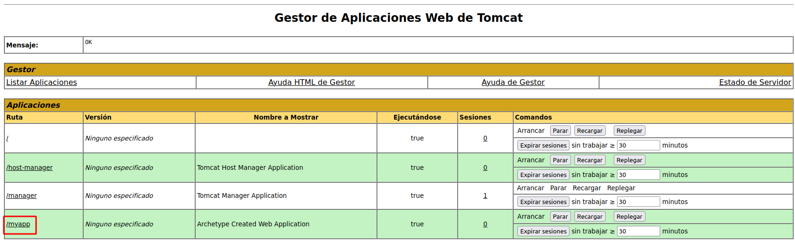

# Práctica 3.1: Instalación de Tomcat

## Introducción

Si consultamos el apartado de [versiones de Tomcat](https://tomcat.apache.org/whichversion.html) en su página oficial, nos daremos cuenta de que no vamos a usar la última versión, la 10, para esta práctica, sino la anterior, la 9. La pregunta es casi inevitable:

### ¿Por qué?

En el enlace anterior vemos como desde su versión 9, Tomcat da soporta a Java 8 y superiores. Sin embargo, a partir de la versión 10.1.x, da soporte a Java 11 y superiores.

**¿Qué significa esto?**

En Java 9 se introdujeron novedades como un nuevo sistema de módulos (Jigsaw), [entre otras](https://blog.codmind.com/java-9-analisis-de-las-novedades/).

En Java 11 se dio un paso más al haber renombrado completamente las rutas de paquetes javax.* a jakarta.*. Oracle, a pesar de haber hecho público el desarrollo de Java, no hizo lo mismo con su nombre. 

Así las cosas, resulta que Java 8 puede que a día de hoy aún sea la más usada en proyectos reales. Dicho esto, podría realizarse un proceso de migración de un proyecto de Java 8 a Java 11 y utilizarlo en Tomcat 10.

No obstante, para Java 8 su soporte para uso comercial (pagando) acabó [en Marzo de 2022](https://en.wikipedia.org/wiki/Java_version_history), pero para uso no comercial sigue hasta 2030.

En conclusión, no es raro encontrarse en el mundo real un proyecto a desplegar realizado en Java 8. Podría realizarse una migración y los conceptos de despliegue que veremos seguirían aplicando. Así las cosas, por facilidad en la realización de las prácticas utilizaremos Tomcat 9 y el plugin oficial de Maven para Tomcat 7 para el despliegue (luego veremos el motivo).


### Instalación de Tomcat

Esta práctica es muy sencilla y va a consistir en realizar la instalación del servidor de aplicaciones Tomcat 9, en una máquina virtual corriendo Debian 11 Bullseye.


Se puede hacer tanto con el administrador de paquetes `apt` como de forma manual. La <u>forma más recomendable</u> por su sencillez es la primera.

Para ello, y como sugerencia, podéis apoyaros en [este tutorial online](https://linuxhint.com/install-apache-tomcat-debian-11/), aunque sóis libres de consultar tantas fuentes como deseéis.

Obviamente, debéis utilizar vuestro propios usuarios y contraseña.

### Despliegue manual mediante la GUI de administración

Realizaremos el despliegue manual de una aplicación ya previamente empaquetada en formato WAR. Para ello:

1. Nos logueamos con el usuario previamente creado.

2. Buscamos la sección que nos permite desplegar un WAR manualmente, seleccionamos nuestro archivo y lo desplegamos. 
    
    

Tras estos pasos, se nos listará la aplicación ya desplegada como un directorio más y podremos acceder a ella. 

!!!task 
    Documenta el despliegue manual de la aplicación que os podéis descargar para tal efecto en Aules (archivo .war).

### Despliegue con Maven

#### Instalación de Maven

Para instalar Maven en nuestro Debian tenemos, de nuevo, dos opciones:

+ Instalación mediante gestor de paquetes APT

+ Instalación manual

La primera, <u>recomendada</u>,  es mucho más sencilla y automatizada (establece todos los paths y variables de entorno), aunque con la segunda se podría conseguir un paquete más actualizado.

Ambos métodos vienen explicados [aquí](https://www.how2shout.com/linux/how-to-install-apache-maven-on-debian-11-bullseye/)

Si decidimos seguir el primer método, el más sencillo, vemos que es tan simple como actualizar los repositorios:

```sh
sudo apt update
```

E instalar Maven

```sh
sudo apt install maven
```
Para comprobar que todo ha ido correctamente, podemos ver la versión instalada de Maven:

```sh
maven --v
```
#### Configuración de Maven

Para poder realizar despliegues en nuestro Tomcat previamente instalado, necesitamos realizar la configuración adecuada para Maven. Ya sabemos que esto en Linux significa editar los archivos de configuración adecuados. Vamos a ello.

1. En primer lugar necesitamos asegurarnos de que en el apartado anterior de la práctica hemos añadido todos los usuarios necesarios, así como sus respectivos roles. Debemos añadir el rol de `manager-script` para permitir que Maven se autentique contra Tomcat y pueda realizar el despliegue.
 
    Los roles utilizados por Tomcat vienen detallados en [su documentación](https://tomcat.apache.org/tomcat-9.0-doc/manager-howto.html), que merece ser consultada:

    

    En dicha documentación se nos indica que, por temas de seguridad, es recomendable no otorgar los roles de **manager-script** o **manager-jmx** al mismo usuario que tenga el rol de **manager-gui**. 

    !!!info 
        Tendremos dos usuarios, uno para la GUI y otro exclusivamente para hacer los deploys de Maven.

    Así las cosas, modificamos el archivo `/etc/tomcat9/tomcat-users.xml` acorde a nuestras necesidades (los nombres de usuario y contraseña deberán ser los que elijáis para vosotros):

    

2. Editar el archivo `/etc/maven/settings.xml`  para indicarle a Maven, un identificador para el servidor sobre el que vamos a desplegar (no es más que un nombre, ponedle el nombre que consideréis), así como las credenciales. Todo esto se hará dentro del bloque *servers* del XML:

    

3. Ahora debemos modificar el `POM` del proyecto para que haga referencia a que el despliegue se realice con el plugin de Maven para Tomcat. 

    !!!info
        No existen plugins **oficiales** para Tomcat más allá de la versión 7 del servidor. No obstante, el plugin para Tomcat 7 sigue funcionando correctamente con Tomcat 9. 
        
        Otra opción sería utilizar el plugin [Cargo](https://codehaus-cargo.github.io/cargo/Home.html)

    
    

    Donde lo que añadimos es el bloque 

    ```yaml
    <build>
            <finalName>war-deploy</finalName> #(1)
            <plugins> 
            <plugin>
            <groupId>org.apache.tomcat.maven</groupId>
            <artifactId>tomcat7-maven-plugin</artifactId>
            <version>2.2</version>
            <configuration>
                <url>http://localhost:8080/manager/text</url> #(2)
                <server>Tomcat.P.3.1</server> #(3)
                <path>/myapp</path> #(4)
            </configuration>
            </plugin>
            </plugins>
    </build>
    ```

    1. Nombre final del ejecutable .jar que se va a generar
   
    2. URL del servidor Tomcat donde se hará el despliegue. Como en nuestro caso Maven y Tomcat están en el mismo servidor, la URL corresponde a localhost.
        Esta URL debe ir seguida por `/manager/text`, tal y como leemos en la [documentación del plugin](https://tomcat.apache.org/maven-plugin-2.2/).
    
    3. Nombre del server donde se va a desplegar la aplicación. El nombre debe ser consistente con lo que hayamos puesto en el `settings.xml` del paso anterior.

    4. Nombre que la aplicación utilizará en el path de la URL

#### Despliegue 

Ahora crearemos una aplicación Java de prueba para ver si podemos desplegarla sobre la arquitectura que hemos montado. Para ello utilizamos el comando:

```sh
    mvn archetype:generate -DgroupId=raul -DartifactId=war-deploy -DarchetypeArtifactId=maven-archetype-webapp -DinteractiveMode=false
```

Podéis sustituir los valores de `groupID` y `artifactId` (este será el nombre de la aplicación) por lo que queráis.

Tras generar esta aplicación, los comandos finales que se utilizan en Maven para desplegar, volver a desplegar o desplegar una aplicación, son:

+ `mvn tomcat7:deploy`
+ `mvn tomcat7:redeploy`
+ `mvn tomcat7:undeploy`

Así pues, tras el despliegue con Maven nos indicará que todo ha ido correctamente con un mensaje de `BUILD SUCCESS`, tal que así:


Y, accediendo a través de la GUI, debemos ver que la aplicación está desplegado y que podemos acceder a ella perfectamente:



##### Tarea

Vamos a repetir el despliegue pero esta vez con otra aplicación. Más adelante ya hablaremos de `git` pero de momento, usaremos los comandos que veremos a continuación.

Nos clonamos el repositorio:

   `git clone https://github.com/cameronmcnz/rock-paper-scissors.git`

Nos situamos dentro de él:

   `cd rock-paper-scissors`

Y cambiamos de rama:

   `git checkout patch-1`

Tras esto debemos proceder exactamente igual que en el caso anterior, con la ventaja de que ya tenemos configurados los usuarios de Tomcat y los parámetros de Maven.

Así pues, sólo habría que añadir el bloque `<plugin>...</plugin>` adecuado para poder hacer nuestro despliegue.

!!!task 
    Documenta, incluyendo capturas de pantallas, el proceso que has seguido para realizar el despliegue de esta nueva aplicación, así como el resultado final.

### Cuestiones

Habéis visto que los archivos de configuración que hemos tocado contienen contraseñas en texto plano, por lo que cualquiera con acceso a ellos obtendría las credenciales de nuestras herramientas. 

En principio esto representa un gran riesgo de seguridad, ¿sabrías razonar o averigüar por qué esto está diseñado de esta forma?

## Referencias

[Tutorial Tomcat I](https://www.how2shout.com/linux/install-apache-tomcat-10-on-debian-11-linux/)

[Tutorial Tomcat II](https://www.linuxtechi.com/how-to-install-apache-tomcat-on-debian/)

[Tutorial Tomcat para Ubuntu](https://www.digitalocean.com/community/tutorials/how-to-install-apache-tomcat-10-on-ubuntu-20-04)

[Instalación Maven](https://www.how2shout.com/linux/how-to-install-apache-maven-on-debian-11-bullseye/)

[JSF 3.0 en Tomcat 10 con Java 11](https://www.nestoralmeida.com/jsf-3-0-en-tomcat-10-con-java-11/#9-renombrar-javax-a-jakarta)

[Migración de Java 8 a Java 11](https://www.adictosaltrabajo.com/2019/05/21/migracion-de-java-8-a-java-11/)

[Install and configure jdk11 + Tomcat + Maven under Linux system](https://developpaper.com/install-and-configure-jdk11-tomcat-maven-under-linux-system/)

[Step-by-step Maven Tomcat WAR file deploy example](https://www.theserverside.com/video/Step-by-step-Maven-Tomcat-WAR-file-deploy-example)

[How to deploy the java application to Tomcat 9 webserver using Maven](https://devopspilot.com/content/tomcat/tutorials/how-to-deploy-java-application-to-tomcat-using-maven.html)

[How to Install Apache Maven on Debian 11 Bullseye](https://www.how2shout.com/linux/how-to-install-apache-maven-on-debian-11-bullseye/)

[How to Deploy a WAR File to Tomcat](https://www.baeldung.com/tomcat-deploy-war)

[Migrate Maven Projects to Java 11](https://winterbe.com/posts/2018/08/29/migrate-maven-projects-to-java-11-jigsaw/)

[How to configure Tomcat 9.0 in Maven](https://programmer.group/how-to-configure-tomcat-9.0-in-maven.html)

[Github: cameronmcnz/rock-paper-scissors](https://github.com/cameronmcnz/rock-paper-scissors)

[Why are plain text passwords in the config files?](https://cwiki.apache.org/confluence/display/TOMCAT/Password)

[How to avoid storing passwords in the clear for tomcat's server.xml Resource definition of a DataSource?](https://stackoverflow.com/questions/129160/how-to-avoid-storing-passwords-in-the-clear-for-tomcats-server-xml-resource-def)