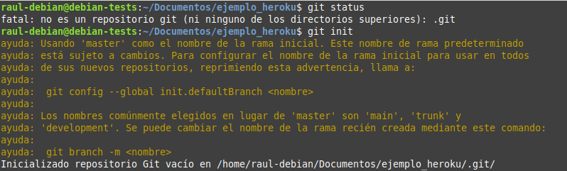
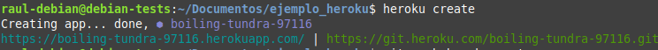
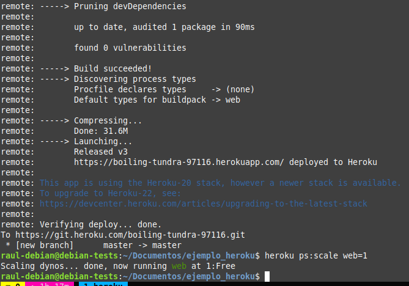

# Práctica 3.4: Despliegue de una aplicación Node.js en Heroku (PaaS)

## Prerrequisitos

!!!warning "¡Atención!"
    Para poder comenzar esta práctica es indispensable que os hayáis creado antes una cuenta gratuitas en Heroku:

    [Heroku](https://www.heroku.com/)

## Introducción

En la práctica anterior hemos visto cómo desplegar una aplicación de Node.js sobre un servidor Express en local (en nuestro propio servidor Debian).

La práctica anterior podría asemejarse a las pruebas que realiza un desarrollador antes de pasar su aplicación al entorno de producción. 

A la hora de desplegar la aplicación en producción, podría utilizarse el método de copiar los archivos al servidor concreto vía SSH u otros y desplegarla para dejarla funcionando. No obstante, esta práctica se acerca más a la realidad ya que utilizaremos un repositorio de Github y una plataforma de PaaS (Platform as a Service) como Heroku para desplegar adecuadamente nuestra aplicación en producción.

### ¿Qué es Github?

A pesar de que trataremos un poco más en profundidad Github en el siguiente tema, daremos una breve explicación aquí.

GitHub es un servicio basado en la nube que aloja un sistema de control de versiones (VCS) llamado Git. Éste permite a los desarrolladores colaborar y realizar cambios en proyectos compartidos, a la vez que mantienen un seguimiento detallado de su progreso.


El control de versiones es un sistema que ayuda a rastrear y gestionar los cambios realizados en un archivo o conjunto de archivos. Utilizado principalmente por ingenieros de software para hacer un seguimiento de las modificaciones realizadas en el código fuente, el sistema de control de versiones les permite analizar todos los cambios y revertirlos sin repercusiones si se comete un error.

### ¿Qué es Heroku?

Heroku es una solución de Plataforma como Servicio (PaaS) basada en la nube para que el cliente solo se preocupe de desarrollar su aplicación mientras Heroku se encarga de la infraestructura que hay detrás.

Para proporcionar este servicio se dispone de unos contenedores virtuales que son los encargados de mantener y ejecutar las aplicaciones. Estos contenedores virtuales son totalmente escalables bajo demanda. Tanto en número como en capacidades.

{: style="height:250px;width:600px"}

Una ventaja de elegir Heroku es su capacidad de soportar múltiples lenguajes de programación. Los principales a utilizar son: Node.js, Ruby, Python, Java, PHP, Go, Scala y Clojure. Aunque esta cantidad de lenguajes puede aumentar en el caso de utilizar Heroku Buildpacks, que permiten compilar las aplicaciones en multitud de ellos más.

!!!note
    Tanto **Github** como **Heroku** pueden ser controlados desde el terminal de nuestro Linux, por lo que seguiremos el procedimiento de contectarnos vía SSH a nuestro Debian y realizar las operaciones por terminal.

## Creación de nuestra aplicación 

Tras loguearnos por SSH en nuestro Debian, nos crearemos un directorio para albergar la aplicacón con el nombre que queramos. En ese directorio, crearemos los 3 archivos (dos `.html` y un `.js`)que conformarán nuestra sencilla aplicación de ejemplo:

=== "head.html"

    ```HTML
    <!DOCTYPE html>
    <html>
    <head>
            <title>Hola Mundo</title>
    </head>
    <body>

            <h1>Esta es la pagina principal</h1>

    <p><a href="/tailPage">Ir a la siguiente pagina</a></p>


    </body>
    ```

=== "tail.html"

    ```HTML
    <!DOCTYPE html>
    <html>
    <head>
            <title>Hola Mundo</title>
    </head>
    <body>
            <h1>FUNCIONA</h1>

    </body>
    ```

=== "aplicacion.js"

    ```javascript
    var http = require('http');
    var fs = require('fs'); // para obtener los datos del archivo html

    http.createServer(function (req, res) {
        res.writeHead(200, { 'Content-Type': 'text/html' });

        // req.url almacena el path o ruta de la URL
        var url = req.url;
        if (url === "/") {
    // fs.readFile busca el archivo HTML
    // el primer parámetro es el path al archivo HTML
    // y el segundo es el callback de la función
    // si el archivo no se encuentra, la función devuelve un error
    // si el archivo se encuentra, el contenido del mismo se encuentra en pgres    
            fs.readFile("head.html", function (err, pgres) {
                if (err)
                    res.write("HEAD.HTML NOT FOUND");
                else {
                    // Las siguientes 3 lineas
                    // tienen la función de enviar el archivo html
                    // y finalizar el proceso de respuesta
                    res.writeHead(200, { 'Content-Type': 'text/html' });
                    res.write(pgres);
                    res.end();
                }
            });
        }
        else if (url === "/tailPage") {
            fs.readFile("tail.html", function (err, pgres) {
                if (err)
                    res.write("TAIL.HTML NOT FOUND");
                else {
                    res.writeHead(200, { 'Content-Type': 'text/html' });
                    res.write(pgres);
                    res.end();
                }
            });
        }
        
    }).listen(3000, function () {
        console.log("SERVER STARTED PORT: 3000");
    });
    ```

Ahora, tal y como hacemos siempre a la hora de crear nuestra aplicación **Node.js**, con el fin de crear el archivo `package.json`, utilizaremos en el terminal el comando:

```sh
npm init
```

Podemos probar que nuestra aplicación funciona perfectamente en local:

```sh
node aplicacion.js
```

Y tras ello, debemos poder acceder, desde nuestra máquina anfitriona a `http://IP-maq-virtual:3000`

Ya con la aplicación creada y comprobada, podremos desplegarla en múltiples plataformas en la nube, como AWS, GCP, Azure, Digital Ocean, Heroku...

## Proceso de despliegue en Heroku

Para trabajar con Heroku desde nuestro terminal, debemos instalar el propio CLI de Heroku. Consultando la [documentación](https://devcenter.heroku.com/articles/heroku-cli#install-the-heroku-cli), vemos que hemos de ejecutar:

```sh
curl https://cli-assets.heroku.com/install.sh | sh
```

Y comprobamos que se ha instalado correctamente consultando su versión:

```sh
heroku -v
```

Lo siguiente será loguearnos en nuestra cuenta de Heroku mediante el terminal, para ello:

```sh
heroku login
```
Esto en teoría nos abre una pestaña del navegador para loguearnos en nuestra cuenta. Puesto que estamos conectados por SSH a nuestra Debian, no sucederá esto ya que el único puerto por el que nos comunicamos es por el 22. Necesitaríamos un túnel SSH para redirigir los puertos de la máquina Debian remota a la nuestra y que nos abriese el navegador en nuestra máquina. 

Puesto que esto escapa de los objetivos del módulo y con el fin de agilizar el proceso, simplemente copiaremos la URL y la pegaremos en nuestro navegador para loguearnos.


Antes de continuar, conviene asegurarnos de que tenemos la última versión de git en nuestra Debian:

```sh
sudo apt-get update && sudo apt-get install git
```

<!-- Es posible manejar nuestros repositorios de Github desde la interfaz gráfica del sitio vía navegador web o bien, desde el terminal de nuestra Debian. Nosotros utilizaremos esta última opción.

Desde Github, desplegaremos nuestra aplicación en Heroku. Si bien esto antes podía realizarse desde el mismo dashboard de Heroku la integración con nuestro Github y el posterior despliegue, esto ya no es posible desde abril de este 2022 por ciertos [problemas de seguridad](https://github.blog/2022-04-15-security-alert-stolen-oauth-user-tokens/) que surgieron con el acceso a repositorios restringidos.

Es por este motivo que usamos Heroku CLI para el despliegue, pudiendo realizar las acciones desde nuestro terminal.

Así pues, vayamos por pasos:

1. Crearemos un repositorio nuevo en nuestro Github, que contendrá los archivos que ya creamos anteriormente para nuestra aplicación Node.js. Este proceso viene descrito fácilmente [aquí](https://docs.github.com/es/get-started/quickstart/create-a-repo)

2. Una vez creado el repositorio, lo clonamos: -->


Ahora, dentro del directorio que habíamos creado previamente para nuestra aplicación, se trata de seguir unos sencillos pasos:

!!!tip
    Aquí aparece explicado con lenguaje *llano* más adelante en el módulo ya hablaremos con mayor propiedad de estas acciones con git

1. Nos aseguramos de que nuestro directorio no es aún un repositorio: `git status`

    Y lo iniciamos: `git init`

    

2. Ahora añadimos todos los archivos presentes en el directorio (`.`) para ser enviados al repositorio: `git add .`
    
    Y los preparamos para que sean envidos al repositorio: `git commit -m "Comentario explicativo del commit"`
    
    

3. Creamos nuestra aplicación en Heroku: `heroku create`

    

    Esto creará un git remoto que conectará con nuestro repositorio git local


4. Desplegamos nuestra aplicación en el server de Heroku : `git push heroku master`

    Y comprobamos que la instancia está corriendo: `heroku ps:scale web=1`

    

    

5. El comando `heraku open` abriría nuestra aplicación en el navegador. Sin embargo, por el problema explicado antes de estar conectados por SSH, esto no ocurrirá. No obstante, podemos acceder a nuestra aplicación de otra forma rápida y sencilla desde nuestro dashboard de Heroku:

    + Localizamos nuestra aplicación:

        

    + Y tras hacer click en ella, localizamos el botón que nos permite abrirla y volvemos a hacer click:
  
         

    + Comprobando que nuestra aplicación, efectivametne se ha desplegado en Heroku y funciona a la perfección:
  
         

         

## Cuestiones

1. Investiga y explica que es un Dyno en terminología Heroku.

2. En Heroku no todo es de color de rosa, tiene sus limitaciones y desventajas. Busca, investiga y explica algunas de ellas detalladamente.

!!!task
    Documenta la realización de toda esta práctica adecuadamente, con las explicaciones y justificaciones necesarias y las capturas de pantalla pertinentes.


## Referencias

[¿Qué es Github?](https://www.hostinger.es/tutoriales/que-es-github)

[¿Qué es Heroku?](https://www.nts-solutions.com/blog/heroku-que-es.html)

[Deploying Node.js applications](https://www.geeksforgeeks.org/deploying-node-js-applications/)

[List of all limitations in Heroku platform](https://riptutorial.com/heroku/example/21465/list-of-all-limitations-in-heroku-platform)