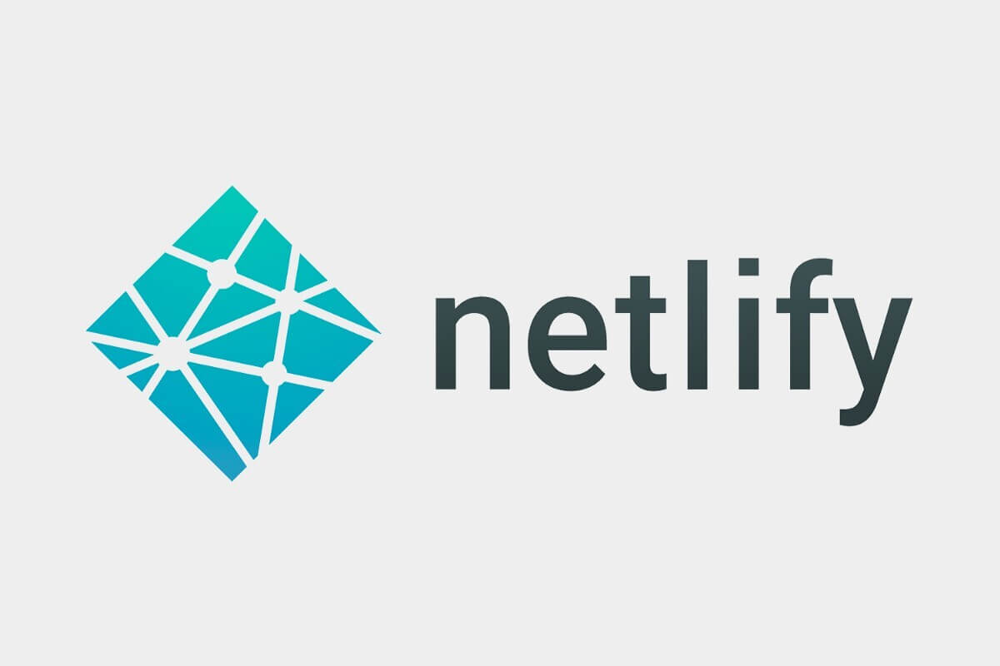
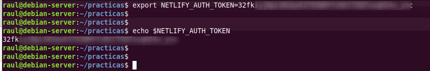
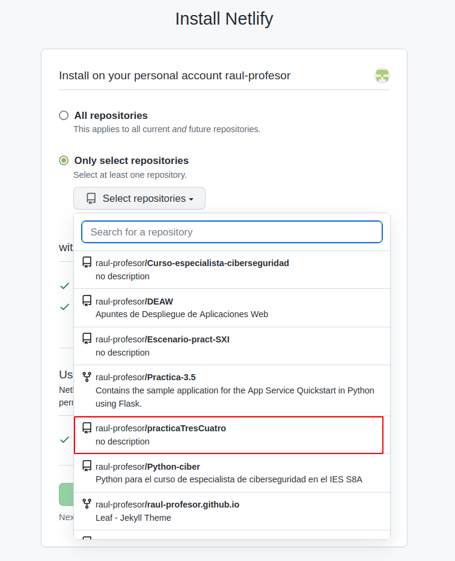
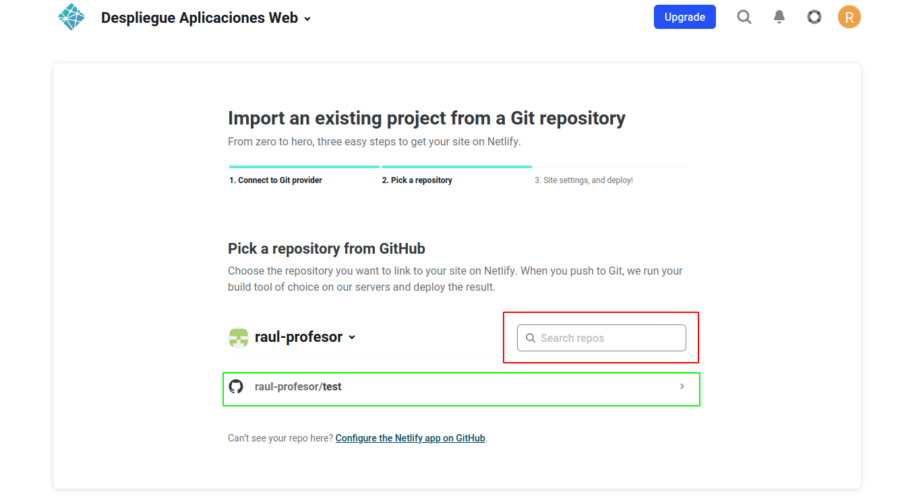
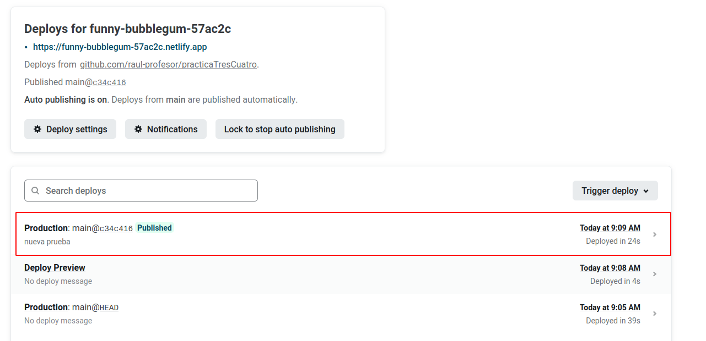

# Práctica 3.4: Despliegue de una aplicación Node.js en Heroku (PaaS) y una aplicación React en Netlify (PaaS)

<!-- ## Prerrequisitos

!!!note "Nota"
    Para esta práctica vamos a crearnos cuentas en distintos servicios cuando se os pida:

    [Heroku](https://www.heroku.com/)
    [GitHub](https://github.com/)
    [Netlify](https://www.netlify.com/) -->

## Introducción

En la práctica anterior hemos visto cómo desplegar una aplicación de Node.js sobre un servidor Express en local (en nuestro propio servidor Debian).

La práctica anterior podría asemejarse a las pruebas que realiza un desarrollador antes de pasar su aplicación al entorno de producción. 

Ya sabemos que entendemos el *despliegue o deployment* como el proceso de mover nuestro código típicamente de un sistema de control de versiones a una plataforma de hosting donde se aloja y es servida a los usuarios finales. 

A la hora de desplegar la aplicación en producción, podría utilizarse el método de copiar los archivos al servidor concreto vía el vetusto FTP, SSH u otros y desplegarla para dejarla funcionando. No obstante, esta práctica se acerca más a la realidad ya que utilizaremos un repositorio de Github y una plataforma de PaaS (Platform as a Service) como Heroku o Netlify para desplegar adecuadamente nuestra aplicación en producción.

### ¿Qué es Github?

A pesar de que trataremos un poco más en profundidad Github en el siguiente tema, daremos una breve explicación aquí.

GitHub es un servicio basado en la nube que aloja un sistema de control de versiones (VCS) llamado Git. Éste permite a los desarrolladores colaborar y realizar cambios en proyectos compartidos, a la vez que mantienen un seguimiento detallado de su progreso.


El control de versiones es un sistema que ayuda a rastrear y gestionar los cambios realizados en un archivo o conjunto de archivos. Utilizado principalmente por ingenieros de software para hacer un seguimiento de las modificaciones realizadas en el código fuente, el sistema de control de versiones les permite analizar todos los cambios y revertirlos sin repercusiones si se comete un error.

### ¿Qué es Heroku?

Heroku es una solución de Plataforma como Servicio (PaaS) basada en la nube para que el cliente solo se preocupe de desarrollar su aplicación mientras Heroku se encarga de la infraestructura que hay detrás.

Para proporcionar este servicio se dispone de unos contenedores virtuales que son los encargados de mantener y ejecutar las aplicaciones. Estos contenedores virtuales son totalmente escalables bajo demanda. Tanto en número como en capacidades.

{: style="height:250px;width:600px"}

Una ventaja de elegir Heroku es su capacidad de soportar múltiples lenguajes de programación. Los principales a utilizar son: Node.js, Ruby, Python, Java, PHP, Go, Scala y Clojure. Aunque esta cantidad de lenguajes puede aumentar en el caso de utilizar Heroku Buildpacks, que permiten compilar las aplicaciones en multitud de ellos más.

!!!note
    Tanto **Github**, como **Heroku**, como **Netlify** pueden ser controlados desde el terminal de nuestro Linux, por lo que seguiremos el procedimiento de contectarnos vía SSH a nuestro Debian y realizar las operaciones por terminal.

### ¿Qué es Netlify?

Netlify es un proveedor de alojamiento en la nube que proporciona servicios de backend sin servidor (*serverless*) para sitios web estáticos. Está diseñado para maximizar la productividad en el sentido de que permite a los desarrolladores (especialmente orientados al frontend), y a los ingenieros construir, probar y desplegar rápidamente sitios web/aplicaciones.

Funciona conectándose a un repositorio de GitHub, de donde extrae el código fuente. A continuación, ejecutará un proceso de construcción para pre-renderizar las páginas de nuestro sitio web/aplicación en archivos estáticos.

{: style="height:350px;width:600px"}


Hay numerosas razones a favor de usar Netlify, aquí están algunas de ellas:

  + Netlify hace que sea increíblemente sencillo desplegar un sitio web - de hecho, la forma más sencilla de lograrlo es utilizar GitHub, GitLab o Bitbucket para configurar el despliegue continuo.
  
  + Netlify hace que sea súper fácil lanzar un sitio web con su solución de gestión de DNS incorporada.
   
  + Podríamos desplegar fácilmente sólo una rama específica de nuestro proyecto Git - esto es útil para probar nuevas características que pueden o no llegar a la rama maestra/principal, o para determinar rápidamente cómo un PR (Pull Request) afectará a su sitio.

  + Netlify te permite previsualizar cualquier despliegue que hagas o quieras hacer - esto te permite a ti y a tu equipo ver cómo se verán los cambios en producción sin tener que desplegarlos en tu sitio existente.

  + Netlify proporciona una práctica función de envío de formularios que nos permite recoger información de los usuarios.


## Creación de nuestra aplicación para Heroku

Tras loguearnos por SSH en nuestro Debian, nos crearemos un directorio para albergar la aplicacón con el nombre que queramos. En ese directorio, crearemos los 3 archivos (dos `.html` y un `.js`)que conformarán nuestra sencilla aplicación de ejemplo:

=== "head.html"

    ```HTML
    <!DOCTYPE html>
    <html>
    <head>
            <title>Hola Mundo</title>
    </head>
    <body>

            <h1>Esta es la pagina principal</h1>

    <p><a href="/tailPage">Ir a la siguiente pagina</a></p>


    </body>
    ```

=== "tail.html"

    ```HTML
    <!DOCTYPE html>
    <html>
    <head>
            <title>Hola Mundo</title>
    </head>
    <body>
            <h1>FUNCIONA</h1>

    </body>
    ```

=== "aplicacion.js"

    ```javascript
    var http = require('http');
    var fs = require('fs'); // para obtener los datos del archivo html
    var port = process.env.PORT || 8080; //Para que funcione en Heroku ya que da error 137 con el puerto 3000

    http.createServer(function (req, res) {
        res.writeHead(200, { 'Content-Type': 'text/html' });

        // req.url almacena el path o ruta de la URL
        var url = req.url;
        if (url === "/") {
    // fs.readFile busca el archivo HTML
    // el primer parámetro es el path al archivo HTML
    // y el segundo es el callback de la función
    // si el archivo no se encuentra, la función devuelve un error
    // si el archivo se encuentra, el contenido del mismo se encuentra en pgres    
            fs.readFile("head.html", function (err, pgres) {
                if (err)
                    res.write("HEAD.HTML NOT FOUND");
                else {
                    // Las siguientes 3 lineas
                    // tienen la función de enviar el archivo html
                    // y finalizar el proceso de respuesta
                    res.writeHead(200, { 'Content-Type': 'text/html' });
                    res.write(pgres);
                    res.end();
                }
            });
        }
        else if (url === "/tailPage") {
            fs.readFile("tail.html", function (err, pgres) {
                if (err)
                    res.write("TAIL.HTML NOT FOUND");
                else {
                    res.writeHead(200, { 'Content-Type': 'text/html' });
                    res.write(pgres);
                    res.end();
                }
            });
        }
        
    }).listen(port, function () {
        console.log("SERVER STARTED PORT: 8080");
    });
    ```

Ahora, tal y como hacemos siempre a la hora de crear nuestra aplicación **Node.js**, con el fin de crear el archivo `package.json`, utilizaremos en el terminal el comando:

```sh
npm init
```

Podemos probar que nuestra aplicación funciona perfectamente en local:

```sh
node aplicacion.js
```

Y tras ello, debemos poder acceder, desde nuestra máquina anfitriona a `http://IP-maq-virtual:8080`

Ya con la aplicación creada y comprobada, podremos desplegarla en múltiples plataformas en la nube, como AWS, GCP, Azure, Digital Ocean, Heroku...

!!!warning "¡Ojo!"

    Para que nos funcione en Heroku, en el archivo `package.json` que se nos ha creado al hacer el `npm init` debemos hacerle una modificación.

    En el bloque scripts, debemos borrar lo que haya dentro y dejar únicamente <u>dentro de él</u>:

    ```json
    "start": "node aplicacion.js"
    ```

    De forma que Heroku sepa que comando utilizar para iniciar la aplicación tras desplegarla.

## Proceso de despliegue en Heroku

Para trabajar con Heroku desde nuestro terminal, debemos instalar el propio CLI de Heroku. Consultando la [documentación](https://devcenter.heroku.com/articles/heroku-cli#install-the-heroku-cli), vemos que hemos de ejecutar:

```sh
curl https://cli-assets.heroku.com/install.sh | sh
```

Y comprobamos que se ha instalado correctamente consultando su versión:

```sh
heroku -v
```

Lo siguiente será loguearnos en nuestra cuenta de Heroku mediante el terminal, para ello:

```sh
heroku login
```
Esto en teoría nos abre una pestaña del navegador para loguearnos en nuestra cuenta. Puesto que estamos conectados por SSH a nuestra Debian, no sucederá esto ya que el único puerto por el que nos comunicamos es por el 22. Necesitaríamos un túnel SSH para redirigir los puertos de la máquina Debian remota a la nuestra y que nos abriese el navegador en nuestra máquina. 

Puesto que esto escapa de los objetivos del módulo y con el fin de agilizar el proceso, simplemente copiaremos la URL y la pegaremos en nuestro navegador para loguearnos.


Antes de continuar, conviene asegurarnos de que tenemos la última versión de git en nuestra Debian:

```sh
sudo apt-get update && sudo apt-get install git
```

<!-- Es posible manejar nuestros repositorios de Github desde la interfaz gráfica del sitio vía navegador web o bien, desde el terminal de nuestra Debian. Nosotros utilizaremos esta última opción.

Desde Github, desplegaremos nuestra aplicación en Heroku. Si bien esto antes podía realizarse desde el mismo dashboard de Heroku la integración con nuestro Github y el posterior despliegue, esto ya no es posible desde abril de este 2022 por ciertos [problemas de seguridad](https://github.blog/2022-04-15-security-alert-stolen-oauth-user-tokens/) que surgieron con el acceso a repositorios restringidos.

Es por este motivo que usamos Heroku CLI para el despliegue, pudiendo realizar las acciones desde nuestro terminal.

Así pues, vayamos por pasos:

1. Crearemos un repositorio nuevo en nuestro Github, que contendrá los archivos que ya creamos anteriormente para nuestra aplicación Node.js. Este proceso viene descrito fácilmente [aquí](https://docs.github.com/es/get-started/quickstart/create-a-repo)

2. Una vez creado el repositorio, lo clonamos: -->


Ahora, dentro del directorio que habíamos creado previamente para nuestra aplicación, se trata de seguir unos sencillos pasos:

!!!tip
    Aquí aparece explicado con lenguaje *llano* más adelante en el módulo ya hablaremos con mayor propiedad de estas acciones con git

1. Nos aseguramos de que nuestro directorio no es aún un repositorio: `git status`

    Y lo iniciamos: `git init`

    

2. Ahora añadimos todos los archivos presentes en el directorio (`.`) para ser enviados al repositorio: `git add .`
    
    Y los preparamos para que sean envidos al repositorio: `git commit -m "Comentario explicativo del commit"`
    
    

3. Creamos nuestra aplicación en Heroku: `heroku create`

    

    Esto creará un git remoto que conectará con nuestro repositorio git local


4. Desplegamos nuestra aplicación en el server de Heroku : `git push heroku master`

    Y comprobamos que la instancia está corriendo: `heroku ps:scale web=1`

    

    

5. El comando `heroku open` abriría nuestra aplicación en el navegador. Sin embargo, por el problema explicado antes de estar conectados por SSH, esto no ocurrirá. No obstante, podemos acceder a nuestra aplicación de otra forma rápida y sencilla desde nuestro dashboard de Heroku:

    + Localizamos nuestra aplicación:

        

    + Y tras hacer click en ella, localizamos el botón que nos permite abrirla y volvemos a hacer click:
  
         

    + Comprobando que nuestra aplicación, efectivametne se ha desplegado en Heroku y funciona a la perfección:
  
         

         


## Aplicación para Netlify

Puesto que el interés en este módulo radica en el proceso de despliegue, suponiendo que la parte de desarrollo ya es abordada en otros módulos, vamos a utilizar una aplicación de ejemplo que nos ahorre tiempo para centrarnos en el despliegue.

Nos clonaremos [este](https://github.com/StackAbuse/color-shades-generator) repositorio:

`git clone https://github.com/StackAbuse/color-shades-generator`


## Proceso de despliegue en Netlify

Por mera curiosidad y ambición de aprendizaje, vamos a ver dos métodos de despliegue en Netlify:

+ Despliegue manual desde el CLI de Netlify, es decir, desde el terminal, a partir de un directorio local de nuestra máquina.
+ Despliegue desde un código publicado en uno de nuestros repositorios de Github

El primero nos permitirá conocer el CLI de Netlify y el segundo nos acercara más a una experiencia real de despliegue.

!!!task
    Vuestra primera tarea será [registraros en Netlify](https://www.netlify.com/) con vuestro email (no con vuestra cuenta de Github) y decirle que no cuando os pida enlazar con vuestra cuenta de Github (lo haremos más adelante).

### Despliegue mediante CLI

Una vez registrados, debemos instalar el CLI de Netlify para ejecutar sus comandos desde el terminal:

```sh
sudo npm install netlify-cli -g
```

Está claro que para realizar acciones de deploy, Netlify nos solicitará una autenticación, esto se hace mediante el comando:

```sh
netlify login
```

El cual nos muestra una pantalla del navegador para que concedamos la autorización pertinente. Sin embargo, recordemos el problema de que estamos conectados por SSH a nuestro servidor y no tenemos la posibilidad del uso de un entorno gráfico.

En este caso, siguiendo las instrucciones de [la documentación](https://docs.netlify.com/cli/get-started/#obtain-a-token-in-the-netlify-ui):

+ Generamos el token de acceso

    

    


+ Lo establecemos como variable de ambiente:

    

	Y nos logueamos
	```
	netlify login
	```

Bueno, tenemos el código de nuestra aplicación, tenemos nuestra cuenta en Netlify y tenemos el CLI necesario para ejecutar comandos desde el terminal en esa cuenta... ¿Podemos proceder al despliegue sin mayores complicaciones?

La respuesta es **NO**, como buenos desarrolladores y en base a experiencias anteriores, ya sabéis que hay que hacer un *build* de la aplicación para, posteriormente, desplegarla. Vamos a ello.

En primer lugar, como sabemos, debemos instalar todas las dependencias que vienen indicadas en el archivo `package.json`:

```sh
npm install
```
Y cuando ya las tengamos instaladas podemos proceder a realizar el build:

```sh
npm run build
```

Esto nos creará una nueva carpeta llamada `build` que contendrá la aplicación que debemos desplegar. Y ya podemos hacer un pre-deploy de la aplicación de la que hemos hecho build antes:

```
netlify deploy
```
Nos hará algunas preguntas para el desplieuge:

+ Indicamos que queremos crear y configurar un nuevo site
+ El Team lo dejamos por defecto
+ Le indicamos el nombre que queremos emplear para la web (`nombre-practica3-4`) y el directorio a utilizar para el deploy (directorio `./build`).

Y si nos indica que todo ha ido bien e incluso podemos ver el "borrador" (Website Draft URL) de la web que nos aporta, podemos pasarla a producción finalmente tal y como nos indica la misma salida del comando:

```
If everything looks good on your draft URL, deploy it to your main site URL with the --prod flag.
netlify deploy --prod
```

!!!warning 
    No olvides desplegar finalmente en producción y comprobar que puedes acceder a la URL.


### Despliegue mediante conexión con Github

En primer lugar, vamos a eliminar el site que hemos desplegado antes en Netlify para evitarnos cualquier problema y/o conflicto:


En segundo lugar, vamos a borrar el directorio donde se halla el repositorio clonado en el paso anterior para así poder empezar de 0:

```
rm -rf directorio_repositorio
```

Como queremos simular que hemos picado el código a man o en local y lo vamos a subir a Github por primera vez, nos descargaremos los fuentes en formato `.zip` sin que tenga ninguna referencia a Github:

```sh
wget https://github.com/StackAbuse/color-shades-generator/archive/refs/heads/main.zip
```
Creamos una carpeta nueva y descomprimimos dentro el zip:

```sh
mkdir practica3.4

unzip main.zip -d practica3.4/
```

Entramos en la carpeta donde está el código:

```
cd practica3.4/color-shades-generator-main/
```
Ahora debemos crear un repositorio <u>**completamente vacío**</u> en Github que se llame `practicaTresCuatro`:


Y tras ello, volviendo al terminal a la carpeta donde estábamos, la iniciamos como repositorio, añadimos todo el contenido de la misma para el commit, hacemos el commit con el mensaje correspondiente y creamos la rama main:


```sh
$ git init
$ git add .
$ git commit -m "Subiendo el código..."
$ git branch -M main
```

Y ahora sólo queda referenciar nuestra carpeta al repositorio recién creado en Github y hacer un `push` para subir todo el contenido del commit a él:

```
$ git remote add origin https://github.com/username/practicaTresCuatro.git
$ git push -u origin main
```

Ahora que ya tenemos subido el código a GitHub, de alguna manera debemos *enganchar* o enlazar nuestra cuenta de Github con la de Netlify para que éste último pueda traerse el código de allí, hacer el build y desplegarlo. Así pues, entramos en nuestro dashboard de Netlify y le damos a importar proyecto existente de `git`:


Le indicamos que concretamente de Github:


Y nos saltará una ventana pidiendo que autoricemos a Netlify a acceder a nuestros repositorios de Github:


Y luego le indicaremos que no acceda a todos nuestros repositorios sino sólo al repositorio que necesitamos, que es donde tenemos el código de nuestra aplicación:



Y ya quedará todo listo:



Y desplegamos la aplicación:


Netlify se encargará de hacer el `build` de forma automática tal y como hemos visto en la imagen de arriba, con el comando `npm run build`, publicando el contenido del directorio `build`.

!!!warning "Atención"
    Tras el deploy, en "Site settings" podeís y debéis cambiar el nombre de la aplicación por nombre-practica3-4, donde *nombre* es vuestro nombre.

Lo que hemos conseguido de esta forma es que, cualquier cambio que hagamos en el proyecto y del que hagamos `commit` y `push` en Github, automáticamente genere un nuevo despliegue en Netlify. Es el principio de lo que más adelante veremos como *despliegue continuo*.

<u>Comprobemos que realmente es así:</u>

  + Dentro de la carpeta `public` encontramos el archivo `robots.txt`, cuyo cometido es indicar a los rastreadores de los buscadores a qué URLs del sitio pueden acceder. A este archivo se puede acceder a través de la URL del site:

    

  + Dentro de la carpeta `public`, utilizando el editor de texto que prefiráis en vuestro terminal, modificad el archivo `robots.txt` para que excluya un directorio que se llame `nombre_apellido`, utilizando obviamente vuestro nombre y apellido.

    ```
    User-agent: *
    Disallow: /nombre_y_apellido/
    ```
  
  + Haz un nuevo `commit` y `push` (del caso anterior, recuerda el commando `git` previo para añadir los archivos a hacer commit)
  + Comprueba en el dashboard de Netlify que se ha producido un nuevo deploy de la aplicación hace escasos segundos

    

    
          
  + Accede a `https://url_de_la_aplicacion/robots.txt` y comprueba que, efectivamente, se ve reflejado el cambio

    


## Cuestiones

1. Investiga y explica que es un Dyno en terminología Heroku.

2. En Heroku no todo es de color de rosa, tiene sus limitaciones y desventajas. Busca, investiga y explica algunas de ellas detalladamente.

!!!task
    Documenta la realización de toda esta práctica adecuadamente, con las explicaciones y justificaciones necesarias y las capturas de pantalla pertinentes.


## Referencias

[¿Qué es Github?](https://www.hostinger.es/tutoriales/que-es-github)

[¿Qué es Heroku?](https://www.nts-solutions.com/blog/heroku-que-es.html)

[Deploying Node.js applications](https://www.geeksforgeeks.org/deploying-node-js-applications/)

[List of all limitations in Heroku platform](https://riptutorial.com/heroku/example/21465/list-of-all-limitations-in-heroku-platform)

[How to deploy your website to Netlify for free](https://medium.com/geekculture/how-to-deploy-your-website-to-netlify-for-free-830e91705b7f)

[A Step-by-Step Guide: Deploying A Static Site or Single-page App](https://www.netlify.com/blog/2016/10/27/a-step-by-step-guide-deploying-a-static-site-or-single-page-app/)

[Guide to Deploying a React App to Netlify](https://stackabuse.com/guide-to-deploying-a-react-app-to-netlify/)

## Evaluación

| Criterio                                                                                                                                      | Puntuación   |
|-----------------------------------------------------------------------------------------------------------------------------------------------|--------------|
| Despliegue correcto y bien documentado en Heroku     | **2 puntos**      |
| Despliegue correcto y bien documentado en Netlify mediante CLI       | **0.75 puntos**  |
| Despliegue correcto y bien documentado en Netlify de forma manual desde el dashboard       | **2 puntos**  |
| Cambio de nombre del site       | **0.25 puntos**  |
| Comprobación correcta y bien documentada de despliegue automático al hacer push en Github       | **3 puntos**  |
| Respuestas correctas a las cuestiones            | **1 puntos**     |
| Se ha prestado especial atención al formato del documento, utilizando la plantilla actualizada y haciendo un correcto uso del lenguaje técnico | **1 puntos**     |