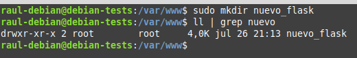
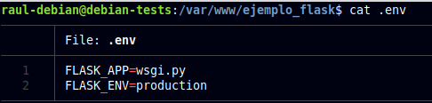
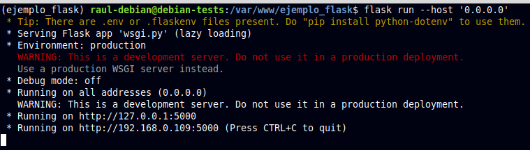
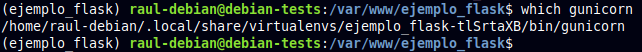

# Práctica 3.5: Despliegue de una aplicación Flask (Python)

## Prerrequisitos

Servidor Debian con los siguientes paquetes instalados:

 * Nginx
 * Gunicorn
 * Pipenv

## Introducción

### ¿Qué es un framework?

Actualmente en el desarrollo moderno de aplicaciones web se utilizan distintos Frameworks que son herramientas que nos dan un esquema de trabajo y una serie de utilidades y funciones que nos facilita y nos abstrae de la construcción de páginas web dinámicas.

En general los Frameworks están asociado a lenguajes de programación (Ruby on Rails (Ruby), Symphony (PHP)), en el mundo de Python el más conocido es Django pero Flask es una opción que quizás no tenga una curva de aprendizaje tan elevada pero nos posibilita la creación de aplicaciones web igual de complejas de las que se pueden crear en Django.

### Flask

En la actualidad existen muchas opciones para crear páginas web y muchos lenguajes (PHP, JAVA), y en este caso Flask nos permite crear de una manera muy sencilla aplicaciones web con Python.

Flask es un “micro” Framework escrito en Python y concebido para facilitar el desarrollo de Aplicaciones Web bajo el patrón MVC.

La palabra “micro” no designa a que sea un proyecto pequeño o que nos permita hacer páginas web pequeñas sino que al instalar Flask tenemos las herramientas necesarias para crear una aplicación web funcional pero si se necesita en algún momento una nueva funcionalidad hay un conjunto muy grande extensiones (plugins) que se pueden instalar con Flask que le van dotando de funcionalidad.


De principio en la instalación no se tienen todas las funcionalidades que se pueden necesitar pero de una manera muy sencilla se pueden extender el proyecto con nuevas funcionalidades por medio de plugins.

El patrón MVC es una manera o una forma de trabajar que permite diferenciar y separar lo que es el modelo de datos (los datos que van a tener la App que normalmente están guardados en BD), la vista (página HTML) y el controlador (donde se gestiona las peticiones de la app web).

### Gunicorn

Cuando se implementa una aplicación web basada en Python, normalmente se tienen estas tres piezas:

+ Servidor web (Nginx, Apache)
+ Servidor de aplicaciones WSGI (Gunicorn, uWSGI, mod_wsgi, Waitress)
+ Aplicación web (Django, Flask, Pyramid, FastAPI)

Los servidores web procesan y distribuyen las solicitudes de los navegadores y otros clientes y envían respuestas a los mismos.

WSGI (Web Server Gateway Interface) proporciona un conjunto de reglas para estandarizar el comportamiento y la comunicación entre servidores web y aplicaciones web. Mediante el uso de servidores y aplicaciones web compatibles con WSGI, los desarrolladores pueden concentrar su tiempo y energía en el desarrollo de aplicaciones web en lugar de administrar la comunicación entre la aplicación y el servidor web.

{: style="height:300px;width:550px"}

Finalmente, Gunicorn, que es la abreviatura de Green Unicorn, es un servidor de aplicaciones WSGI que se encuentra entre el servidor web y su aplicación web, gestionando la comunicación entre los dos. Acepta solicitudes del servidor y las traduce (a través de WSGI) en algo que la aplicación web puede entender antes de pasarla a la aplicación web real. Envía respuestas desde la aplicación web al servidor. También se encarga de ejecutar varias instancias de la aplicación web, reiniciándolas según sea necesario y distribuyendo solicitudes a instancias saludables.

### Gestor de paquetes `pip`

`pip` es el comando para instalar paquetes de Python integrados en las fuentes desde la versión 3.4.

Este comando automatiza la conexión al sitio https://pypi.org/, la descarga, la instalación e incluso la compilación del módulo solicitado.

Además, se ocupa de las dependencias de cada paquete.


### Entornos virtuales en Python 

Un entorno virtual es una forma de tener múltiples instancias paralelas del intérprete de Python, cada una con diferentes conjuntos de paquetes y diferentes configuraciones. Cada entorno virtual contiene una copia independiente del intérprete de Python, incluyendo copias de sus utilidades de soporte.

Los paquetes instalados en cada entorno virtual sólo se ven en ese entorno virtual y en ningún otro. Incluso los paquetes grandes y complejos con binarios dependientes de la plataforma pueden ser acorralados entre sí en entornos virtuales.

De esta forma, tendremos entornos independientes entre sí, parecido a como ocurría con los directorios de los proyectos de `Node.js`. De este modo, los entornos virtuales de Python nos permiten instalar un paquete de Python en una ubicación aislada en lugar de instalarlo de manera global.

### Pipenv

`Pipenv` es una herramienta que apunta a traer todo lo mejor del mundo de empaquetado (bundler, composer, npm, cargo, yarn, etc.) al mundo de Python. 

{: style="height:300px;width:550px"}

Automáticamente crea y maneja un entorno virtual para tus proyectos, también permite agregar/eliminar paquetes desde tu Pipfile así como como instalar/desinstalar paquetes. También genera lo más importante , el archivo `Pipfile.lock`, que es usado para producir determinado build.


{: style="height:300px;width:550px"}

## Procedimiento completo para el despliegue

1. Instalamos el gestor de paquetes de Python pip:
    
    ```bash
    sudo apt-get update

    sudo apt-get install python3-pip
    ```

2. Instalamos el paquete `pipenv` para gestionar los entornos virtuales:
    
    ```bash
    pip3 install pipenv
    ```
   
3. Y comprobamos que está instalado correctamente mostrando su versión:
     
    ```bash
    PATH=$PATH:/home/raul/.local/bin
    
    pipenv --version
    ```
   
4. Creamos el directorio en el que almacenaremos nuestro proyecto:
     
    ```bash
    sudo mkdir /var/www/nombre_mi_aplicacion
    ```
   
5. Al crearlo con `sudo`, los permisos pertenecen a root:
     
    
   
6. Hay que cambiarlo para que el dueño sea nuestro usuario (`raul-debian` en mi caso) y pertenezca al grupo `www-data`, el usuario usado por defecto por el servidor web para correr:
     
    ```bash
    sudo chown -R $USER:www-data /var/www/mi_aplicacion
    ```
   
7. Establecemos los permisos adecuados a este directorio, para que pueda ser leído por todo el mundo:
  
    ```bash
    chmod -R 775 /var/www/mi_aplicacion   
    ```
       
    !!!warning
        Es **indispensable** asignar estos permisos, de otra forma obtendríamos un error al acceder a la aplicación cuando pongamos en marcha **Nginx**

8. Dentro del directorio de nuestra aplicación, creamos un archivo oculto `.env` que contendrá las variables de entorno necesarias:

    ```bash
    touch .env
    ```

9. Editamos el archivo y añadimos las variables, indicando cuál es el archivo `.py` de la aplicación y el entorno, que en nuestro caso será producción: 

        

    !!!note "Nota"
        En el mundo laboral real, se supone que la aplicación previamente ha pasado por los entornos de dev, test y preprod para el desarrollo y prueba de la misma, antes de pasarla a producción.

10. Iniciamos ahora nuestro entorno virtual. `Pipenv` cargará las variables de entorno desde el fichero `.env` de forma automática:
    
    ```bash
    pipenv shell
    ```
    Veremos que se nos inicia el entorno virtual, cosa que comprobamos porque aparece su nombre al inicio del prompt del shell:

    

11. Usamos `pipenv` para instalar las dependencias necesarias para nuestro proyecto:

    ```bash
    pipenv install flask gunicorn
    ```

12. Vamos ahora a crear la aplicación *Flask* más simple posible, a modo de *PoC* (proof of concept o prueba de concepto). El archivo que contendrá la aplicación propiamente dicha será `application.py` y `wsgi.py` se encargará únicamente de iniciarla y dejarla corriendo:

    ```bash
    touch application.py wsgi.py
    ```
    Y tras crear los archivos, los editamos para dejarlos así:

    

13. Corramos ahora nuestra aplicación a modo de comprobación con el servidor web integrado de Flask. Si especificamos la dirección `0.0.0.0` lo que le estamos diciendo al servidor es que escuche en todas sus interfaces, si las tuviera:

    


14. Ahora podremos acceder a la aplicación desde nuestro ordenador, nuestra máquina anfitrión, introduciendo en un navegador web: `http://IP-maq-virtual:5000`:

    

    Tras la comprobación, paramos el servidor con `CTRL+C`

15. Comprobemos ahora que Gunicorn funciona correctamente también. Si os ha funcionado el servidor de desarrollo de Flask, podéis usar el siguiente comando para probar que la alicación funciona correctamente usando Gunicorn, accediendo con vuestro navegador de la misma forma que en el paso anterior:
    
    ```bash
    gunicorn --workers 4 --bind 0.0.0.0:5000 wsgi:app
    ```
    Donde:
    
    + `--workers N` establece el número de `workers` o hilos que queremos utilizar, como ocurría con Node Express. Dependerá del número de cores que le hayamos dado a la CPU de nuestra máquina virtual.
  
    + `--bind 0.0.0.0:5000` hace que el servidor escuche peticiones por todas sus interfaces de red y en el puerto 5000

    + `wsgi:app` es el nombre del archivo con extensión `.py` y `app` es la instancia de la aplicación Flask dentro del archivo.


16. Todavía dentro de nuestro entorno virtual, debemos tomar nota de cual es el path o ruta desde la que se ejecuta `gunicorn` para poder configurar más adelante un servicio del sistema. Podemos averigurarlo así:
    
    

    !!!tip
        Y tras ello debemos salir de nuestro entorno virtual con el sencillo comando `deactivate`

17. Puesto que ya debemos tener instalado Nginx en nuestro sistema, lo ininciamos y comprobamos que su estado sea activo:

    ```bash
    sudo systemctl start nginx
    
    sudo systemctl status nginx
    ```

18. Ya fuera de nuestro entorno virtual, crearemos un archivo para que [systemd](https://es.wikipedia.org/wiki/Systemd) corra Gunicorn como un servicio del sistema más:

    

    Donde:

    - **`User`**: Establece el usuario que tiene permisos sobre el directorio del proyecto (el que pusistéis en el paso 5)
    - **`Group`**: Establece el grupo que tiene permisos sobre el directorio del proyecto (el que pusistéis en el paso 5)
    - **`Environment`**: Establece el directorio `bin` (donde se guardan los binarios ejecutables) dentro del entorno virtual (lo vistéis en el paso 14)
    - **`WorkingDirectory`**: Establece el directorio base donde reside nuestro proyecto 
    - **`ExecStart`**: Establece el *path* donde se encuentra el ejecutable de `gunicorn` dentro del entorno virtual, así como las opciones y comandos con los que se iniciará 

    !!!warning
        Debéis cambiar los valores para que coincidan con los de vuestro caso particular.

19. Ahora, como cada vez que se crea un servicio nuevo de `systemd`, se habilita y se inicia:

    ```bash
    systemctl enable nombre_mi_servicio

    systemctl start nombre_mi_servicio
    ```

    Recordad que el nombre del servicio es el nombre del archivo que creastéis en el paso anterior.


    Pasemos ahora a configurar <u>**Nginx**</u>, que es algo que ya deberíamos tener dominado de capítulos anteriores.

20. Creamos un archivo con el nombre de nuestra aplicación y dentro estableceremos la configuración para ese sitio web. El archivo, como recordáis, debe estar en `/etc/nginx/sites-available/nombre_aplicacion` y tras ello lo editamos para que quede:

    ```yaml
    server {
        listen 80;
        server_name mi_aplicacion www.mi_aplicacion; #(1)

        access_log /var/log/nginx/mi_aplicacion.access.log; #(2)
        error_log /var/log/nginx/mi_aplicacion.error.log;

        location / { 
                include proxy_params;
                proxy_pass http://unix:/var/www/nombre_aplicacion/nombre_aplicacion.sock; #(3)
        }
    }   
    ```

    1. Nombre del dominio, ya veremos más adelante como el DNS resolverá este nombre para acceder a nuestra aplicación.

    2. Dónde estarán ubicados los logs de acceso y de errores.
       
    3. Bloque donde se le indica a Nginx que haga de proxy inverso hacia el socket creado en nuestra propia máquina por gunicorn para acceder a nuestra aplicación Flask.


21. Recordemos que ahora debemos crear un link simbólico del archivo de sitios webs disponibles al de sitios web activos:

    ```bash
    sudo ln -s /etc/nginx/sites-available/nombre_aplicacion /etc/nginx/sites-enabled/
    ```

    Y nos aseguramos de que se ha creado dicho link simbólico:

    ```bash
    ls -l /etc/nginx/sites-enabled/ | grep nombre_aplicacion
    ```

22. Nos aseguramos de que la configuración de Nginx no contiene errores, reiniciamos Nginx y comprobamos que se estado es activo:

    ```bash
    nginx -t

    sudo systemctl restart nginx

    sudo systemctl status nginx
    ```

23. Ya no podremos acceder por IP a nuestra aplicación ya que ahora está siendo servida por Gunicorn y Nginx, necesitamos acceder por su `server_name`. Puesto que aún no hemos tratado con el DNS, vamos a editar el archivo `/etc/hosts` de nuestra máquina anfitriona para que asocie la IP de la máquina virtual, a nuestro `server_name`.

    Este archivo, en Linux, está en: `/etc/hosts`

    Y en Windows: ` C:\Windows\System32\drivers\etc\hosts`

    Y deberemos añadirle la línea:
    
     `192.168.X.X myproject www.myproject`
     
    donde debéis sustituir la IP por la que tenga vuestra máquina virtual.

24. El último paso es comprobar que todo el desplieuge se ha realizado de forma correcta y está funcionando, para ello accedemos desde nuestra máquina anfitrión a:

    `http://nombre_aplicacion`

    O:

    `http://www.nombre_aplicacion`

    Y debería mostraros la misma página que en el paso 14:

          


!!!task "Ejercicio"
    Repite todo el proceso con la aplicación del siguiente repositorio: `https://github.com/raul-profesor/Practica-3.5`

    Recuerda que deberás clonar el repositorio en tu directorio `/var/www`:

    `git clone https://github.com/raul-profesor/Practica-3.5`

    Y, ***tras activar el entorno virtual dentro del directorio del repositorio clonado***, para instalar las dependencias del proyecto de la aplicación deberás hacer:

    `pipenv install -r requirements.txt`

    Y un último detalle, si miráis el código del proyecto, quee es muy sencillo, veréis que *Gunicorn* debe iniciarse ahora así:

    ```
    gunicorn --workers 4 --bind 0.0.0.0:5000 wsgi:app

    ```

    Y el resto sería proceder tal y como hemos hecho en esta práctica.


!!!warning Atención
    Documenta adecuadamente con explicaciones y capturas de pantalla los procesos de despliegue de **ambas** aplicaciones en Flask, así como las respuestas a las cuestiones planteadas.

## Cuestiones

!!!task "Cuestion 1"
    Busca, lee, entiende y explica qué es y para que sirve un servidor *WSGI*

## Tareas de ampliación

!!!task "Ampliación"
    Despliega cualquiera de las dos aplicaciones Flask presentadas aquí en Heroku.

## Referencias

[¿Qué es Flask?](https://openwebinars.net/blog/que-es-flask/)

[Deploy Flask The Easy Way With Gunicorn and Nginx!](https://dev.to/brandonwallace/deploy-flask-the-easy-way-with-gunicorn-and-nginx-jgc)

[Deploy flask app with Nginx using Gunicorn](https://faun.pub/deploy-flask-app-with-nginx-using-gunicorn-7fda4f50066a)

## Evaluación

| Criterio                                                                                                                                      | Puntuación   |
|-----------------------------------------------------------------------------------------------------------------------------------------------|--------------|
| Despliegue correcto, completo y bien documentado del primer ejemplo     | **2 puntos**      |
| Despliegue correcto, completo y bien documentado del segundo ejemplo       | **5 puntos**  |
| Respuestas correctas a las cuestiones            | **1 puntos**     |
| Tarea de ampliación            | **1 punto**     |
| Se ha prestado especial atención al formato del documento, utilizando la plantilla actualizada y haciendo un correcto uso del lenguaje técnico | **2 puntos**     |