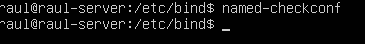
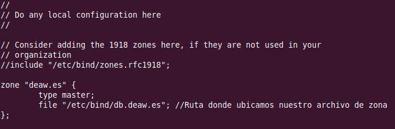
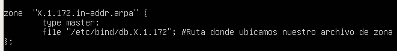
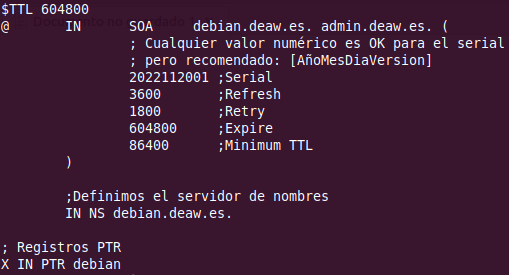
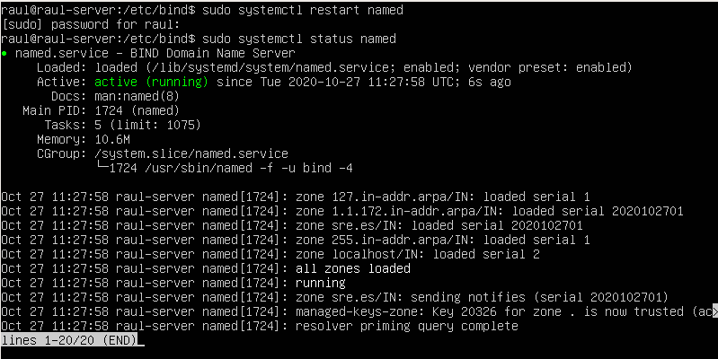
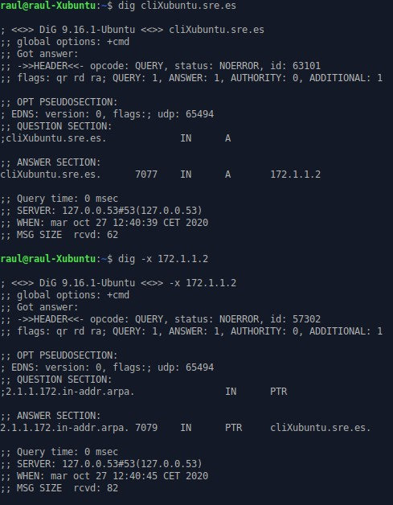

# Práctica 4.1 - Configuraciónn de un servidor DNS

!!!danger "Atención, importante antes de comenzar"


## Instalación de servidor DNS

Bind es el estándar de facto para servidores DNS. Es una herramienta de software libre y se distribuye con la mayoría de plataformas Unix y Linux, donde también se le conoce con el sobrenombre de named (name daemon). Bind9 es la versión recomendada para usarse y es la que emplearemos.

Para instalar el servidor DNS en Ubuntu Server, usaremos los repositorios oficiales. Por ello, podremos instalarlo como cualquier paquete en Ubuntu:

```sh
sudo apt-get install bind9 bind9utils bind9-doc 
```

## Configuraciónn del servidor

Puesto que en clase sólo vamos a utilizar IPv4, vamos a decírselo a Bind, en su archivo general de Configuraciónn. Este archivo `named` se encuentra en el directorio:

```linuxconf
/etc/default
```

Y para indicarle que sólo use IPv4, debemos modificar la línea siguiente con el texto resaltado:

```linuxconf
OPTIONS = "-u bind -4"
```

El archivo de Configuraciónn principal `named.conf` de Bind está en el directorio:

```linuxconf
/etc/bind
```

Si lo consultamos veremos lo siguiente:


Este archivo sirve simplemente para aglutinar o agrupar a los archivos de Configuraciónn que usaremos. Estos 3 includes hacen referencia a los 3 diferentes archivos donde deberemos realizar la verdadera Configuraciónn, ubicados en el mismo directorio.

### Configuraciónn *named.conf.options*

Es  una  buena  práctica  que  hagáis  siempre  una  copia  de  seguridad  de  un  archivo  de Configuraciónn cada vez que vayáis a realizar algún cambio:

```sh
sudo cp /etc/bind/named.conf.options /etc/bind/named.conf.options.backup
```

Ahora editaremos el archivo `named.conf.options` e incluiremos los siguientes contenidos:

 + Por motivos de seguridad, vamos a incluir una lista de acceso para que sólo puedan hacer consultas recursivas al servidor aquellos hosts que nosotros decidamos.

    En nuestro caso, los hosts confiables serán los de la red 192.168..X.0/24. Así pues, justo antes del bloque ```options {…}```, al principio del archivo, añadiremos algo así:

    

Si nos fijamos el servidor por defecto ya viene configurado para ser un DNS caché. El directorio donde se cachearán o guardarán las zonas es `/var/cache/bind`.

```linuxconf
/var/cache/bind
```

Debemos configurar los siguientes aspectos dentro del bloque `options {…}` ahora:
+ Que sólo se permitan las consultas recursivas a los hosts que hemos decidido en la lista de acceso anterior
  
+ No permitir transferencia de zonas a nadie, de momento
  
+ Configurar el servidor para que escuche consultas DNS en el puerto 53 (por defecto DNS utiliza puerto 53 UDP) y en la IP de su interfaz de la red privada. Deberéis colocar la IP de la interfaz conectada a la red privada del servidor, puesto que resolverá las consultas DNS del cliente/s de esa red.
  
+ Permitir las consultas recursivas, ya que en el primer punto ya le hemos dicho que sólo puedan hacerlas los hosts de la ACL.
  
+ Además, vamos a comentar la línea que pone `listen-on-v6 { any; };` puesto que no vamos a responder a consultas de IPv6. Para [comentarla](http://astro.uni-tuebingen.de/software/bind/comments.html) basta añadir al principio de la línea dos barras `//`. También podría hacerse con una almohadilla pero aparecería resaltado con color ya que estos comentarios los suele utilizar el administrador para aclarar algún aspecto de la Configuraciónn.

     


Podemos comprobar si nuestra Configuraciónn es correcta con el comando:



Si hay algún error, nos lo hará saber. En caso contrario, nos devuelve a la línea de comandos. 

Reiniciamos el servidor y comprobamos su estado:


### Configuración *named.conf.local*

En este archivo configuraremos aspectos relativos a nuestras zonas. Vamos a declarar la zona “daw.es”. Por ahora simplemente indicaremos que el servidor DNS es maestro para esta zona y donde estará ubicado el archivo de zona que crearemos más adelante:




### Creación del archivo de zona

Vamos a crear el archivo de zona de resolución directa justo en el directorio que hemos indicado antes y con el mismo nombre que hemos indicado antes.

El contenido será algo así (procurad respetar el formato):


Recordad de teoría que los registros SOA son para detallar aspectos de la zona autoritativa, los NS para indicar los servidores DNS de la zona y los A las IPs respectivas.

Donde aparecen las X debéis poner vuestras IPs privadas correspondientes, tanto de vuestro servidor como de vuestro cliente..

### Creació de l'arxiu de zona pera a la resolució inversa

Recordad que deben existir ambos archivos de zona, uno para la resolución directa y otro para la inversa. Vamos pues a crear el archivo de zona inversa.

En primer lugar, debemos añadir las líneas correspondientes a esta zona inversa en el archivo
**`named.conf.local`**, igual que hemos hecho antes con la zona de resolución directa:



Donde la X es el tercer byte de vuestra red interna.

Y la configuración de la zona de resolución inversa:



Podemos comprobar que la configuración de las zonas es correcta con el comando adecuado.

### Comprobación de las configuraciones

Para comprobar la configuración de la zona de resolución directa:

m

Y para comprobar la configuración de la zona de resolución inversa:


Si todo está bien, devolverá OK. En caso de haber algún error, nos informará de ello.

Reiniciamos el servicio y comprobamos el estado:



!!!warning "Atención"
    Es muy importante que el cliente esté configurado para usar como servidor DNS el que acabamos de instalar y configurar.

### Comprobación de las resoluciones y de las consultas

Podemos comprobar desde los clientes, con dig o nslookup las resoluciones directas e inversas:

=== "Resoluciones nombre del server"
    

=== "Resoluciones nombre del cliente"
    

## Tareas a realitzar


!!!caution "Atenció para el informe"
    Documenta toda la práctica con	las	capturas de	pantalla correspondientes de cada configuración y comprobación..

## Cuestiones finales

!!!Task "Cuestión 1"
    ¿Qué pasará si un cliente de una red diferente a la tuya intenta hacer uso de tu DNS de alguna manera, le funcionará?¿Por qué, en qué parte de la configuración puede verse?
    
!!!Task "Cuestión 2"
    ¿Por qué tenemos que permitir las consultas recursivas en la configuración?
    
!!!Task "Cuestión 3"
    El servidor DNS que acabáis de montar, ¿es autoritativo?¿Por qué?


## Evaluación

| Criterio      | Puntuación                         |
| :--------- | :----------------------------------: |
| Configuración correcta del servidor DNS       |** puntos**  |
| Configuración correcta de la zona DNS      | ** puntos** |
| Evidencias de las comprobaciones del correcto funcionamento | ** puntos**|
| Cuestiones finales | ** puntos**|
|  Se ha prestado especial atención al formato del documento, utilizando la plantilla actualizada y haciendo un correcto uso del lenguaje técnico  |** punt**  |


