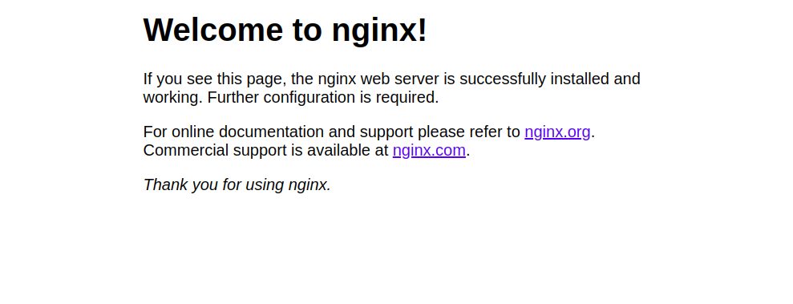

# Práctica 6.2 - Despliegue de una aplicación PHP con Nginx y MySQL usando *Docker* y *docker-compose*

## Introducción

!!!warning "¡Atención!"
    En caso de que tengáis problemas, esta práctica está comprobada y funcionando usando las siguientes versiones:

    + **<u>Docker:</u>** Docker version 20.10.17, build 100c701
    + **<u>Docker-compose:</u>** Docker Compose version v2.10.2

### Recordando qué es *docker-compose*

[Como vimos en la parte de teoría](https://raul-profesor.github.io/DEAW/docker-compose/) para ejecutar nuestra aplicación en docker creamos un fichero llamado `Dockerfile` y este fichero contiene una configuración. Esta configuración varía dependiendo de qué queremos poner en el contenedor, ya que no es lo mismo poner una página web, que una base de datos.

Este proceso, de crear todos los `Dockerfile` y ejecutarlos puede ser bastante tedioso, ya que debemos pensar que una aplicación de tamaño mediano es probable que tenga un front end, un back end, quizá algunos background-workers así como la base de datos, sistema de caché, sistema de colas o de message-broker... por lo que cada uno de nuestros servicios será un contenedor diferente.

Por lo tanto, crear múltiples `Dockerfile` y ejecutarlos todo en un script queda largo y feo.

Aquí es donde entra `docker-compose` el cual es una herramienta que nos permite definir y correr múltiples contenedores en Docker. Estos múltiples contenedores se definen en un fichero denominado docker-compose con la extensión .yml. Luego, con un solo comando, crea e inicia todos los servicios desde su configuración.


Compose funciona en todos los entornos: producción, puesta en escena, desarrollo, pruebas, así como flujos de trabajo de CI.

Usar Compose es básicamente un proceso de tres pasos:

+ Definir el entorno de nuestra aplicación con un Dockerfile para que pueda reproducirse en cualquier lugar.

+ Definir los servicios que componen la aplicación `docker-compose.yml` para que puedan ejecutarse juntos en un entorno aislado.

+ Ejecutar `docker-compose up` y Compose inicia y ejecuta toda su aplicación.

Este proceso se denomina orquestación de contenedores y se lleva a cabo de forma local al interior de los containers, quienes, además, se encontrarán unidos a través de una red de Docker.

## Instalación de *docker-compose*

## Proceso de dockerización de Nginx+PHP+MySQL

### 1. Estructura de directorios

Para que quede claro todo el proceso que vamos a seguir, la estructura de directorios que nos debe quedar en nuestra Debian al finalizar la práctica es esta:
```
/usuario/home/practica6-2/
├── docker-compose.yml
├── nginx
│   ├── default.conf
│   └── Dockerfile
├── php
│   └── Dockerfile
└── www
    └── html
        └── index.php
```
Podéis ir creando los directorios y archivos paso a paso o crearlo todo a la vez y luego ir rellenando los archivos vacíos siguiendo un procedimiento como este:

```sh
mkdir practica6-2
cd practica6-2
touch docker-compose.yml
mkdir nginx
touch nginx/default.conf
...
```

### 2. Creación de un contenedor Nginx

Paara empezar, necesitamos crear y correr un contendor Nginx que permita alojar nuestra aplicación en PHP.

**Dentro de la carpeta /usuario/home/practica6-2/** debemos haber creado o crear ahora el archivo `docker-compose.yml`

Y editamos este archivo con el editor de texto que prefiramos, nano por ejemplo:

```sh
nano docker-compose.yml
```

Y añadimos la siguientes líneas:

```dockercompose
nginx:
  image: nginx:latest
  container_name: nginx-container
  ports:
    - 80:80
```

Y lo guardamos.

El archivo que acabamos de crear será el encargado de descargarse la última versión de la imagen de Nginx, crear un contenedor con ella y publicar o escuchar en el puerto 80 del contenedor que también se corresponderá con el 80 de nuestra máquina (80:80).

Iniciemos entonces este proceso:

```dh
docker-compose up -d
```
Con la opción `-d` (de daemon), estamos indicando que el contenedor se ejecute en background o segundo plano:


Para comprobar que el contenedor está corriendo, podemos hacer:

```sh
docker ps
```

Y deberíamos ver algo como:

```
CONTAINER ID   IMAGE          COMMAND                  CREATED         STATUS         PORTS                               NAMES
c6641e4d5bbf   nginx:latest   "/docker-entrypoint.…"   5 seconds ago   Up 3 seconds   0.0.0.0:80->80/tcp, :::80->80/tcp   nginx-container
```

Además, si abrimos el navegador de nuestra máquina anfitrión y accedemos a `http://IP_Maq_Virtual` deberíamos ver la página de bienvenida de Nginx:




### 3. Creación de un contenedor PHP

Creamos la carpeta y el documento pertinente dentro de ella, si no lo habíamos hecho antes:

```sh
mkdir -p /home/usuario/practica6-2/www/html
nano /home/usuario/practica6-2/www/html/index.php
```
Y dentro de `index.php` añadimos el siguiente código:

```html
<!DOCTYPE html>
<head>
  <title>¡Hola mundo!</title>
</head>

<body>
  <h1>¡Hola mundo!</h1>
  <p><?php echo 'Estamos corriendo PHP, version: ' . phpversion(); ?></p>
</body>
```

Guardad el archivo y cread, si no lo habíais hecho antes, un directorio llamado *nginx* dentro del directorio del proyecto:

```sh
mkdir /home/usuario/practica6-2/nginx
```
Ahora vamos a crear el archivo de configuración por defecto para que Nginx pueda correr la aplicación PHP:

```sh
nano /home/usuario/practica6-2/nginx/default.conf
```

Y dentro de ese archivo, colocaremos la siguiente configuración:

```apacheconf
server {

     listen 80 default_server;
     root /var/www/html;
     index index.html index.php;

     charset utf-8;

     location / {
      try_files $uri $uri/ /index.php?$query_string;
     }

     location = /favicon.ico { access_log off; log_not_found off; }
     location = /robots.txt { access_log off; log_not_found off; }

     access_log off;
     error_log /var/log/nginx/error.log error;

     sendfile off;

     client_max_body_size 100m;

     location ~ .php$ {
      fastcgi_split_path_info ^(.+.php)(/.+)$;
      fastcgi_pass php:9000;
      fastcgi_index index.php;
      include fastcgi_params;
      fastcgi_param SCRIPT_FILENAME $document_root$fastcgi_script_name;
      fastcgi_intercept_errors off;
      fastcgi_buffer_size 16k;
      fastcgi_buffers 4 16k;
    }

     location ~ /.ht {
      deny all;
     }
    }
```
Guardamos el archivo y ahora crearemos el `Dockerfile` dentro del directorio *nginx*. En este archivo se copiará el archivo de configuración de Nginx al contenedor correspondiente.

Así pues:

```sh
nano /home/usuario/practica6-2/nginx/Dockerfile
```
Y dentro de este archivo:

```dockerfile
FROM nginx:latest
COPY ./default.conf /etc/nginx/conf.d/default.conf
```

Y ahora editamos nuestro archivo `docker-compose.yml`:

```dockerfile
services:
  nginx:
    build: ./nginx/
    container_name: nginx-container
    ports:
      - 80:80
    links:
      - php
    volumes:
      - ./www/html/:/var/www/html/

  php:
    image: php:7.0-fpm
    container_name: php-container
    expose:
      - 9000
    volumes:
      - ./www/html/:/var/www/html/
```
Ahora con este fichero `docker-compose.yml` se creará un nuevo contenedor PHP-FPM en el puerto 9000, enlazará el contenedor *nginx* con el contendor *php*, así como creará un volumen y lo montará en el directorio `/var/www/html` de los contenedores.

Así pues, ejecutaremos el nuevo contenedor volviendo a ejecutando compose. Cuidado pues se debe ejecutar el comando en el mismo directorio donde tengamos nuestro archivo `docker-compose.yml`:

```sh
cd /home/usuario/practica6-2

docker-compose up -d
```

Y comprobamos que los contenedores están corriendo:

```sh
docker ps
```

Debiendo ver algo como:

```
CONTAINER ID   IMAGE                  COMMAND                  CREATED          STATUS          PORTS                               NAMES
82c8baf15221   docker-project_nginx   "/docker-entrypoint.…"   23 seconds ago   Up 22 seconds   0.0.0.0:80->80/tcp, :::80->80/tcp   nginx-container
10778c6686d8   php:7.0-fpm            "docker-php-entrypoi…"   25 seconds ago   Up 23 seconds   9000/tcp                            php-container
```

Y si ahora volvemos a acceder a `http://IP_Maq_Virtual`, veremos la página `Hola mundo`:


### 4. Creación de un contenedor para datos

Como véis, hemos montado el directorio `www/html` en ambos contenedores, el de nginx y el de php. Sin embargo, esta no es una forma adecuada de hacerlo. En este paso crearemos un contenedor independiente que se encargará de contener los datos y lo enlazaremos con el resto de contenedores.

Para llevar a cabo esta tarea, volvemos a editar el `docker-compose.yml`:

```sh
nano /usuario/home/practica6-2/docker-compose.yml
```
Y añadiremos un nuevo servicio a los que ya teníamos, quedando así:

```dockerfile
nginx:
  build: ./nginx/
  container_name: nginx-container
  ports:
    - 80:80
  links:
    - php
  volumes_from:
    - app-data

php:
  image: php:7.0-fpm
  container_name: php-container
  expose:
    - 9000
  volumes_from:
    - app-data

app-data:
  image: php:7.0-fpm
  container_name: app-data-container
  volumes:
    - ./www/html/:/var/www/html/
  command: "true"
```

Así que para recrear y lanzar todos los contenedores ejecutamos de nuevo (recordad, dentro del directorio donde se encuentra el archivo):

```sh
docker-compose up -d
```

Y volvemos a verificar que están corriendo todos:

```sh
docker ps -a
```

Debiendo ver algo como:

```
CONTAINER ID   IMAGE                  COMMAND                  CREATED          STATUS                      PORTS                               NAMES
849315c7ffc0   docker-project_nginx   "/docker-entrypoint.…"   27 seconds ago   Up 25 seconds               0.0.0.0:80->80/tcp, :::80->80/tcp   nginx-container
59a0d7040fd8   php:7.0-fpm            "docker-php-entrypoi…"   28 seconds ago   Up 27 seconds               9000/tcp                            php-container
fbca95944234   php:7.0-fpm            "docker-php-entrypoi…"   29 seconds ago   Exited (0) 28 seconds ago                                       app-data-container
```

### 5. Creación de un contenedor MySQL

En esta sección crearemos un contenedor de una base de datos MySQL y lo enlazaremos con el resto de contenedores.

Primero, modificaremos la imagen PHP e instalaremos la extensión PHP para MySQL, de tal forma que nos permita conectarnos desde nuestra aplicación PHP a nuestra BBDD MySQL.

Creamos, si no lo teníamos ya, nuestro directorio *php* y dentro de él, el archivo `Dockerfile`:

```sh
mkdir /home/usuario/practica6-2/php
nano /home/usuario/practica6-2/php/Dockerfile
```

Y dentro del `Dockerfile` ponemos:

```dockerfile
FROM php:7.0-fpm
RUN docker-php-ext-install pdo_mysql
```

Y una vez más, debemos editar `docker-compose.yml` con el objetivo de que se creen el contenedor para MySQL y el contenedor de los datos de MySQL que contendrá la base de datos y las tablas:

```dockerfile
services:
  nginx:
    build: ./nginx/
    container_name: nginx-container
    ports:
      - 80:80
    links:
      - php
    volumes_from:
      - app-data
  php:
    build: ./php/
    container_name: php-container
    expose:
      - 9000
    links:
      - mysql
    volumes_from:
      - app-data

  app-data:
    image: php:7.0-fpm
    container_name: app-data-container
    volumes:
      - ./www/html/:/var/www/html/
    command: "true"

  mysql:
    image: mysql:5.7
    container_name: mysql-container
    volumes_from:
      - mysql-data
    environment:
      MYSQL_ROOT_PASSWORD: secret
      MYSQL_DATABASE: mydb
      MYSQL_USER: myuser
      MYSQL_PASSWORD: password

  mysql-data:
    image: mysql:5.7
    container_name: mysql-data-container
    volumes:
      - /var/lib/mysql
    command: "true"
```

Después de guardar este archivo, editamos el archivo `index.php` y hacemos algunos cambios para comprobar la conexión a la base de datos.

El archivo `index.php` debe quedar así:

```html
     <!DOCTYPE html>
     <head>
      <title>¡Hola mundo!</title>
     </head>

     <body>
      <h1>¡Hola mundo!</h1>
      <p><?php echo 'Estamos corriendo PHP, version: ' . phpversion(); ?></p>
      <?
       $database ="mydb";
       $user = "myuser";
       $password = "password";
       $host = "mysql";

       $connection = new PDO("mysql:host={$host};dbname={$database};charset=utf8", $user, $password);
       $query = $connection->query("SELECT TABLE_NAME FROM information_schema.TABLES WHERE TABLE_TYPE='BASE TABLE'");
       $tables = $query->fetchAll(PDO::FETCH_COLUMN);

        if (empty($tables)) {
          echo "<p>No hay tablas en la base de datos \"{$database}\".</p>";
        } else {
          echo "<p>La base de datos \"{$database}\" tiene las siguientes tablas:</p>";
          echo "<ul>";
            foreach ($tables as $table) {
              echo "<li>{$table}</li>";
            }
          echo "</ul>";
        }
        ?>
    </body>
</html>
```

Guardad el archivo y lanzad los contenedores una vez más:

```sh
docker-compose up -d
```

Y verificamos que están ejecutándose:

```sh
docker ps -a
```
Y veremos:

```
CONTAINER ID   IMAGE                  COMMAND                  CREATED          STATUS                      PORTS                               NAMES
d3e82747fe0d   mysql:5.7              "docker-entrypoint.s…"   39 seconds ago   Up 38 seconds               3306/tcp, 33060/tcp                 mysql-container
606320e5a7f8   mysql:5.7              "docker-entrypoint.s…"   41 seconds ago   Exited (0) 39 seconds ago                                       mysql-data-container
ca4f63797d11   docker-project_php     "docker-php-entrypoi…"   2 hours ago      Up 2 hours                  9000/tcp                            php-container
849315c7ffc0   docker-project_nginx   "/docker-entrypoint.…"   2 hours ago      Up 2 hours                  0.0.0.0:80->80/tcp, :::80->80/tcp   nginx-container
fbca95944234   php:7.0-fpm            "docker-php-entrypoi…"   2 hours ago      Exited (0) 39 seconds ago                                       app-data-
```

### 6. Verificación de conexión a la base de datos

Si ahora accedemos a `http://IP_Maq_Virtual`, deberíamos obtener la siguiente pantalla:


Como podéis ver, nos dice que no tenemos ninguna tabla en la base de datos *mydb*.

Sin embargo, el hecho es que realmente sí existen algunas tablas, símplemente no son visibles para un usuario normal. Si quisiéramos verlas, debemos editar el archivo `index.php` y cambiar **`$user`** por *`root`* y **`$password`** a *`secret`*.

Es decir:

```sh
nano /home/usuario/www/html/index.php
```
Y cambiar las líneas:

```php
$user = "root";
$password = "secret";
```
Guardad el archivo y refrescad la página. Deberías obtener ahora una pantalla con todas las tablas de la base de datos, tal que así:


!!!task "Tarea"
    Documenta, incluyendo capturas de pantallas, el proceso que has seguido para realizar el despliegue de esta nueva aplicación, así como el resultado final.

## Referencias

[¿Qué es Docker Compose?](https://keepcoding.io/blog/que-es-docker-compose/)

[¿Qué demonios es Docker y Docker-Compose? y cómo Dockerizar Dotnet Core WebApi y SQL Server en un ambiente de desarrollo ideal](https://dev.to/ebarrioscode/que-demonios-es-docker-docker-compose-y-como-dockerizar-dotnet-core-webapi-y-sql-server-en-un-ambiente-de-desarrollo-ideal-95a)

[Introducción a docker-compose](https://www.netmentor.es/entrada/docker-compose)

[How to Deploy a PHP Application with Nginx and MySQL Using Docker and Docker Compose](https://www.atlantic.net/vps-hosting/how-to-deploy-a-php-application-with-nginx-and-mysql-using-docker-and-docker-compose/)