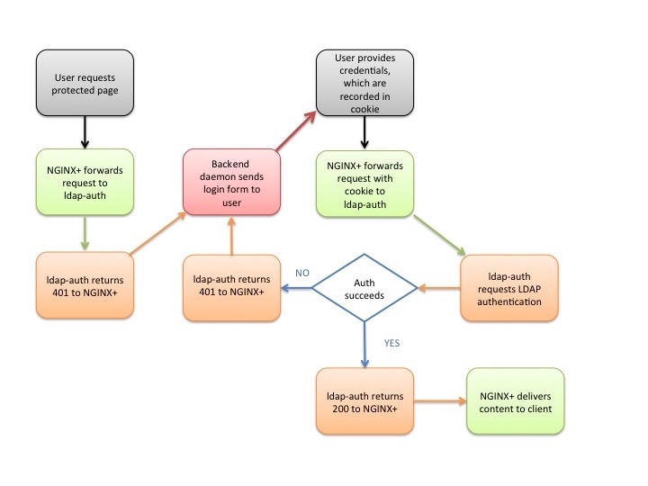

# Práctica 6.2 - Despliegue de servidores web con usuarios autenticados mediante LDAP usando *Docker* y *docker-compose*

## Introducción

### ¿Qué es un servicio de directorio LDAP? 

LDAP (Lightweight Directory Access Protocol) o también conocido como «Protocolo Ligero de Acceso a Directorios» es un protocolo de la capa de aplicación TCP/IP que permite el acceso a un servicio de directorio ordenado y distribuido, para buscar cualquier información en un entorno de red.

!!!note "Aclaración"
    Un directorio es un conjunto de objetos con atributos que están organizados de manera lógica y jerárquica, es decir, está en forma de árbol y perfectamente ordenado en función de lo que nosotros queramos, ya sea alfabéticamente, por usuarios, direcciones etc.

Generalmente un servidor LDAP se encarga de almacenar información de autenticación, es decir, el usuario y la contraseña, para posteriormente dar acceso a otro protocolo o servicio del sistema. Además de almacenar el nombre de usuario y la contraseña, también puede almacenar otra información como datos de contacto del usuario, ubicación de los recursos de la red local, certificados digitales de los propios usuarios y mucho más.

LDAP es un protocolo que nos permite acceder a los recursos de la red local, sin necesidad de crear los diferentes usuarios en el sistema operativo, además, es mucho más versátil. Por ejemplo, LDAP permite realizar tareas de autenticación y autorización a usuarios de diferentes softwares como Docker, OpenVPN, servidores de archivos como los usados por QNAP, Synology o ASUSTOR entre otros, y muchos más usos.


LDAP puede ser utilizado tanto por un usuario al que se pide unos  credenciales de acceso, como también por las aplicaciones para saber si tienen acceso a determinada información del sistema o no. Generalmente un servidor LDAP se encuentra en una red privada, es decir, redes de área local, para autenticar las diferentes aplicaciones y usuarios, pero también podría funcionar sobre redes públicas sin ningún problema.

!!!info
    En definitiva, LDAP nos proporciona un serivicio de autenticación y autorización para poder acceder a distintos recursos en red, como por ejemplo, a un sitio web. Si recordamos la práctica 2.2, nuestro usuario se autenticaba utilizando usuarios creados en el mismo sistema operativo (Debian Linux) donde se había instalado el servidor web Nginx.

    Tenemos, por tanto, la posibilidad de utilizar otra autenticación centralizada para el mismo cometido con LDAP.

### Implementaciones de LDAP

Microsoft Active Directory utiliza internamente el protocolo LDAP para realizar todas las comunicaciones desde los clientes hasta el servidor o servidores, por lo tanto, se encarga de que los clientes puedan autenticarse y acceder a cualquier dato almacenado, además, debemos tener en cuenta que este protocolo es multiplataforma, no solamente lo tenemos en sistemas operativos Windows sino que también es compatible con Linux, Unix y macOS, todo ello a través del protocolo. Para que os hagáis una idea, los siguientes servicios de directorio usan este protocolo para su comunicación:

+ Active Directory de Microsoft
+ Apache
+ Servicio de directorio de Red Hat
+ OpenLDAP

Y muchos otros servicios también lo usan, sobre todo el último, OpenLDAP, el cual es una implementación de código abierto del protocolo y que se puede instalar en cualquier sistema, ya que está disponible el código fuente para compilarlo. No obstante, en la mayoría de distribuciones de Linux lo tenemos disponible en sus repositorios.


### ¿Cómo se organiza la información en LDAP?

**En LDAP, las entradas están organizadas en una estructura jerárquica en árbol**. Tradicionalmente, esta estructura reflejaba los límites geográficos y organizacionales.

Las entradas que representan países aparecen en la parte superior del árbol. Debajo de ellos, están las entradas que representan los estados y las organizaciones nacionales. Debajo de estás, pueden estar las entradas que representan las unidades organizacionales, empleados, impresoras, documentos o todo aquello que pueda imaginarse. La siguiente figura muestra un ejemplo de un árbol de directorio LDAP haciendo uso del nombramiento tradicional.


El árbol también se puede organizar basándose en los nombres de dominio de Internet. Este tipo de nombramiento es muy popular, ya que permite localizar un servicio de directorio haciendo uso de los DNS. La siguiente figura muestra un ejemplo de un directorio LDAP que hace uso de los nombres basados en dominios.


#### ¿Cómo se referencia la información?

Una entrada es referenciada por su nombre distinguido (DN), que es construido por el nombre de la propia entrada (llamado Nombre Relativo Distinguido o RDN) y la concatenación de los nombres de las entradas que le anteceden. 

Por ejemplo, la entrada para Nuno Gonçalves en el ejemplo del nombramiento de Internet anterior tiene el siguiente RDN: uid=nuno y su DN sería: uid=nuno,ou=estig,dc=ipb,dc=pt.  

#### Cómo se accede a la información?

LDAP define operaciones para interrogar y actualizar el directorio. Provee operaciones para añadir y borrar entradas del directorio, modificar una entrada existente y cambiar el nombre de una entrada. La mayor parte del tiempo, sin embargo, LDAP se utiliza para buscar información almacenada en el directorio. Las operaciones de búsqueda de LDAP permiten buscar entradas que concuerdan con algún criterio especificado por un filtro de búsqueda. La información puede ser solicitada desde cada entrada que concuerda con dicho criterio.

Por ejemplo, imaginemos que queremos buscar en el subárbol del directorio que está por debajo de dc=ipb,dc=pt a personas con el nombre Nuno Gonçalves, obteniendo la dirección de correo electrónico de cada entrada que concuerde. LDAP permite hacer esto fácilmente. O tal vez preferimos buscar las organizaciones que posean la cadena IPB en su nombre, posean número de fax y estén debajo de la entrada st=Bragança,c=PT. LDAP permite hacer esto también.

LDAP ofrece una autenticación y autorización optimizadas y una búsqueda eficaz de datos de direcciones y de usuarios. Debido a sus muchas ventajas para las empresas. LDAP sirve a modo de un estándar de la industria y es compatible con la mayoría de los productos de software. Las ventajas principales son la rapidez de las consultas y conexiones, un lenguaje de consulta sencillo y un protocolo claramente estructurado


### Módulos en Apache

Un módulo es una parte independiente de un programa. La mayor parte de la funcionalidad de Apache está contenida en módulos que pueden incluirse o excluirse. Como decimos, existen una gran cantidad de Módulos para utilizarse con Apache, algunos ejemplo son: "Virtual Hosting","Mod_JK(Java)" y "Rewrite".

Una de las principales razones de emplear módulos en Apache, es que no toda instalación requiere de las mismas funcionalidades, esto es, una instalación que utilice PHP probablemente no requiera de Tomcat (Java), o bien posiblemente no todas las instalaciones requieran de "Virtual Hosting".

Así las cosas, para no incluir todas las funcionalidades de Apache, necesarias e innecesarias para cada ocasión, en un único paquete de instalación que lo haría demasiado grande en tamaño y pesado en recursos, se hace uso de los módulos, de tal forma que sólo cargaremos en memoria los que nos hagan falta en cada ocasión.

Los módulos le permiten a los administradores del servidor activar y desactivar funcionalidades adicionales. Apache tiene módulos de seguridad, almacenamiento en caché, reescritura de URL, autenticación de contraseña y más.

!!! info 
    
    En Apache hay dos tipos de módulos:

    + **Estáticos:** Son añadidos al compilar el servidor.
    + **Dinámicos:** Se cargan dinámicamente al iniciar el servidor. 

Se puede habilitar cualquiera de los módulos de la lista con el comando `a2enmod (nombre del módulo)` (usando el `sudo` si no se es superusuario), y deshabilitar cualquiera de ellos previamente habilitado mediante el comando `a2dismod (nombre del módulo)`  (usando el `sudo` si no se es superusuario).


### Módulos en Nginx

Los módulos <u>estáticos</u> existen desde sus inicios en Nginx y los <u>dinámicos</u> desde la versión 1.9.11 (Febrero de 2016).

Nginx es, de hecho, una colección de módulos. Incluso funciones básicas tales como HTTP o servir ficheros estáticos dentro de HTTP, están implementadas por módulos.

Se puede extender la funcionalidad de Nginx añadiendo módulos propios. Esta arquitectura modular permite modificar fácilmente Nginx.

#### Módulo autenticación LDAP en Nginx

La solución aprovecha el módulo ngx_http_auth_request_module de Nginx y NGINX, que reenvía las peticiones de autenticación a un servicio externo. En la implementación de referencia, ese servicio es un demonio que llamamos ldap-auth. Está escrito en Python y se comunica con un servidor de autenticación del Protocolo Ligero de Acceso a Directorios (LDAP) - OpenLDAP por defecto, pero hemos probado el demonio ldap-auth también con configuraciones por defecto de Microsoft® Windows® Server Active Directory (tanto la versión 2003 como la 2012).

Para realizar la autenticación, el módulo http_auth_request realiza una subconsulta HTTP al demonio ldap-auth, que actúa como intermediario e interpreta la subconsulta para el servidor LDAP - utiliza HTTP para la comunicación con Nginx y la API apropiada para la comunicación con el servidor LDAP.


Para realizar la autenticación, el módulo http_auth_request realiza una subconsulta HTTP al demonio ldap-auth, que actúa como intermediario e interpreta la subconsulta para el servidor LDAP - utiliza HTTP para la comunicación con Nginx y la API apropiada para la comunicación con el servidor LDAP.

A continuación se describe paso a paso el proceso de autenticación en la implementación de referencia. Los detalles se determinan por los ajustes en el archivo de configuración nginx-ldap-auth.conf; ver Configuración de la implementación de referencia más abajo. 

El diagrama de flujo debajo de los pasos resume el proceso.



1. Un cliente envía una solicitud HTTP para un recurso protegido alojado en un servidor para el que Nginx está actuando como proxy inverso.

2. Nginx (concretamente, el módulo *http_auth_request*) reenvía la solicitud al demonio *ldap-auth*, que responde con el código HTTP 401 porque no se han proporcionado credenciales.

3. Nginx reenvía la solicitud a `http://backend/login`, que corresponde al demonio del backend. Escribe el URI de la solicitud original en la cabecera X-Target de la solicitud reenviada.

4. El demonio del backend envía al cliente un formulario de inicio de sesión (el formulario está definido en el código Python del demonio). Tal y como se configura en la directiva error_page, NGINX establece el código HTTP del formulario de inicio de sesión en 200.

5. El usuario rellena los campos *Nombre de usuario* y *Contraseña* en el formulario y hace clic en el botón Login. Según el código del formulario, el cliente genera una petición HTTP POST dirigida a `/login`, que Nginx reenvía al demonio del backend.

6. El demonio del backend construye una cadena con el formato nombre de `usuario:contraseña`, aplica la codificación Base64, genera una cookie llamada **nginxauth** con su valor establecido a la cadena codificada, y envía la cookie al cliente. Establece el flag httponly para evitar el uso de JavaScript para leer o manipular la cookie (protegiendo contra la vulnerabilidad cross-site scripting [XSS]).

7. El cliente retransmite su solicitud original (del paso 1), esta vez incluyendo la cookie en el campo Cookie de la cabecera HTTP. Nginx reenvía la solicitud al demonio `ldap-auth` (como en el paso 2).

8. El demonio `ldap-auth` decodifica la cookie y envía el nombre de usuario y la contraseña al servidor LDAP en una solicitud de autenticación.

9. La siguiente acción depende de si el servidor LDAP autentifica con éxito al usuario:

    + Si la autenticación tiene éxito, el demonio `ldap-auth` envía el código HTTP 200 a Nginx. Nginx solicita el recurso al demonio del backend y éste devuelve el código del sitio web.

        El archivo `nginx-ldap-auth.conf` incluye directivas para el almacenamiento en caché de los resultados del intento de autenticación.

    + Si la autenticación falla, el demonio `ldap-auth` envía el código HTTP 401 a Nginx. Nginx reenvía la solicitud al demonio del backend de nuevo (como en el paso 3), y el proceso se repite.


## Despliegue con Docker de **NGINX + demonio de autenticación LDAP + OpenLDAP**

Para esta práctica nos crearemos un directorio que contendrá nuestro index.html, con un texto muy simple:

```sh
$ mkdir app

$ cat << EOF > app/index.html
<html>
<body>
<h1>¡Hola Mundo!</h1>
</body>
</html>
EOF
```

Así como otro directorio, con el contenido de la configuración pertinente de Nginx:

```sh
$ mkdir conf

$ cat << EOF > conf/ldap_nginx.conf
    server {
      listen 8080;

      location = / {
         auth_request /auth-proxy;
      }

      location = /auth-proxy {
         internal;

         proxy_pass http://nginx-ldap:8888;

         # URL y puerto para conectarse al servidor LDAP
         proxy_set_header X-Ldap-URL "ldap://openldap:1389";

         # Base DN
         proxy_set_header X-Ldap-BaseDN "dc=example,dc=org";

         # Bind DN
         proxy_set_header X-Ldap-BindDN "cn=admin,dc=example,dc=org";

         # Bind password
         proxy_set_header X-Ldap-BindPass "adminpassword";
      }
   }
```
En esta configuración le decimos a Nginx:

+ Que escuche en el puerto 8080 las peticiones HTTP
+ Que cuando se acceda al sitio web, se solicite autorización en el directorio del sitio web llamado */auth-proxy*
+ Se crea un nuevo location para ese directorio */auth-proxy* y que es donde se realizará la configuración de cómo conectarnos a nuestro openldap, de acuerdo con la [documentación oficial de Nginx](https://www.nginx.com/blog/nginx-plus-authenticate-users/#ldap-auth-configure) a propósito de su módulo de autenticación:
  + Se indica la URL de nuestro openldap (es el nombre del contenedor que hemos levantado, ya que Docker tiene un DNS propio entre sus contenedores)
  + El DN (Nombre distinguido) base sobre el que se realizarán las búsquedas en openldap
  + El usuario y contraseña con el que nos conectaremos al openldap para realizar las consultas


Y ahora, procedemos con el siguiente `docker-compose.yml`:

```yaml
version: '2'

services:
  nginx-ldap:  # (1)
    image: bitnami/nginx-ldap-auth-daemon # (2)
    ports: # (3)
      - 8888:8888
  nginx: # (4)
    image: bitnami/nginx
    ports: 
     - 8080:8080
    volumes: # (5)
     - ./app:/app
     - ./conf/ldap_nginx.conf:/opt/bitnami/nginx/conf/server_blocks/ldap_nginx.conf
  openldap: # (6)
    image: bitnami/openldap
    ports:
      - '1389:1389'    
    environment: # (7)
      - LDAP_ADMIN_USERNAME=admin
      - LDAP_ADMIN_PASSWORD=adminpassword
      - LDAP_USERS=customuser
      - LDAP_PASSWORDS=custompassword

```

1. Nombre del contenedor
2. Imagen que descargaremos del Dockerhub y a partir de la cual crearemos nuestro contenedor
3. Puerto/s que se publicarán para el contenedor
4. Nombre del contenedor
5. Volúmenes o directorios compartidos entre nuestra máquina y el contenedor
6. Nombre del contenedor
7. Variables de entorno utilizadas para la configuración de este contenedor. Incluye credenciales del administrador de openldap, así como un usuario que se creará en dicho openldap (podéis cambiar usuario y contraseña si queréis, pero luego debéis recordarlas)

Tras esto sólo queda ejecutar compose:

```sh
docker-compose up
```

Y comprobar que no se producen errores.


## Despliegue con Docker de PHP + Apache con autenticación LDAP

1. En primer lugar, como es obvio, debemos crear el `index.php` de nuestra aplicación:

```php
<?php
echo 'Well, hello LDAP authenticated user!';
```

```dockerfile
# ./Docker/Dockerfile --> directorio donde se encuentra este archivo

# Imagen base sobre la que vamos a trabajar
____ php:7-apache

# Activamos el módulo LDAP de Apache ejecutand el siguiente comando
____ a2enmod authnz_ldap

# Añadimos las reglas/configuración de LDAP al directorio conf-enabled de Apache
# (crearemos este archivo en el siguiente paso)
____ Docker/ldap-demo.conf /etc/apache2/conf-enabled/

# Añadimos ayuda de depuración (debugging) en la configuración de apache
# En caso de necesitarlo, lo descomentamos para ejecutar el siguiente comando
# ____ echo "LogLevel debug" >> apache2.conf

# Establecemos el directorio de trabajo adecuado
____ /var/www/html/demo


# Configuramos Apache para usar la configuración ldap definida arriba, la copiamos de nuestro ordenador al contenedor
____ Docker/.htaccess ./.htaccess

#  Copiamos los archivos del proyecto que necesitamos, al contenedor

____ index.php ./
```


Construimos la imagen:

```yaml
docker build \
    -t docker-ldap \
    -f ./Docker/dockerfile \
    .
```

Corremos el contenedor indicando las credenciales de nuestra cuenta LDAP:

```yaml
docker run \
    -p 3000:80 \
    --name ldap_demo \
    -e LDAP_BIND_ON='"CN=example,OU=example,DC=example"' \
    -e LDAP_PASSWORD='"my_ldap_password"' \
    -e LDAP_URL='"my_ldap_url"' \
    docker-ldap
```


## Referencias

[Para qué sirve el protocolo LDAP y cómo funciona](https://www.redeszone.net/tutoriales/servidores/que-es-ldap-funcionamiento/)

[OpenLDAP conceptos teóricos](https://www.sergio-gonzalez.com/doc/10-ldap-samba-cups-pykota/html/openldap-que-es.html)

[Using Nginx and NGINX to Authenticate Application Users with LDAP](https://www.nginx.com/blog/nginx-plus-authenticate-users/)

[Simple Docker/Apache/PHP Authentication with LDAP](https://medium.com/ihme-tech/simple-docker-apache-php-authentication-with-ldap-3ac16b17bf31)

[bitnami/nginx-ldap-auth-daemon](https://hub.docker.com/r/bitnami/nginx-ldap-auth-daemon)

[nginxinc/nginx-ldap-auth](https://github.com/nginxinc/nginx-ldap-auth/)

[Dockerfile cheatsheet](https://devhints.io/dockerfile)

[Difference between RUN and CMD in a Dockerfile](https://stackoverflow.com/questions/37461868/difference-between-run-and-cmd-in-a-dockerfile)