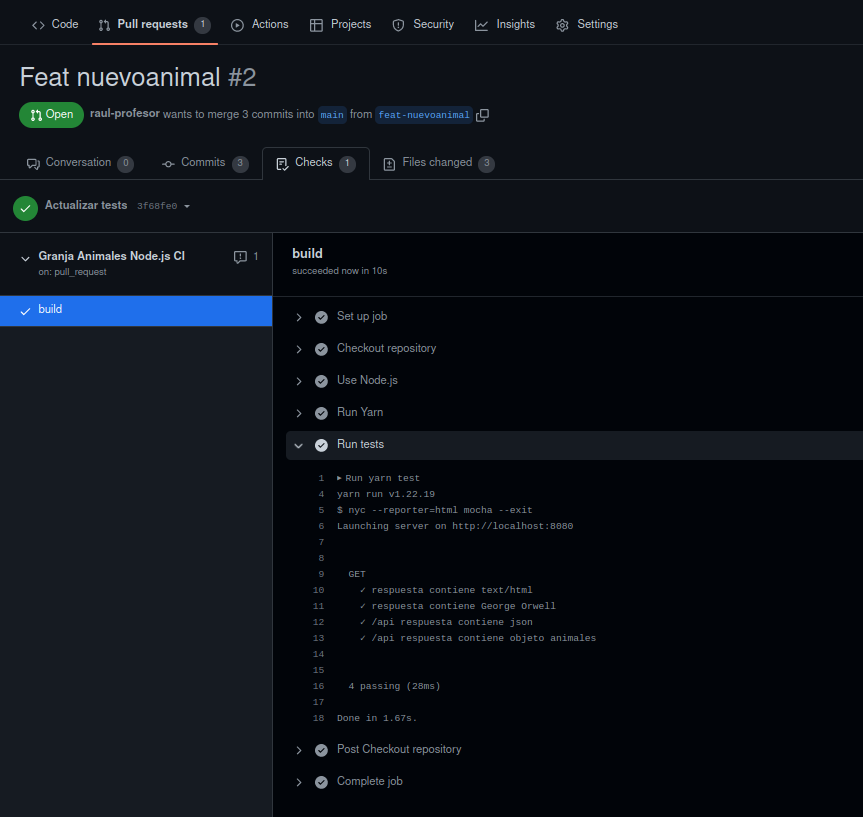
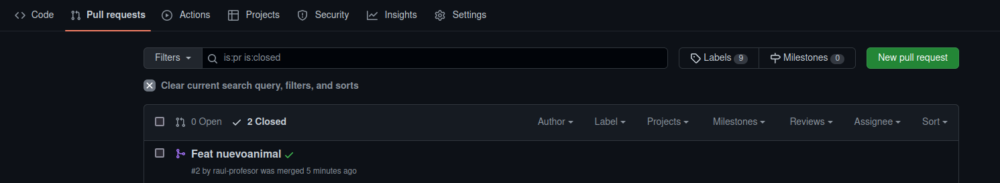

# Práctica 7.1- Toma de contacto con CI/CD usando Github actions

!!!warning "Atención"
    Antes de comenzar esta práctica, debéis tener una cuenta en Docker Hub: [https://hub.docker.com/](https://hub.docker.com/)

## Introducción

### ¿Qué es Github actions?

GitHub Actions es una plataforma de integración y despliegue continuos (CI/CD) que te permite automatizar tu mapa de compilación, pruebas y despliegue. Puedes crear flujos de trabajo (*workflows*) y crear y probar cada solicitud de cambios en tu repositorio o desplegar solicitudes de cambios fusionadas a producción.

GitHub Actions va más allá de solo DevOps y te permite ejecutar flujos de trabajo cuando otros eventos suceden en tu repositorio. Por ejemplo, puedes ejecutar un flujo de trabajo para que agregue automáticamente las etiquetas adecuadas cada que alguien cree una propuesta nueva en tu repositorio.

GitHub proporciona máquinas virtuales Linux, Windows y macOS para que ejecutes tus flujos de trabajo o puedes hospedar tus propios ejecutores auto-hospedados en tu propio centro de datos o infraestructura en la nube.

Un **workflow** ejecutará uno o más jobs y se definen mediante un archivo YAML. Estos archivos se ubican en el directorio `.github/workflows` de un repositorio y puede haber varios archivos de workflow para diferentes cometidos.

Un **evento** es una actividad que dispara un flujo de trabajo o workflow. Estos eventos pueden ser un *push*, un *pull request* o un *merge*.

Por último, los **jobs** son acciones o pasos que se ejecutan dentro de un workflow.

Una *acción* es una aplicación personalizada para la plataforma de GitHub Actions que realiza una tarea compleja pero que se repite frecuentemente

Para entender detalladamente todos los componentes, podéis consultar [aquí](https://docs.github.com/es/actions/learn-github-actions/understanding-github-actions).

## Comenzamos

El objetivo de esta práctica será utilizar GitHub Actions para añadir ciertas automatizaciones iniciales a nuestro repositorio. Haremos que se *disparen* pruebas sobre nuestro código cuando se abra un *pull request* y, automáticamente, construiremos una imagen Docker para nuestra aplicación.

Vamos a utilizar una [aplicación simple](https://github.com/jamtur01/animal-farm-nodejs) en NodeJS, que correrá en un servidor Express. Por tanto, como prerrequisitos, necesitamos tener instalados en nuestro sistema Node.js (ya deberíamos tenerlo de prácticas anteriores) y Yarn. Yarn es un gestor de paquetes de JavaScript y en Debian se puede instalar mediante npm, apt o script. 

!!!tip "Instalación de Yarn"
    [Aquí](https://kifarunix.com/install-yarn-on-debian-11/) se explican los 3 métodos de instalación, elegid el que más os guste.


Empezaremos clonando el repositorio necesario y echando un ojo a lo que tiene:

```console
$ git clone https://github.com/raul-profesor/practica_7.1.git
$ cd practica_7.1
```

Utilizamos ahora **yarn** para instalar los módulos requeridos de Node.js

```console
$ yarn install
```

Y utilizamos yarn una vez más para iniciar la aplicación:

```console
$ yarn start
```

Si ahora accedemos a la IP de la máquina virtual, en el puerto 8080, deberíamos tener acceso al sitio web:


Si actualizáis varias veces, podréis ver qué otros animales hay en la granja. 

También tenemos una batería de pruebas, no muy exhaustiva, en el directorio `test`. Probemos a ejecutarlos con yarn:


## Creando nuestro primer workflow

Todos los repositorios de GitHub vienen con *Actions* activado por defecto. Comprobad en vuestro repositorio que existe una pestaña llamada **Actions**. Lo que necesitáis hacer es, en los *settings* de vuestro repositorio buscar el apartado de *Actions* y darle permisos para realizar cualquier acción. Podéis consultar el procedimiento en detalle [aquí](https://docs.github.com/es/repositories/managing-your-repositorys-settings-and-features/enabling-features-for-your-repository/managing-github-actions-settings-for-a-repository)

Como ya hemos dicho, Actions ejecuta los workflows, los cuales suelen estar asociados a fases específicas del ciclo de desarrollo. Por ejemplo, un workflow que crra cuando se abra un pull request. También hemos comentado que dentro de los workflows están los jobs, que son acciones individuales dentro de un workflow. Por ejemplo:

```
Workflow 1
    1. Clona el repositorio
    2. Instala los prerrequisitos
    3. Ejecuta los tests
```
En la [introducción](P7.1.md#que-es-github-actions) también se ha explicado dónde y cómo se definen estos workflows. Así pues, en el repositorio clonado en nuestra Debian, añadamos la carpeta pertinente:

```console
$ mkdir -p .github/workflows
$ cd .github/workflows
```
## Testeando nuestro código con un workflow

Como lo prometido es deuda, vamos a crear un workflow que ejecute nuestras pruebas cuando abramos un nuevo pull request. Creemos el archivo YAML para tal cometido. 

En el directorio de nuestros workflows crearemos un archivo llamado `test`, que definirá nuestras pruebas:

```console
touch test.yml
```

!!!note "Nota"
    El formato YAML puede llegar a ser bastante puñetero hasta que sea correcto. Podéis comprobar si vuestro archivo .yml está correctamente formateado en [este validador online](https://www.yamllint.com/) 

Y el contenido del archivo será:

```yaml
name: Granja Animales Node.js CI  #(1)

on: #(2)
  push:
   branches:
      - main
  pull_request:
    branches:
      - main
jobs: #(3)
  build:
    runs-on: ubuntu-latest #(4)
    steps: #(5)
    - name: Checkout repository # (6)
      uses: actions/checkout@v2 #(7)
    - name: Use Node.js
      uses: actions/setup-node@v1 #(8)
      with:
        node-version: '18.x'
    - name: Run Yarn #(9)
      run: yarn
    - name: Run tests
      run: yarn test

```

1. Nombre descriptivo para nuestro workflow
2. En este bloque *on* definimos cuándo va a ejecutarse nuestro workflow:
     + Cuando alguien haga push sobre la rama **main**
     + Cuando alguien abra un pull request desde la rama **main**

3. Aquí se definen los jobs, en nuestro caso uno solo: `build`. 
4. Cada job corre en una [plataforma esecífica](https://docs.github.com/en/actions/using-workflows/workflow-syntax-for-github-actions#jobsjob_idruns-on), pudiendo elegir entre Linux, Windows o MacOS. En nuestro caso particular vamos a ejecutar nuestro job en un contenedor usando Ubuntu Linux.
5. Las tareas o *pasos* que ejecutará el job. Si un paso falla, por norma general, fallará todo el job.
6. Nombramos cada paso del job
7. Este paso básicamente hace un clonado del repositorio. 
  Hace uso de una acción pre-empaquetada (`actions/checkout@v2`). Este tipo de acciones las suele proporcionar la comunidad de GitHub y, normalmente, ejecutan tareas que de otra forma supondrían múltiples pasos o supondrían una configuración muy repetitiva.
1. Se trata de otra acción pre-empaquetada. Se encarga de intalar Node.js dentro del contenedor que está corriendo o ejecutando nuestro job. Podemos pasarle argumentos, en este caso con el bloque `with` le decimos qué versión de Node.js debe instalar.
2. Estos pasos son el núcleo de nuestro job ya que se encargará de ejecutar yarn para instalar los módulos necesarios de Node.js y, en el último paso, ejecutar los tests con `yarn tests`

### Comprobando nuestro workflow

Vamos a realizar un cambio en nuestra aplicación para después crear un pull request con él. 

1. Debéis modificar por tanto el código de la app (fichero `app.js`), añadiendo un nuevo animal junto con su onomatopeya.
2. Ahora crearemos una nueva rama y subimos el cambio al repositorio en ella: 
  ```console
    $ git checkout -b feat-nuevoanimal

    $ git add app.js

    $ git commit -a -m “Añadido un nuevo animal”

    $ git push origin feat-nuevoanimal
  ```
Ahora crearemos un pull request para esta rama. Tras crearlo, Actions iniciará automáticamente nuestro workflow. 

En la pestaña de checks podremos comprobar el estado de nuestro workflow.

!!!task "Tarea"
    Comprueba si este workflow se ha completado con éxito (check verde) o no (aspa roja). En caso de no haberlo hecho, modifica el test con lo necesario y súbelo al repositorio para que se pueda completar con éxito.

Cuando el workflow se ejecute correctamente, deberemos ver algo como esto:


   

## Un workflow para construir imágenes de Docker

Nuestro objetivo ahora, puesto que hemos automatizado los tests a nuestro código, es que cuando éstos se completen con éxito, se construya una imagen Docker de nuestra aplicación y automáticamente se suba a los repositorios de Docker Hub y Github Container Registry (el repositorio para imágenes Docker de GitHub). Veamos como crear esta nueva Action.

En primer lugar, como ya sabemos, debemos crear un archivo para el nuevo workflow:

```console
cd .github/workflows
touch docker.yml
```

Y lo editamos, introduciendo el código yaml necesario:

```yaml
name: Publicar imagen Docker

on: 
  push:
    branches:
      - main

jobs:
  build-and-push:
    runs-on: ubuntu-latest
    steps:
      -
        name: Checkout
        uses: actions/checkout@v2
      -
        name: Set up QEMU
        uses: docker/setup-qemu-action@v1
      -
        name: Set up Docker Buildx
        uses: docker/setup-buildx-action@v1
      -
        name: Login to DockerHub
        uses: docker/login-action@v1
        with:
          username: ${{ secrets.DOCKERHUB_USERNAME }}
          password: ${{ secrets.DOCKERHUB_TOKEN }}
      -
        name: Login to GitHub Container Registry
        uses: docker/login-action@v1
        with:
          registry: ghcr.io
          username: ${{ github.repository_owner }}
          password: ${{ secrets.GHRC_TOKEN }}
      -
        name: Build and push
        uses: docker/build-push-action@v2
        with:
          context: .
          file: ./Dockerfile
          push: true
          tags: | #(1)
            raul-profesor/practica_7.1:latest 
            ghcr.io/raul-profesor/practica_7.1:latest 

```

1. Sustituid `raul-profesor` por vuestro nombre de usuario de Docker Hub y Github (ghcr) respectivamente


Hemos llamado a nuestro nuevo workflow *Publicar imagen Docker*. En este caso nuestro bloque `on` sólo se "dispara" o activa cuando se produce un merge en la rama main.

Tenemos un job en nuestro workflow llamado `build-and-push` que se ejecuta en `ubuntu-latest`. Este job hace check out (clonado) usando la action que usamos en nuestro anterior workflow. Tras ello, utiliza unas actions pre-empaquetadas nuevas, con el fin de configurar un entorno para construir imágenes de Docker usando QEMU y Docker buildx.

!!!note "Aclaración"
    [Qemu](https://wiki.archlinux.org/title/QEMU_(Espa%C3%B1ol)) es una aplicación de código abierto que emula diferentes arquitecturas hardware y permite virtualizar.

    [Buildx](https://docs.docker.com/build/) es un plugin de Docker para ampliar las capacidades a la hora de construir imágenes.

Utilizamos otra Action para hacer login en ambos, Docker Hub y Github Container Registry. En los pasos de esta nueva Action vemos un nuevo elemento, las <u>**variables**</u>

```yaml
${{ secrets.DOCKERHUB_USERNAME }}
```

Las Actions pueden usar variables para personalizar los workflows y permitir que introduzcamos datos externos. Estos datos pueden incluir secretos (secrets), como nuestro usuario y password/token de Docker Hub, variables de entorno como nuestro path o valores específicamente definidos por el usuario.

!!!note "Nota"
    Los secretos cifrados permiten almacenar información sensible en un repositorio.

    Los secretos son variables cifradas que creas en una organización, repositorio o entorno de repositorio. Los secretos que creas están disponibles para utilizarse en los flujos de trabajo de GitHub Actions. GitHub garantiza que los secretos se cifren antes de llegar a GitHub y permanezcan cifrados hasta que los use en un flujo de trabajo.

    Más información [aquí](https://docs.github.com/es/actions/security-guides/encrypted-secrets).

Para configurar los secrets de nuestro repositorio, debemos acceder dentro de él a `Settings > Secrets and variables > Actions`:


Y ahí crearemos los secretos para nuestro repositorio con el mismo nombre que aparecen en el archivo del workflow, así como los valores pertinentes para vuestro caso.

!!!note
    En caso de no tenerlo, podéis crearos un token en Docker Hub en `Account Settings > Security`.

En última instancia, nuestro workflow construye la nueva imagen de Docker usando el Dockerfile disponible en nuestro repositorio y hace *push* de la imagen construida tanto a Docker Hub como a Github Container Registry.

!!!warning "Cuidado"
    No olvidéis hacer otra vez commit y push para subir este workflow al repositorio, de otra forma, al no existir en el repositorio y sólo en vuestra máquina local, no se ejecutará.

Así las cosas, hagamos merge de nuestro PR (Pull Request). Esto activará nuestros dos workflows, el primero que correrá una vez más los tests para confirmar que la nueva rama main está funcionando correctamente y el segundo que construirá la imagen Docker y hará el push a los repositorios de imágenes.

Si todo se ha hecho bien, funcionará correctamente.

Merge del pull request:



Resultado de los workflows:


!!!Task "Tarea"
    1. Comprobad, entrando via web, que la imagen Docker que acabáis de construir está disponible en vuestro repositorio personal.
    2. Comprobad que podéis descargarla y correr el contenedor asociado sin problemas:
        ```console
        docker run -p 9000:8080 vuestro_usuario_docker/practica_7.1
        ```
    3. Comprueba que el contenedor está funcionando correctamente accediendo a la aplicación en `http://IP_Maq_Virtual:9000` (hemos hecho corresponder el puerto 8080 del contenedor con el 9000 del anfitrión)

Y esto es sólo una pequeñínisima muestra de todo lo que se puede hacer con GitHub Actions.


## Referencias

[Build a CI/CD workflow with Github Actions ](https://github.com/readme/guides/sothebys-github-actions)

## Evaluación

| Criterio      | Puntuación                         |
| :--------- | :----------------------------------: |
| Creación y comprobación del correcto funcionamiento del workflow de test      |**3 puntos**  |
| Creación y comprobación del correcto funcionamiento del workflow de creación de imágenes Docker | **4 puntos**|
| Comprobación del correcto funcionamiento de los contenedores creados a partir de las imágenes anteriores | **2.5 puntos**|
| Se ha prestado especial atención al formato del documento, utilizando la plantilla actualizada y haciendo un correcto uso del lenguaje técnico  |**0.5 puntos**  |