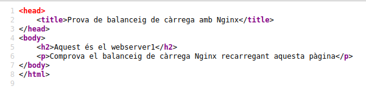

# Pràctica 4.4 – Balanceig de càrrega amb proxy invers en Nginx

## Requisits abans de començar la pràctica

!!!danger "Atenció, molt important abans de començar!"

    + La pràctica 4.3 ha d'estar funcionant correctament
    + No començar la pràctica abans de tenir la 4.3 ^^**funcionant i comprovada**^^

!!!info "Nota - Descripció de les màquines"

    Heu de posar al principi de l'informe de la pràctica aquest apartat, indicant què màquines heu utilitzat en la pràctica i amb quines IPs:

    | Màquina      | IP                         |
    | :--------- | :---------------------------------: |
    | Servidor web       |172.1.X.X |
    | Servidor web 2        |172.1.X.X |
    |  Proxy invers       |172.1.X.X |
    | ...       |... |


## Introducció

Els servidors proxy inversos i els balancejadores de càrrega són components d'una arquitectura informàtica client-servidor. Tots dos actuen com a intermediaris en la comunicació entre els clients i els servidors, realitzant funcions que milloren l'eficiència. 

Les definicions bàsiques són simples:

+ Un [proxy invers](https://www-nginx-com.translate.goog/resources/glossary/reverse-proxy-server?_x_tr_sl=en&_x_tr_tl=ca&_x_tr_hl=es&_x_tr_pto=nui) accepta una sol·licitud d'un client, la reenvía a un servidor que pot complir-la i retorna la resposta del servidor al client. 

+ Un [balancejador de càrrega](https://www-nginx-com.translate.goog/resources/glossary/load-balancing?_x_tr_sl=en&_x_tr_tl=ca&_x_tr_hl=es&_x_tr_pto=nui) distribueix les sol·licituds entrants del client entre un grup de servidors, en cada cas retornant la resposta del servidor seleccionat al client apropiat. 

Suenan bastant similars, veritat? Tots dos tipus d'aplicacions se situen entre clients i servidors, acceptant sol·licituds del primer i lliurant respostes del segon. No és d'estranyar que hi hagi confusió sobre què és un proxy invers i un balancejador de càrrega. Per ajudar a diferenciar-los, explorem quan i per què normalment s'implementen en un lloc web.

### Proxy invers

Ja coneixem aquest concepte de la pràctica anterior.

Mentre que implementar un balancejador de càrrega solament té sentit quan es tén diversos servidors, sovint té sentit implementar un proxy invers fins i tot amb un sol servidor web o servidor d'aplicacions. 

Es pot pensar en el proxy invers com la "cara pública" d'un lloc web. La seva adreça és la que s'anuncia per al lloc web i es troba a la frontera de la xarxa del lloc per acceptar sol·licituds de navegadors web i aplicacions mòbils per al contingut allotjat en el lloc web. 

### Balancejadors de càrrega

Els balancejadores de càrrega s'implementen amb major freqüència quan un lloc necessita diversos servidors perquè el volum de sol·licituds és massa perquè un sol servidor ho manegi de manera eficient. 

La implementació de diversos servidors també elimina un sol punt de falla, la qual cosa fa que el lloc web sigui més confiable. En general, tots els servidors allotgen el mateix contingut, i el treball del balancejador de càrrega és distribuir la càrrega de treball  de manera que  es faci el millor ús de la capacitat de cada servidor, eviti la sobrecàrrega en qualsevola de ells i doni com resultat la resposta més ràpida possible al client. 

^^Un balancejador de càrrega també pot millorar l'experiència de l'usuari en reduir la quantitat de respostes d'error que veu el client. Ho fa detectant quan els servidors cauen i desviant les sol·licituds d'ells als altres servidors del grup^^. En la implementació més simple, el balancejador de càrrega detecta l'estat del servidor en interceptar les respostes d'error a les sol·licituds regulars. 

!!!info 
    En aquesta pràctica tindrem l'escenari on Nginx farà tant de proxy invers com de balancejador de càrrega al mateix temps.


## Tasca

Anem a configurar dos servidors web Nginx amb dues màquines Ubuntu Server, a més de reutilitzar el proxy invers Nginx configurat en la pràctica anterior. Partirem per tant de la configuració de la pràctica anterior, afegint el necessari:

  + Cada servidor web presentarà un lloc web específic per a aquesta pràctica
      + El webserver2 ha de tenir la IP assignada de forma fixa mitjançant la configuració DHCP.
  + Il proxy invers que ja teníem configurat, hi haurà ara que configurar-ho perquè realitzi el balanceig de càrrega que desitgem
  + Realitzarem les peticions HTTP des del navegador web del nostre Xubuntu.
El diagrama de xarxa quedaria així:


Les tres màquines estaran a la nostra xarxa interna. Farem les peticions web des del navegador al proxy invers, que les repartirà entre els dos servidors web que tenim. 

Accedirem a ```http://balanceig``` i hem d'observar que les peticions, efectivament, es van repartint entre el servidor 1 i el 2.


### Configuracions

#### Nginx Servidor Web 1

El primer servidor web serà el servidor principal que hem vingut utilitzant fins ara durant el curs, on tenim instal·lats ja els servicis DNS, DHCP i Web.

Hem de configurar aquest servidor web perquè servicixi el següent index.html que heu de crear dins de la carpeta **```/var/www/webserver1/html```**:



+ El nom de l'lloc web que heu d'utilitzar en els arxius corresponents (sites-available…) que heu de crear per Nginx és **```webserver1```**, així com en les seues configuracions. Fixeu-vos en les configuracions que vau fer en pràctiques anteriors a manera de referència.
+ El lloc web ha d'escoltar en el port 8080.
+ Heu d'afegir una capçalera que es crida ```Serv_Web1_vostrenom```.

#### Nginx Servidor Web 2

Ha de ser una màquina Ubuntu Server amb tots els servicis parats excepte Nginx.

+ En aquest servidor web hem de realitzar una configuració idèntica al servidor web 1 però canviant ```webserver1``` per ```webserver2``` (també en el index.html), així com el nom de la capçalera afegida, que serà ```Serv_Web2_vostrenom```

!!!warning 
    
    És important que no quede cap referència a webserver1 per cap arxiu, d'una altra forma vos donarà resultats erronis i vos dificultarà molt trobar l'error.

#### Configuració DNS

Hem d'afegir dos nous registres a la nostra zona:

1. De pràctiques anteriors existeix un registre en el DNS de tipus CNAME (que fa referència al servidor que venim utilitzant des de principi de curs amb tots els servicis) per al nom ```webserver```. Heu de canviar-ho a ```webserver1``` que és com es dirà ara.

2. Un registre CNAME per a que ```balanceig``` sigui un àlies de ```proxy-server.dominio.es.```, tal com vau fer en la pràctica anterior.

    + Això permetrà que quan accedim via navegador a ```http://balanceig```, el DNS resolgui que la IP d'aquest domini és la del proxy invers.

3. ja que webserver2 és una màquina nova i independent, no podem afegir cap àlies per a ella. 
    + En aquest cas hem d'afegir un registre de tipus A perquè aquest nom apunti a la IP que tingui la màquina.

#### Nginx Proxy Invers

Ja disposem dels dos servidors web entre els quals es van a repartir les peticions que realitzi el client des del navegador. 
Anem, per tant, a configurar el proxy invers perquè realitzi aquest repartiment de peticions:

+ En sites-available heu de crear l'arxiu de configuració amb el nom **```balanceig```**
+ 
Aquest arxiu tindrà el següent format:

```yaml
	upstream backend_hosts {
                random;
                server ________:____;
                server ________:____;
    }
        	server {
                listen 80;
                server_name ________;      
                location / {
                	proxy_pass http://backend_hosts;
                }
            }
```
On:

- El bloc upstream → són els servidors entre els quals es va a repartir la càrrega, que són els dos que hem configurat anteriorment. 
  
    1. Si mireu el diagrama i teniu en compte la configuració que heu fet fins ara, aquí haureu de col·locar el nom de cada servidor, així com el port on està escoltant les peticions web.

    2. A aquest grup de servidors li posem un nom, que és ```backend_hosts```
   
        !!!Quote "Aclaració"
            En un lloc web, el backend s'encarrega de tots els processos necessaris perquè la web funcioni de forma correcta. Aquests processos o funcions no són visibles, però tenen molta importància en el bon funcionament d'un lloc web

    3. El paràmetre random el que fa és repartir les peticions HTTP que arriben al proxy invers de forma completament aleatòria entre el grup de servidors que s'hagi definit en el bloc upstream (en el nostre cas només hi ha dos).
   
         + Posarem random perquè és el més fàcil per comprovar que tot funciona bé en la pràctica, però hi ha diferents formes de repartir la càrrega (les peticions HTTP).

!!!Danger "Ull!"
    És importan que només ```webserver1``` (antic dnsserver) tinga tots els servicis habilitats

    ```Webserver2``` i ```proxy-invers``` només han de tindre nginx habilitat.

## Comprovacions

Si accediu a vostre lloc web, heu de poder seguir accedint sense problemes.

- Comproveu donant-li repetidament a F5, que accediu cada vegada a un dels servidors. Se us mostrarà el contingut del index.html del servidor corresponent cada vegada.
  
    + Per a una doble comprovació, utilitzant les eines de desenvolupador, mostreu que la web que se us mostra coincideix amb la capçalera que ha afegit el servidor web en la resposta HTTP.

!!!Note "Recordatori"
    Recordeu que és ^^**molt important**^^ que per realitzar aquestes comprovacions tingueu marcat el checkbox “Desactivar caché”. 

    

    Si no marqueu això, la pàgina es guardarà en la memòria caché del navegador i no estareu rebent la resposta del servidor sinó de la caché del navegador, la qual cosa pot donar lloc a resultats erronis.

### Comprovació del balanceig de càrrega quan cau un servidor

El nostre balancejador de càrrega està constantment monitorizando “la salut” dels servidors web. D'aquesta forma, si un deixa de funcionar per qualsevol raó, sempre enviarà les sol·licituds als quals quedin “vius”. Anem a comprovar-ho:

+ Per al servici Nginx en el servidor web 1 i comprova, de la mateixa forma que en l'apartat anterior, que totes les sol·licituds s'envien ara al servidor web 2
  
+ Després d'iniciar de nou Nginx en el servidor web 1, repeteix el procés amb el servidor web 2. 
  


## Qüestions finals

!!!Task "Questió 1"
    Busca informació de quins altres mètodes de balanceig es poden aplicar amb Nginx i descriu almenys 3 d'ells.

!!!Task "Questió 2"
    Si vull afegir 2 servidors webs més al balanceig de càrrega, descriu detalladament quina configuració hauré d'afegir i a on.

!!!Task "Questió 3"
    Descriu tots els passos que haurieu de seguir i configurar per tal de fer el balanceig de càrrega amb una de les vostres web de les pràctiques anteriors. 
    
    Indiqueu la configuració de totes les màquines (webservers, proxy...) i dels seus servicis.


## Avaluació

| Criteri      | Puntuació                         |
| :--------- | :----------------------------------: |
|  Configuració correcta i completa del servidor web 1   |**1 punts**  |
|  Configuració correcta i completa del servidor web 1   |**1 punts**  |
|  Configuració correcta i completa del DNS  |**2.5 punts**  |
|  Configuració correcta i completa del proxy invers| **1 punts** |
|Qüestions finals | **3 punts** |
| S'ha tingut cura amb el format del document, utilitzant la plantilla actualitzada i fent ús d'un correcte llenguatge tècnic |**1 punt** |
| S'ha inclòs la taula amb les IPs de cada màquina de la pràctica, tal i com es demana|**0.5 punt**|

