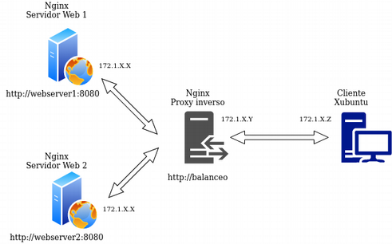
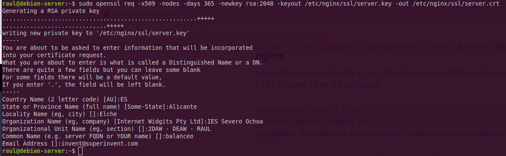
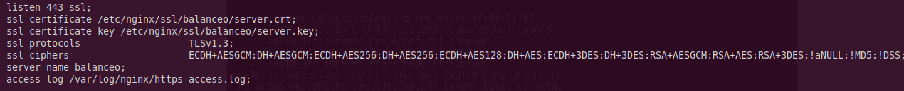
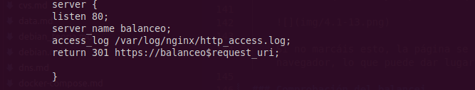

# Practica4.5 - Proxy invers i balanceig de càrrega amb SSL en NGINX

## Requisits abans de començar la pràctica

!!!danger "Atenció, molt important abans de començar!"

    + La pràctica 4.4 ha d'estar funcionant correctament
    + No començar la pràctica abans de tenir la 4.3 ^^**funcionant i comprovada**^^

!!!info "Nota - Descripció de les màquines"

    Heu de posar al principi de l'informe de la pràctica aquest apartat, indicant què màquines heu utilitzat en la pràctica i amb quines IPs:

    | Màquina      | IP                         |
    | :--------- | :---------------------------------: |
    | Servidor web       |172.1.X.X |
    | Servidor web 2        |172.1.X.X |
    |  Proxy invers       |172.1.X.X |
    | ...       |... |


## Introducció

A partir de les pràctiques anteriors hem arribat a un escenari on un proxy invers actua d'intermediari entre dos servidors web Nginx, balancejant la càrrega entre ells. 

Ja vam dir que una important funció que podia tenir un proxy invers era realitzar el xifrat i desxifrat de SSL per utilitzar HTTPS en els servidors web. D'aquesta forma s'alleujava la càrrega de treball dels servidors web, ja que és una tasca que consumeix recursos.

En definitiva, tindríem un esquema com aquest:


Podria arribar-se a pensar que en termes de seguretat no és adequat que el tràfic de xarxa entre el balanceador de càrrega i els servidors web vagi sense xifrar (HTTP). No obstant això, pensant en un cas real, la xarxa privada i el proxy invers/balanceador de càrrega, a més d'estar a la mateixa xarxa privada, solen estar administrats per les mateixes persones de la mateixa empresa, per la qual cosa no suposa un perill real que aquest tràfic vagi sense xifrar.

Podria xifrar-se si fos necessari, però llavors perd sentit que el proxy invers s'encarregui del xifrat SSL para HTTPS, ja que faríem el mateix treball dues vegades.

Així les coses, ens quedarem amb l'esquema de la imatge de més amunt per a la pràctica.

### Certificats

HTTPS es basa en l'ús de certificats digitals.

Grosso modo, quan entrem en una web via HTTPS, aquesta ens presenta un certificat digital per assegurar que és qui diu ser. Com sabem que aquest certificat és vàlid? Hem de consultar a l'Autoritat de Certificació (CA) que va emetre aquest certificat si és vàlid.

Les CA són entitats que emeten certificats i el seu funcionament es basa en la confiança. Confiem que els certificats emesos i signats per aquestes entitats són reals i funcionals. 


Els navegadors web tenen precargadas les Autoritats de Certificació en les quals confien per defecte a l'hora de navegar per webs HTTPS:


Si accedim a una web que el seu certificat no hagi estat emès i signat per una d'aquestes entitats, ens saltarà el famós avís:


Ja que si el certificat no ha estat emès i signat per una CA de confiança, pot ser que es tracti d'una web maliciosa que ens suposi un risc de seguretat, com bé diu l'avís.

## Tasca

Partim de la configuració exacta de la pràctica anterior, que recordem era aquesta:



Pel que en aquesta pràctica simplement hem d'afegir la configuració SSL per al xifrat en el Proxy Invers:


Tal com quedarà la configuració, des del client encara podríem accedir als dos servidors web amb HTTP (podeu provar-ho) però és alguna cosa que solucionarem en següents temes, configurant un firewall perquè només la IP del proxy invers pugui accedir per HTTP als servidors web i ningú més.

### Creació del certificat autofirmat

Nosaltres no utilitzarem certificats de cap CA de confiança, bàsicament perquè:

+ Els nostres servicis no estan publicats en Internet
  
+ Aquests certificats son de pagament
  

  
Així doncs, nosaltres crearem els nostres propis certificats i els signarem nosaltres mateixos com si anéssim una CA autèntica per poder simular aquest escenari.

!!!warning
    Això provocarà que quan accedim per HTTPS a nostre lloc web per primera vegada, ens vaig saltar l'avís de seguretat que es comentava en la introducció.

En aquest cas no hi haurà perill donat que estem 100% segurs de que aquest certificat ho hem emès nosaltres per a aquesta pràctica, no hi ha dubtes.

Veiem doncs el procés per generar els certificats i les claus associades a ells (privada/pública). En primer lloc hem de crear el següent directori:

```/etc/nginx/ssl/balanceig```

Podem crear el certificat i les claus de forma simultània amb un únic comando, on:

* **openssl**: aquesta és l'eina per línia de comandos bàsica per crear i administrar certificats, claus i altres arxius OpenSSL. 
  
* **req**: aquest subcomando s'utilitza per generar una sol·licitud de certificats i també sol·licituds de signatura de certificats (CSR).
  
* **-x509**: Això modifica encara més el subcomando anterior en dir-li a l'eina que volem crear un certificat autofirmat en lloc de generar una sol·licitud de signatura de certificat, com succeiria normalment. 
  
* **-nodes**: Això li diu a OpenSSL que ometi l'opció d'assegurar el nostre certificat amb contrasenya. Necessitem que Nginx puga llegir l'arxiu sense la intervenció de l'usuari quan s'inicia el servidor. Una contrasenya evitaria que això passés ja que hauríem de introduir-la a mà després de cada reinici. 
  
* **-days 365**: aquesta opció estableix el temps durant el qual el certificat es considerarà vàlid. Ho configurem pa r a un any.
  
* **-newkey rsa**: 2048 : Això especifica que volem generar un nou certificat i una nova clau al mateix temps. No vam crear la clau necessària per signar el certificat en un pas anterior, per la qual cosa hem de crear-la juntament amb el certificat. La rsa:2048part li diu que creï una clau RSA de 2048 bits de longitud. 
  
* **-keyout**: aquest paràmetre li diu a OpenSSL on col·locar l'arxiu de clau privada generat que estem creant. 
  
* **-out**: Això li diu a OpenSSL on col·locar el certificat que estem creant. 

El comando complet seria així:



Vos sol·licitarà que introduïu una sèrie de paràmetres, com veieu en el requadre vermell de baix de la imatge. Heu d'introduir els mateixos paràmetres que en la imatge excepte en el “Organizational Unit Name” que veieu en el requadre en groc. Ací haureu de posar ```2SMR – SRE - Vostrenom```

### Configuració SSL en el proxy invers

De la pràctica anterior, dins del directori ```/etc/nginx/sites-available``` ja heu de tenir l'arxiu de configuració anomenat *“balanceig”*. És precisament aquí on realitzarem la configuració perquè l'accés  a l'lloc web es realitzi mitjançant SSL (HTTPS).

Dins del bloc ```server {…}``` heu d'afegir, sense llevar res, les següents línies de configuració:



On li esteu dient que:

* Escolti en el port 443 → Port per defecte d'HTTPS

* El directori on està el certificat que heu generat anteriorment

* El directori on està la clau que heu generat anteriorment

* Els protocols i tipus de xifrats que es poden utilitzar → Aquestes són les versions de protocols i els tipus de xifrats considerats assegurances a dia d'avui (hi ha molts més però no es consideren assegurances actualment)

* ```server_name``` ja ho teníeu de la pràctica anterior, no fa mancada tocar-ho

* L'arxiu on es guarden els logs canvia de nom, ara serà https_access.log.

Recordeu que després de modificar qualsevol configuració d'un servici, cal reiniciar el servici, en aquest cas Nginx.

### Comprovacions

* Si accediu ara a https://balanceig us hauria de saltar un avís de seguretat a causa que el nostre certificat és autofirmat, com comentàvem anteriorment.

* Si afegiu una una excepció podreu accedir a l'lloc web i recarregant repetidament la pàgina amb F5, veureu que el balanceig de càrrega es fa correctament accedint mitjançant HTTPS.

* Per comprovar que les dades del certificat són, efectivament, els vostres podeu comprovar-ho així. Prement en el cadenat de la barra de recerca:


Amb més informació:


!!!info 
    Ací també podreu eliminar l'excepció que heu afegit a la pàgina de l'advertiment de seguretat, per si necessiteu reiniciar les proves.

I finalment, veure certificat:


I podrem veure els detalls:


Si ara intenteu accedir a **```http://balanceig```**, hauríeu de poder accedir? Comproveu-ho i descriviu què passa i per què.

### Redirecció forçosa a HTTPS

Perquè, indistintament de la forma per la qual accedim a l'lloc web balancejo, sempre es forci a utilitzar HTTPS, necessitarem una configuració addicional.

Necessitem afegir un bloc “server” addicional i separat de l'altre, a l'arxiu de configuració de “balanceig”. Alguna cosa així:



Amb aquesta configuració li estem dient que:

* Escolti en el port 80 (HTTP)

* Que el nom al que respondrà el servidor/lloc web és balanceig

* Què guardi els logs d'aquest bloc en aquest directori i amb aquest nom

* Quan es rep una petició amb les dues condicions anteriors, es retorna un codi HTTP 301:

    - **HTTP 301 Moved Permanently** (Mogut permanentment en valencià) és un codi d'estat d'HTTP que indica que el host ha estat capaç de comunicar-se amb el servidor però que el recurs sol·licitat ha estat mogut a una altra adreça permanentementeEs molt important configurar les redireccions 301 en els llocs web i per a això hi ha diferents mètodes i sintaxis per realitzar la redirecció 301.
  
        * La **redirecció 301** és un codi o comando inserit per un Webmaster que permet redirigir als usuaris i cercadors d'un lloc web d'un lloc a un altre
  
    !!!Note "Aclaració"
        És a dir, la qual cosa estem fent és que quan es rebi una petició HTTP (port 80) en ```http://balanceig```, es redirigeixi a ```https://balanceig``` (HTTPS)

!!!Question "Tasca"
    * Elimineu de l'altre bloc ```server{…}``` la línies que facin referència a escoltar en el port 80 (```listen 80…```).
    * Reinicieu el servici
    * Comproveu ara que quan entreu en ```http://balanceig```, automàticament us redirigeix a la versió segura de la web.
    * Comproveu que quan realitzeu una petició en l'arxiu de log ```http_access.log``` apareix la redirecció 301 i que, de la mateixa manera, apareix una petició GET en ```https_access.log```.


## Qüestions finals

!!!Task "Questió 1"
    Hem configurat el nostre proxy invers amb tot lo que ens fa falta però no ens funciona i ens dona un error del tipus ```This site can't provide a secure connection, ERR_SSL_PROTOCOL_ERROR.```

    Dins del nostre server block tenim això:
    
    ```yaml
	server {
		listen 443;
		ssl_certificate /etc/nginx/ssl/enrico-berlinguer/server.crt;
		ssl_certificate_key /etc/nginx/ssl/enrico-berlinguer/server.key;
		ssl_protocols                   TLSv1.3;
		ssl_ciphers                     ECDH+AESGCM:DH+AESGCM:ECDH+AES256:DH+AES256:ECDH+AES128:DH+AES:ECDH+3DES:DH+3DES:RSA+AESGCM:RSA+AES:RSA+3DES:!aNULL:!MD5:!DSS;
		server_name enrico-berlinguer;
		access_log /var/log/nginx/https_access.log;

		location / {
			proxy_pass http://red-party;
		    }
    	}
    ```
!!!Task "Qüestió 2"
    Imagineu que intentem accedir al nostre lloc web HTTPS i ens trobem el següent error:

    

    Investigueu què està passant i com s'ha de solucionar.


## Avaluació

| Criteri      | Puntuació                         |
| :--------- | :----------------------------------: |
| Creació correcta del certificat    |**1 punts**  |
| Configuració SSL correcta del proxy  | **3 punts** |
|Comprovacions | **2 punts**|
| Configuració correcta de la redirecció forçosa a HTTPS i comprovacions | **2 punts**|
| Qüestions finals | **1 punt**|
| S'ha tingut cura amb el format del document, utilitzant la plantilla actualitzada i fent ús d'un correcte llenguatge tècnic |**0.5 punt** |
|S'ha inclòs la taula amb les IPs de cada màquina de la pràctica, tal i com es demana|**0.5 punt**|


