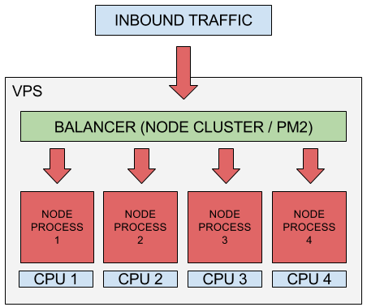
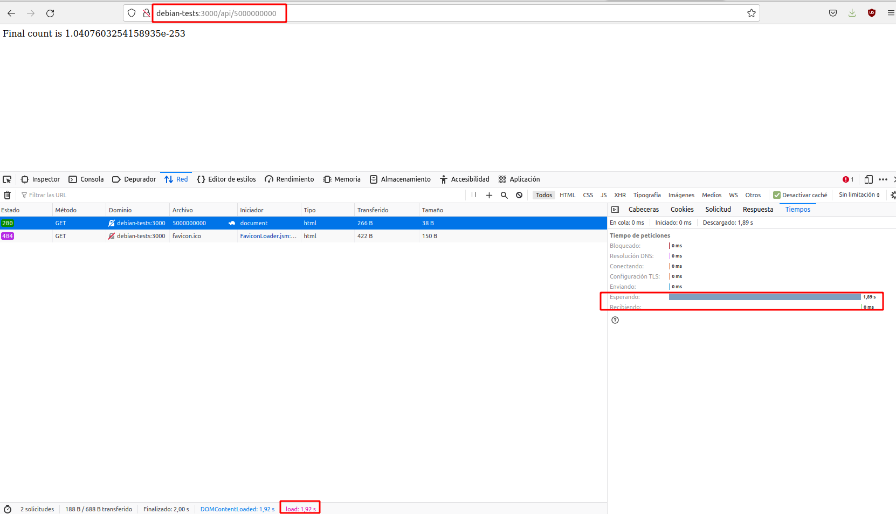
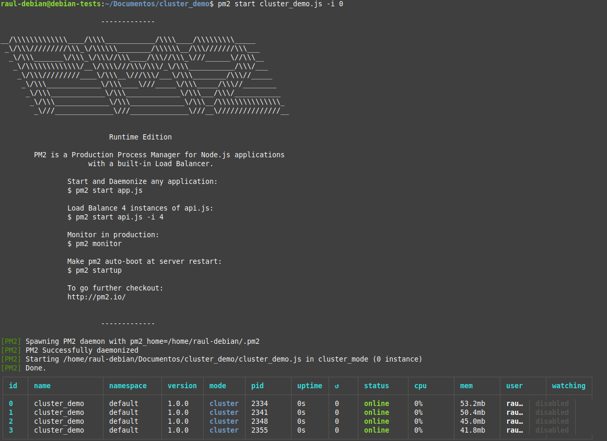

# Práctica 3.3: Despliegue de una aplicación "clusterizada" con Node Express

## Introducción

Cuando se construye una aplicación de producción, normalmente se busca la forma de optimizar su rendimiento llegando a una solución de compromiso. En esta práctica echaremos un vistazo a un enfoque que puede ofrecer una victoria rápida cuando se trata de mejorar la manera en que las aplicaciones Node.js manejan la carga de trabajo.

Una instancia de Node.js se ejecuta en un solo hilo, lo que significa que en un sistema multinúcleo (como la mayoría de los ordenadores de hoy en día), no todos los núcleos serán utilizados por la aplicación. Para aprovechar los otros núcleos disponibles, podemos lanzar un cluster de procesos Node.js y distribuir la carga entre ellos.



Tener varios hilos para manejar las peticiones mejora el rendimiento (peticiones/segundo) del servidor, ya que varios clientes pueden ser atendidos simultáneamente. Veremos cómo crear procesos hijos con el módulo de cluster de Node.js para, más tarde, ver cómo gestionar el cluster con el gestor de procesos PM2.

### Un vistazo rápido a los clusters

[El módulo de clúster de Node.js](https://nodejs.org/api/cluster.html) permite la creación de procesos secundarios (*workers*) que se ejecutan simultáneamente y comparten el mismo puerto de servidor. Cada hijo generado tiene su propio ciclo de eventos y memoria. Los procesos secundarios utilizan IPC (comunicación entre procesos) para comunicarse con el proceso principal de Node.js.

Tener múltiples procesos para manejar las solicitudes entrantes significa que se pueden procesar varias solicitudes simultáneamente y si hay una operación de bloqueo/ejecución prolongada en un *worker*, los otros *workers* pueden continuar administrando otras solicitudes entrantes; la aplicación no se detendrá hasta que finalice la operación de bloqueo.

La ejecución de varios *workers* también permite actualizar la aplicación en producción con poco o ningún tiempo de inactividad. Se pueden realizar cambios en la aplicación y reiniciar los *workers* uno por uno, esperando que un proceso secundario se genere por completo antes de reiniciar otro. De esta manera, siempre habrá *workers* ejecutándose mientras se produce la actualización.

Las conexiones entrantes se distribuyen entre los procesos secundarios de dos maneras:

* El proceso maestro escucha las conexiones en un puerto y las distribuye entre los *workers* de forma rotatoria. Este es el enfoque por defecto en todas las plataformas, excepto Windows.

* El proceso maestro crea un socket de escucha y lo envía a los *workers* interesados ​​que luego podrán aceptar conexiones entrantes directamente.

### Usando los clusters

#### Primero sin clúster

Para ver las ventajas que ofrece la agrupación en clústeres, comenzaremos con una aplicación de prueba en Node.js que no usa clústeres y la compararemos con una que sí los usa, se trata de la siguiente:

```javascript
const express = require("express");
const app = express();
const port = 3000;
 
app.get("/", (req, res) => {
 res.send("Hello World!");
});
 
app.get("/api/:n", function (req, res) {
 let n = parseInt(req.params.n);
 let count = 0;
 
 if (n > 5000000000) n = 5000000000;
 
 for (let i = 0; i <= n; i++) {
 count += i;
 }
 
 res.send(`Final count is ${count}`);
});
 
app.listen(port, () => {
 console.log(`App listening on port ${port}`);
});
```
Se trata de una aplicación un tanto *prefabricada* en el sentido de que es algo que jamás encontraríamos en el mundo real. No obstante, nos servirá para ilustrar nuestro propósito.

Esta aplicación contiene dos rutas, una ruta raíz `/` que devuelve la cadena `Hello World!` y otra ruta `/api/n` donde se toma `n` como parámetro y va realizando una operación de suma (el bucle for) cuyo resultado acumula en la variable `count` que se muestra al final.

Si a este parámetro `n`, le damos un valor muy alto, nos permitirá simular operaciones intensivas y de ejecución prolongada en el servidor. Le damos como valor límite `5000000000` para evitar una operación demasiado costosa para nuestro ordenador.

!!!task
    1. Debéis conectaros al servidor Debian mediante SSH
    2. Debéis crear un directorio para el proyecto de esta aplicación
    3. DENTRO del directorio ejecutaréis 2 comandos:
          1. `npm init` para crear automáticamente la estructura de carpetas y el archivo `package.json` (Con ir dándole a <ENTER> a todas las preguntas, o basta)
          2. `npm install express` para instalar express para este proyecto
    4. Tras esto, DENTRO del directorio, ya podéis iniciar la aplicación con: `node nombre_aplicacion.js`

Para comprobarlo, podéis acceder a `http://IP-maq-virtual:3000` o a `http://IP-maq-virtual:3000/api/50` donde `IP-maq-virtual` es la IP del adaptador puente de vuestra Debian.

Utilizada un valor de `n` relativamente pequeño, como el 50 del ejemplo anterior y comprobaréis que se ejecutará rápidamente, devolviendo una respuesta casi inmediata.

Hagamos otra simple comprobación para valores de `n` más grandes. Desplegada e iniciada la aplicación, acceded a la ruta `http://IP-maq-virtual:3000/api/5000000000`. 


Mientras esta solicitud que tarda unos segundos se está procesando, acceded en otra pestaña del navegador a `http://IP-maq-virtual:3000` o a `http://IP-maq-virtual:3000/api/n` siendo `n` el valor que le queráis dar.


Utilizando las devoloper tools, podemos ver el tiempo que tardan en procesarse las solicitudes:

1. La primera solicitud, al tener un valor de `n` grande, nos lleva unos cuantos segundos completarla.
2. La segunda solicitud, pese a tener un valor de `n` que ya habíamos comprobado que ofrecía una respuesta casi inmediata, también se demora unos segundos.

**¿Por qué ocurre esto?** Porque el único subproceso estará ocupado procesando la otra operación de ejecución prolongada. El único núcleo de la CPU tiene que completar la primera solicitud antes de que pueda encargarse de la otra.

#### ¡Ahora con más clúster!

Ahora usaremos el módulo de clúster en la aplicación para generar algunos procesos secundarios y ver cómo eso mejora las cosas.

A continuación se muestra la aplicación modificada:

```javascript
const express = require("express");
const port = 3000;
const cluster = require("cluster");
const totalCPUs = require("os").cpus().length;
 
if (cluster.isMaster) {
 console.log(`Number of CPUs is ${totalCPUs}`);
 console.log(`Master ${process.pid} is running`);
 
 // Fork workers.
 for (let i = 0; i < totalCPUs; i++) {
 cluster.fork();
 }
 
 cluster.on("exit", (worker, code, signal) => {
 console.log(`worker ${worker.process.pid} died`);
 console.log("Let's fork another worker!");
 cluster.fork();
 });
} else {
 const app = express();
 console.log(`Worker ${process.pid} started`);
 
 app.get("/", (req, res) => {
 res.send("Hello World!");
 });
 
 app.get("/api/:n", function (req, res) {
 let n = parseInt(req.params.n);
 let count = 0;
 
 if (n > 5000000000) n = 5000000000;
 
 for (let i = 0; i <= n; i++) {
 count += i;
 }
 
 res.send(`Final count is ${count}`);
 });
 
 app.listen(port, () => {
 console.log(`App listening on port ${port}`);
 });
}
```
Esta aplicación hace lo mismo que antes pero esta vez estamos generando varios procesos secundarios que compartirán el puerto 3000 y que podrán manejar las solicitudes enviadas a este puerto. Los procesos de trabajo se generan utilizando el método `child_process.fork()`. El método devuelve un objeto `ChildProcess` que tiene un canal de comunicación incorporado que permite que los mensajes se transmitan entre el hijo y su padre.

Creamos tantos procesos secundarios como núcleos de CPU hay en la máquina en la que se ejecuta la aplicación. Se recomienda no crear más *workers* que núcleos lógicos en la computadora, ya que esto puede causar una sobrecarga en términos de costos de programación. Esto sucede porque el sistema tendrá que programar todos los procesos creados para que se vayan ejecutando por turnos en los núcleos.

Los *workers* son creados y administrados por el proceso maestro. Cuando la aplicación se ejecuta por primera vez, verificamos si es un proceso maestro con `isMaster`. Esto está determinado por la variable `process.env.NODE_UNIQUE_ID`. Si `process.env.NODE_UNIQUE_ID` tiene valor *undefined*, entonces `isMaster` será *true*.

Si el proceso es un maestro, llamamos a `cluster.fork()` para generar varios procesos. Registramos los ID de proceso maestro y *worker*. Cuando un proceso secundario muere, generamos uno nuevo para seguir utilizando los núcleos de CPU disponibles.

Ahora repetiremos el mismo experimento de antes, primero realizamos una solicitud al servidor con un valor alto `n`: 



Y ejecutamos rápidamente otra solicitud en otra pestaña del navegador, midiendo los tiempos de procesamiento de ambas:


Comprobaremos que éstos se reducen drásticamente.

!!!note
    Con varios *workers* disponibles para aceptar solicitudes, se mejoran tanto la disponibilidad del servidor como el rendimiento.

Ejecutar una solicitud en una pestaña del navegador y ejecutar rápidamente otra en una segunda pestaña sirve para mostrarnos la mejora que ofrece la agrupación en clústeres para nuestro ejemplo de una forma más o menos rápida, pero es un método un tanto "chapucero" y no es una forma adecuada o confiable de determinar las mejoras de rendimiento.

En el siguiente apartado echaremos un vistazo a algunos puntos de referencia que demostrarán mejor cuánto ha mejorado la agrupación en clústeres nuestra aplicación.

#### Métricas de rendimiento

Realizaremos una prueba de carga en nuestras dos aplicaciones para ver cómo cada una maneja una gran cantidad de conexiones entrantes. Usaremos el paquete `loadtest` para esto.

El paquete `loadtest` nos permite simular una gran cantidad de conexiones simultáneas a nuestra API para que podamos medir su rendimiento.

Para usar `loadtest`, primero debemos instalarlo globalmente. Tras conectaros por SSH al servidor Debian:

```sh
npm install -g loadtest
```

Luego ejecutamos la aplicación que queremos probar (`node nombre_aplicacion.js`). Comenzaremos probando la versión que no utiliza la agrupación en clústeres.

Mientras ejecutamos la aplicación, en otro terminal realizamos la siguiente prueba de carga:

```sh
loadtest http://localhost:3000/api/500000 -n 1000 -c 100
```

El comando anterior enviará 1000 solicitudes a la URL dada, de las cuales 100 son concurrentes. El siguiente es el resultado de ejecutar el comando anterior:


Vemos que con la misma solicitud (con n= 500000) el servidor ha podido manejar 404 solicitudes por segundo con una latencia media de 232.4 milisegundos (el tiempo promedio que tarda en completar una sola solicitud).

Intentémoslo de nuevo, pero esta vez con más solicitudes (y sin clústeres):


Vemos que las métricas arrojan resultados aún peores.

Ahora detenemos nuestra aplicación sin clústers y ejecutamos la que sí los tiene (`node nombre_aplicacion_cluster.js`). Ejecutaremos exactamente las mismas pruebas con el objetivo de realizar una comparación:


Es obvio que los clústers permiten manejar una mayor cantidad de peticiones por segundo con una menor latencia.

#### Uso de PM2 para administrar un clúster de Node.js

En nuestra aplicación, hemos usado el módulo `cluster` de Node.js para crear y administrar manualmente los procesos.

Primero hemos determinado la cantidad de *workers* (usando la cantidad de núcleos de CPU como referencia), luego los hemos generado y, finalmente, escuchamos si hay *workers* muertos para poder generar nuevos.

En nuestra aplicación de ejemplo muy sencilla, tuvimos que escribir una cantidad considerable de código solo para administración la agrupación en clústeres. En una aplicación de producción es bastante problable que se deba escribir aún más código.

Existe una herramienta que nos puede ayudar a administrar todo esto un poco mejor: el administrador de procesos `PM2`. `PM2` es un administrador de procesos de producción para aplicaciones Node.js con un balanceador de carga incorporado.

Cuando está configurado correctamente, `PM2` ejecuta automáticamente la aplicación en modo de clúster, generando *workers* y se encargándose de generar nuevos *workers* cuando un *worker* muera.

`PM2` facilita la parada, eliminación e inicio de procesos, además de disponer de algunas herramientas de monitorización que pueden ayudarnos a monitorizar y ajustar el rendimiento de su aplicación.

Para usar `PM2`, primero instalamos globalmente en nuestra Debian:

```sh
npm install pm2 -g
```

Vamos a utilizarlo con nuestra primera aplicación, la que no estab "clusterizada" en el código. Para ello ejecutaremos el siguiente comando:

```sh
pm2 start nombre_aplicacion_sin_cluster.js -i 0
```

Donde:

+ `-i` <número workers> le indicará a `PM2` que inicie la aplicación en `cluster_mode` (a diferencia de `fork_mode`).

    Si <número workers>se establece a 0, `PM2` generará automáticamente tantos *workers* como núcleos de CPU haya.

Y así, nuestra aplicación se ejecuta en modo de clúster, sin necesidad de cambios de código. 

!!!task
    Ejecuta y documenta con capturas de pantallas, las mismas pruebas que antes pero utilizando PM2 y comprueba si se obtienen los mismos resultados.

Por detrás, `PM2` también utiliza el módulo `cluster` de Node.js, así como otras herramientas que facilitan la gestión de procesos.

En el Terminal, obtendremos una tabla que muestra algunos detalles de los procesos generados:



Podemos detener la aplicación con el siguiente comando:

```sh
pm2 stop app.js
```

La aplicación se desconectará y la salida por terminal mostrará todos los procesos con un estado `stopped`.


En vez de tener pasar siempre las configuraciones cuando ejecuta la aplicación con `pm2 start app.js -i 0`, podríamos facilitarnos la tarea y guardarlas en un archivo de configuración separado, llamado [Ecosystem](https://pm2.keymetrics.io/docs/usage/application-declaration/). 

Este archivo también nos permite establecer configuraciones específicas para diferentes aplicaciones.

Crearemos el archivo *Ecosystem* con el siguiente comando:


Que generará un archivo llamado ***ecosystem.config.js***. Para el caso concreto de nuestra aplicación, necesitamos modificarlo como se muestra a continuación:

```json
module.exports = {
 apps: [
 {
 name: "nombre_aplicacion",
 script: "nombre_aplicacion_sin_cluster.js",
 instances: 0,
 exec_mode: "cluster",
 },
 ],
};
```

Al configurar `exec_mode` con el valor `cluster`, le indica a `PM2` que balancee la carga entre cada instancia. `instances` está configurado a **0** como antes, lo que generará tantos *workers* como núcleos de CPU.

La opción `-i` o `instances` se puede establecer con los siguientes valores:

  + `0` o `max`(en desuso) para "repartir" la aplicación entre todas las CPU

  + `-1` para "repartir" la aplicación en todas las CPU - 1

  + `número` para difundir la aplicación a través de un número concreto de CPU

Ahora podemos ejecutar la aplicación con:

```sh
pm2 start ecosystem.config.js
```

La aplicación se ejecutará en modo clúster, exactamente como antes.

Podremos iniciar, reiniciar, recargar, detener y eliminar una aplicación con los siguientes comandos, respectivamente:

```sh
$ pm2 start nombre_aplicacion
$ pm2 restart nombre_aplicacion
$ pm2 reload nombre_aplicacion
$ pm2 stop nombre_aplicacion
$ pm2 delete nombre_aplicacion
 
# Cuando usemos el archivo Ecosystem:
 
$ pm2 [start|restart|reload|stop|delete] ecosystem.config.js
```

El comando `restart` elimina y reinicia inmediatamente los procesos, mientras que el comando `reload` logra un tiempo de inactividad de 0 segundos donde los *workers* se reinician uno por uno, esperando que aparezca un nuevo *worker* antes de matar al anterior.

También puede verificar el estado, los registros y las métricas de las aplicaciones en ejecución.

!!!task
    Investiga los siguientes comandos y explica que salida por terminal nos ofrecen y para qué se utilizan:

    ```sh
    pm2 ls
    pm2 logs
    pm2 monit
    ```


!!!warning
    Documenta la realización de toda esta práctica adecuadamente, con las explicaciones y justificaciones necesarias, las respuestas a las preguntas planteadas y las capturas de pantalla pertinentes.

## Cuestiones

Fijáos en las siguientes imágenes:


La primera imagen ilustra los resultados de unas pruebas de carga sobre la aplicación sin clúster y la segunda sobre la aplicación clusterizada.

¿Sabrías decir por qué en algunos casos concretos, como este, la aplicación sin clusterizar tiene mejores resultados?

## Referencias

[How to install ExpressJS on Debian 11?](https://unixcop.com/how-to-install-expressjs-on-debian-11/)

[Improving Node.js Application Performance With Clustering](https://blog.appsignal.com/2021/02/03/improving-node-application-performance-with-clustering.html)