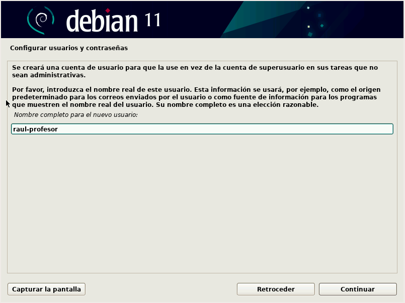
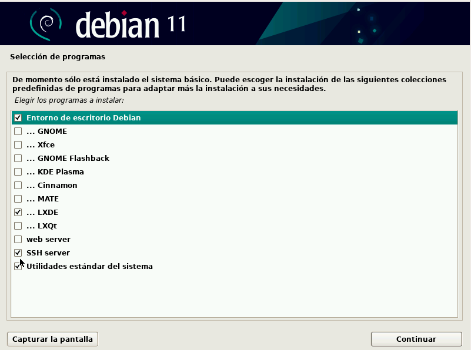

# Instalación y configuración de nuestra máquina virtual

## Instalación de Debian

Como servidor, utilizaremos la distribución Linux Debian. Tal y como podemos leer en la [propia página de Debian](https://www.debian.org/CD/netinst/index.es.html):

!!!quote
     Un CD de "instalación por red" o "netinst" es un único CD que posibilita que instale el sistema completo. Este único CD contiene sólo la mínima cantidad de software para instalar el sistema base y obtener el resto de paquetes a través de Internet.

Así pues, procedamos a descargar la imagen de Debian netinstall [aquí](https://cdimage.debian.org/debian-cd/current/amd64/iso-cd/debian-11.4.0-amd64-netinst.iso)

!!!info "Info"
    Queda muy lejos de la intención de este módulo explicar como instalar máquinas virtuales puesto que es algo que se supone aprendido del curso anterior y/u otros módulos. Así pues, se darán unas pautas generales para instalar la máquina correctamente.

    La instalación de esta máquina virtual debería servir a lo largo del módulo utilizado cualquier hipervisor (VMWare, VirtualBox, KVM, HyperV...). No obstante, se utilizará Virtualbox para esta explicación.

En primer lugar, debemos crear una máquina virtual nueva, indicando su ubicación, su nombre y el tipo de sistema operativo:


Le indicamos que monte como unidad de CD la iso de netinstall de Debian que hemos descargado previamente:


También estableceremos un único interfaz de red. Para ello, en el único adaptador de red que debe tener la máquina virtual, debemos configurarlo como tipo puente, de forma que obtenga una IP en el rango de la red local en la que nos encontremos conectados (casa, instituto...).


**Sin entorno gráfico la máquina puede que funcione perfectamente con 1GB de RAM, no obstante se aconseja, si es posible, asignarle 2GB de RAM y, como mínimo, 2 procesadores.**

Podéis instalar Debian tanto de forma gráfica como de forma clásica en terminal. La primera de ellas es la que os recomiendo:


Le dáis el nombre que queráis a vuestra máquina. Recomendable un nombre corto pues luego aparecerá en el *prompt* del terminal (`usuario@nombredemaquina`)


Os pedirá también contraseña de superusuario (root), nombre de vuestro usuario y contraseña para este nuevo usuario:



Tras ello, para simplificar nuestro proceso, le diremos que utilice todo el disco para la instalación:


E iremos dejando todas las opciones que nos vayan apareciendo por defecto y continuando la instalación.

Tras un rato, que puede ser más o menos largo, nos mostrará la opción de instalar un entorno gráfico. En principio no nos hace falta ninguno y esta es la opción recomendada por un tema de economización de los recursos. 


Pero si por alguna razón queréis instalar alguno, os recomiendo LXDE puesto que es el que menos recursos consume:



También debéis marcar las opciones que aparecen en la imagen, **SSH Server** y **Utilidades estándar**.

Le indicamos que sí que instale el gestor de arranque GRUB y continuamos con todas las opciones por defecto:


Y le indicamos que lo instale en el único disco que tenemos: `/dev/sda1` (pinchad en el nombre o no lo instalará ahí)


Completará el proceso y pedirá reiniciar, cosa que haréis. Tras ello, si no tenéis entorno gráfico aparecerá un terminal pidiendo login. 

Si hubieráis instalado el entorno gráfico, os aparecerá algo así:


En ambos casos, introduciendo el nombre de usuario y contraseña podremos loguearnos en el sistema.


## Dar permisos de sudo a nuestro usuario

Una vez instalada nuestra Debian, tendremos un usuario *raso* que es el que le dijimos que crease durante la instalación.

Puesto que a lo largo de este módulo realizaremos incontables tareas de administración, resulta un tanto incómodo, así como peligroso, el tener que cambiar de nuestro usuario a *root* cada vez que haya que instalar, configurar o modificar algo que así lo requiera.

Así pues, le daremos permisos de `sudo` a nuestro usuario. Estos permisos nos permitirán que cualquier comando que ejecutemos en el terminal precedido de la palabra `sudo` se ejecute como *root*. De la misma forma, cualquier comando que ejecutemos con nuestro usuario sin `sudo`, será ejecutado con los permisos de nuestro usuario, por lo que nos protegemos de *liarla* con un comando que no toca como *root*.

Dicho esto, hay varias formas de proceder, veamos la más típica y conocida. Se trata de modificar el archivo del sistema encargado de recoger estos permisos: `/etc/sudoers`. 

En primer lugar debemos conectarnos por SSH a nuestra máquina Debian:

```
ssh -l nombre_de_usuario IP_MV_Debian
```

Donde:

+ `nombre_de_usuario` es vuestro nombre de usuario (el que configurastéis durante la instalación)
+ `IP_MV_Debian` es la IP de la máquina Debian

!!!info
    Existen varias formas de conocer la IP de vuestra Debian pero quizás la más sencilla sea desde la propia máquina virtual, con el comando:

    ```
    ip a
    ```

    

    Ahí veo que esa IP está dentro del rango de mi red local. Además, puesto que la máquina sólo tiene una interfaz de red, no puede ser ninguna otra. Esa será la IP a la que conectarse.


Cambiando de nuestro usuario al usuario *root*:

```
su root
```

Ejecutamos la aplicación `visudo` que se encarga directamente de modificar el archivo de sudoers:

```
# /usr/sbin/visudo
```

Y dejamos el archivo así, claro está, con vuestro propio nombre de usuario:

```
# User privilege specification
root            ALL=(ALL:ALL) ALL 
nombreusuario	ALL=(ALL:ALL) ALL
```

Pulsamos `CTRL+x` y guardamos los cambios.

Tras esto, debemos desloguearnos de nuestra sesión SSH y volver a loguearnos. Ahora podremos validar que ya podemos realizar acciones que requieran permisos de superusuario o root. Esta validación puede realizarse con el comando:

```sh
sudo -v
```

Que en caso de no tener permisos nos devolverá el siguiente mensaje:

```sh
Sorry, user [username] may not run sudo on [hostname].
```

Y en caso de tenerlos, no devolverá nada.

Si aún así no os quedase del todo claro, podéis utilizar este comando:

```sh
timeout 2 sudo id && echo Access granted || echo Access denied
```

Que, en caso de tener los permisos de sudo devuelve:

```
uid=0(root) gid=0(root) grupos=0(root)
Access granted
```

Y si no los tuviera, devuelve:

```
[username] is not in the sudoers file.  This incident will be reported.
Access denied

```


### Configuración

En primer lugar nos crearemos nuestro par de claves, pública y privada, en el ordenador que se conectará a nuestra debian, con el comando (**sin sudo**):

```
ssh-keygen -b 4096
```

Si dejáis las opciones por defecto, creará una clave privada `id_rsa` y una clave pública `id_rsa.pub` en el directorio `/home/nombreusuario/.ssh`.

Os pedirá una contraseña para proteger el uso de la clave privada. Puesto que precisamente queremos agilizar el proceso de conexión por SSH para no introducir contraseñas, **debéis dejarla vacía**.

Una vez creado el par de claves, tal y como hemos visto en el apartado anterior, el servidor SSH (Debian) debe poseer nuestra clave pública para que podamos autenticarnos con nuestra clave privada, que como su nombre indica, sólo debemos poseer nosotros y por eso nos identifica unívocamente.

Este proceso de copia se puede realizar fácilmente con el comando:

```
ssh-copy-id usuario@ip_servidor
```

Para no tener ningún problema con los permisos sobre directorios y archivos, ejecutad en Debian:

```
chmod 700 /.ssh
chmod 600 /.ssh/authorized_keys
```


Que no es más que una conexión SSH que además copia la clave, por lo que:

+ usuario: nombre de vuestro usuario en Debian
+ ip_servidor: ip de la máquina Debian

!!!note "Para Windows"
    Este módulo está diseñado desde un cliente Linux conectándose al servidor Linux, por lo que el cliente SSH está integrado en el propio terminal. Para Windows existen multitud de alternativas como cliente SSH, desde utilizar el propio WSL2 (Windows Subsystem Linux) de forma similar a lo que aquí se describe, hasta utilizar cualquier otro de los [varios clientes disponibles](https://www.redeszone.net/tutoriales/servidores/mejores-clientes-ssh-windows/)

    Por ejemplo, si utilizáis [Putty](https://www.chiark.greenend.org.uk/~sgtatham/putty/latest.html), deberéis seguir los pasos que detallan en [este tutorial](https://www.hostinger.es/tutoriales/llaves-ssh) para configurar las claves.

    En caso de utilizar otro cliente, buscad la forma de hacerlo pues diferirá en cada caso.


## Referencias

[¿Qué es un VPS? Todo lo que necesitas saber sobre servidores virtuales](https://www.hostinger.es/tutoriales/que-es-un-vps)