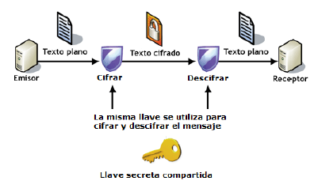

# Introducción

En este módulo vamos a simular escenarios reales donde apenas trabajaremos en local, en nuestro propio ordenador. Simularemos, mediante una máquina virtual que es en la que realmente trabajaremos, que todos nuestros despliegues ocurren en una máquina remota, tal y como ocurre en la realidad.

De hecho, se simulará un escenario donde tengamos contratado un VPS (Virtual Private Server) y debamos conectarnos de forma remota al mismo para poder trabajar. Un escenario muy común en el mundo real.

## ¿Qué es un VPS?

Un servidor es una computadora en la que tu proveedor de alojamiento web almacena los archivos y las bases de datos necesarios para tu sitio web. Cada vez que un visitante en línea quiere acceder a tu sitio web, su navegador le envía una solicitud a tu servidor y transfiere los archivos necesarios a través de Internet. El alojamiento VPS te proporciona un servidor en la nube que simula un servidor físico; sin embargo, en realidad, la máquina se comparte entre varios usuarios.

Al usar la tecnología de virtualización, tu proveedor de alojamiento web instala una capa virtual sobre el sistema operativo del servidor. Esta capa divide el servidor en particiones y le permite a cada usuario instalar su propio sistema operativo y software.

Por lo tanto, un servidor privado virtual (VPS) es tanto virtual como privado porque tienes control absoluto. Está separado de otros usuarios del servidor a nivel del sistema operativo. De hecho, la tecnología VPS es similar a la creación de particiones en tu computadora cuando quieres ejecutar más de un sistema operativo (por ejemplo, Windows y Linux) sin tener que reiniciar.

Un VPS te permite configurar tu sitio web dentro de un contenedor seguro con recursos garantizados (memoria, espacio en disco, núcleos de CPU, etc.) que no tienes que compartir con otros usuarios. Con el hosting VPS, tienes el mismo acceso de nivel raíz que si alquilaras un servidor dedicado, pero a un costo mucho más bajo.

El VPS es una solución más segura y estable que el hosting compartido, con el que no obtienes espacio de servidor dedicado. Sin embargo, es de menor escala y más barato que alquilar un servidor completo.

El hosting VPS generalmente es elegido por los propietarios de sitios web que tienen un tráfico de nivel medio que excede los límites de los planes de hosting compartido pero que aún no necesitan los recursos de un servidor dedicado.

## Conexión mediante SSH

Aunque nuestra máquina virtual esté en nuestro ordenador, ya hemos dicho que estamos simulando un VPS remoto. Para conectarnos a una máquina de forma remota y segura, la opción más recomendable es SSH.

SSH o Secure Shell es un protocolo de red criptográfico para operar servicios de red de forma segura a través de una red no protegida. Las aplicaciones típicas incluyen línea de comandos remota, inicio de sesión y ejecución de comandos remota, pero cualquier servicio de red puede protegerse con SSH.

SSH proporciona un canal seguro a través de una red no segura mediante el uso de una arquitectura cliente-servidor , conectando una aplicación cliente SSH con un servidor SSH.  El puerto TCP estándar para SSH es 22 y se usa generalmente para acceder a sistemas operativos similares a Unix, pero también se puede usar en Microsoft Windows.

Proporciona un mecanismo para autenticar un usuario remoto, transferir entradas desde el cliente al host y retransmitir la salida de vuelta al cliente.

SSH tiene muchas aplicaciones diferentes:

+ Gestión de servidores a los que no se puede acceder localmente
+ Transferencia segura de archivos
+ Creación de copias de seguridad
+ Conexión entre dos ordenadores con encriptación de extremo a extremo
+ Mantenimiento remoto desde otros ordenadores

### Autenticación

Los dos métodos de autenticación de usuario SSH más comunes que se utilizan son las contraseñas (cifrado simétrico) y las claves SSH (cifrado asimétrico o de clave pública). Los clientes envían contraseñas cifradas al servidor de forma segura. Sin embargo, las contraseñas son un método de autenticación arriesgado porque su solidez depende de que el usuario sepa qué hace que una contraseña sea segura. 

Los pares de claves pública-privada SSH encriptados asimétricamente son una mejor opción. Una vez que el cliente descifra el mensaje, el servidor le otorga acceso al sistema.

Es decir, SSH opta por el cifrado híbrido, donde se utiliza el cifrado asimétrico para intercambiar unas claves que serán las que se utilizarán posteriormente en el intercambio de información.

Este tipo de cifrado utiliza la misma clave para cifrar y para descifrar la información. Por este motivo, la clave debe ser secreta y sólo conocida por el emisor y el receptor del mensaje.

#### Cifrados simétricos o de clave privada

Este tipo de cifrado utiliza la misma clave para cifrar y para descifrar la información. Por este motivo, la clave debe ser secreta y sólo conocida por el emisor y el receptor del mensaje.

**Ventajas**

+ Muy rápidos → cifrar y descifrar un mensaje cada vez requiere un cierto tiempo, que si el algoritmo es complejo, puede ser elevado. 

**Inconvenientes**

+ Si alguien no autorizado consigue la clave, podrá espiar la comunicación sin problemas
+ ¿Cómo hacemos para que emisor y receptar conozcan la clave en un primer momento? → no se puede transmitir por el canal inseguro → hay que transmitirla por otro canal seguro
    <u>Ejemplos:</u> PIN de la tarjeta del banco o archivo comprimido con contraseña

#### Cifrados asimétricos o de clave pública

En este tipo de cifrados cada usuario utiliza un par de claves: una clave pública y una clave privada. Un mensaje cifrado con la clave pública sólo se puede descifrar con su correspondiente clave privada y viceversa.

La *clave pública* es accesible a cualquier persona que quiera consultarla, no hace falta que sea transmitida por un canal seguro como en el caso anterior.

La *clave privada* sólo la debe conocer su dueño.

<u>**Funcionamiento:**</u>

 1. El emisor cifra un mensaje con la clave pública del receptor
 2. El receptor recibe el mensaje y es el único que podrá descifrarlo porque es el único que posee la clave cifrada asociada

**Ventajas**

  + No se necesita un nuevo canal independiente y seguro para transmitir la clave

**Inconvenientes**

  + Son más lentos que los cifrados simétricos
  + Hay que proteger muy bien la clave privada y tenerla siempre disponible para poder descifrar los mensajes (no es una contraseña)
  + Hay que asegurarse de que la clave pública es de quién dice ser y no de un impostor que se esté haciendo pasar por él

!!!note "Nota"
    Nosotros, para conectarnos por primera vez por SSH y comprobar la conectividad, utilizaremos el cifrado simétrico (una contraseña).

    Tras ello, simulando un entorno real que aporte comodidad (no introducir contraseña cada vez que hagamos *login*) pero también y sobre todo, por seguridad, utilizaremos cifrado asimétrico. Esto es, un par de claves.

## Referencias

[¿Qué es un VPS? Todo lo que necesitas saber sobre servidores virtuales](https://www.hostinger.es/tutoriales/que-es-un-vps)